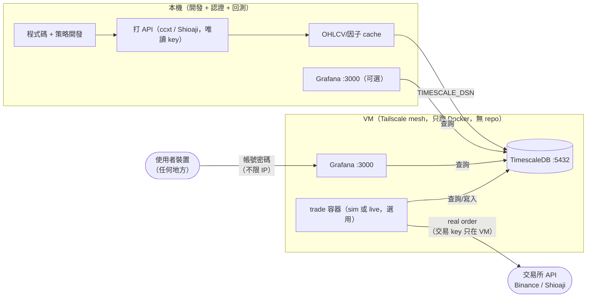
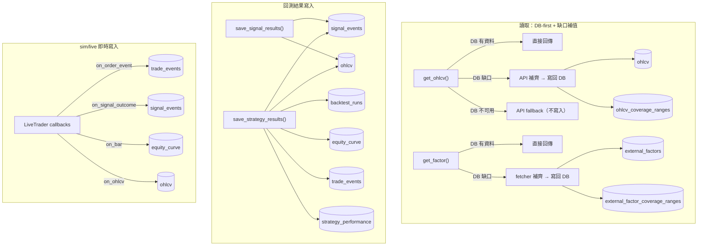

# quant-strategy-lab

量化策略研究與即時監控平台。自建回測引擎 ([librae](librae/README.md)) + 策略框架 + TimescaleDB + Grafana。

---

## 架構



- **本機**：策略開發、回測、資料抓取都在這裡；OHLCV 快取進 DB 避免重複打 API。本機的 Shioaji/Binance key 一律唯讀，不下真單。
- **VM**：只裝 Docker，跑 TimescaleDB + Grafana，可選常駐一個 trade 容器做真實下單（Binance/Shioaji live）。交易 key（含 Shioaji CA 憑證）只存在 VM 上，細節見「讓策略常駐 VM」。**不 clone repo**，靠 Tailscale 私有網路連線，密碼/程式碼都不落地到 VM 之外的地方。
- **Grafana**：本機開（幾乎不吃資源，直接查遠端 DB）或放 VM 上皆可。

---

## Quick Start（本機）

```bash
git clone git@github-quant-strategy:awwesomeman/quant-strategy-lab.git
cd quant-strategy-lab
uv sync --extra test   # 開發/測試用；只要跑本機 tw_futures live 才需要再加 --extra tw-live

cp .env.example .env   # 填入 TIMESCALE_DSN、密碼
cp .env.secrets.example .env.secrets   # 若要跑 Shioaji 再填 SHIOAJI_*（這份不會被任何 deploy 腳本同步出去）
```

之後所有指令都透過 `uv run` 執行（例如 `uv run pytest tests/ -q`），或 `source .venv/bin/activate` 後直接跑——下面「常用指令」為求簡潔省略了 `uv run` 前綴。

---

## VM 部署（DB + Grafana，經 Tailscale）

VM 上完全不放程式碼，只跑 `deploy/` 目錄同一份 `docker-compose.yml`。

### 從一台全新的 VM 開始

以下三件事要先做完，才能進到下面「部署」的步驟——雲端服務商 GUI 操作因人而異，這裡只列出結果要滿足什麼條件：

1. **SSH 能連進去**：把本機的公鑰（`~/.ssh/id_ed25519.pub` 或等效檔案）加進 VM 的 metadata/authorized_keys。雲端主控台的「貼公鑰」欄位不一定可靠（貼了存了，實際卻沒生效——踩過這個坑，見 `docs/learnings/ERRORS.md`），能用 CLI 寫入 instance metadata 就優先用 CLI，寫完務必實際 `ssh <user>@<vm-ip>` 驗證一次，不要只看主控台顯示「已儲存」。之後一律用這個使用者連線（例如 `jason`）——GCP 主控台的 SSH 按鈕、或省略使用者名稱的 `gcloud compute ssh`，走的是你的 Google 身分（OS Login），會自動帶出另一個帳號（例如 `jasonpanbackup`），看不到 `quant-deploy` 底下的東西。
2. **固定的對外 IP**：預設配發的外部 IP 通常是動態的，重開機會換掉——升級成靜態 IP（雲端主控台的網路設定裡通常叫「保留靜態位址」/"Reserve static address"）。這個 IP 之後會用在：Binance API 白名單、`SHIOAJI_CA_PATH` 所在機器的識別。
3. **裝好 Docker**：`ssh` 進去後 `apt install -y docker.io docker-compose-plugin`（`cloud_deploy.sh`/`trade.sh` 都假設這兩個已經裝好，不會幫你裝）。

**SSH 防火牆**：SSH（`tcp:22`）的來源限制在 IAP（Identity-Aware Proxy）的固定 IP 段，不對整個網際網路開放：

```bash
gcloud compute firewall-rules update default-allow-ssh --source-ranges=35.235.240.0/20
```

平常用 Tailscale mesh IP 的 `ssh <user>@<tailscale-ip>` 不受影響（Tailscale 走額外的虛擬網路介面，跟這條防火牆規則管的實體網卡是兩回事）；Tailscale 連不上時，`gcloud compute ssh <instance> --zone=<zone> --tunnel-through-iap` 走 IAP 通道當緊急備援。直接對公網 IP 的 SSH（沒裝 Tailscale、也不是用 `gcloud` 的裝置）連不進去，這是預期行為。Grafana 的 `librae-grafana`（port 3000）是完全獨立的另一條防火牆規則，維持公開 + 密碼登入，不受這條 SSH 規則影響。

```bash
# 1. 一次性：在 VM 上裝 Tailscale，取得私有 mesh IP
./deploy/bootstrap_tailscale.sh <user>@<vm-host>

# 2. 拿到上一步印出的 tailscale IP 後，本機 .env 設定 TSDB_BIND=<tailscale-ip>
#    （預設 127.0.0.1 只綁 loopback，Tailscale 連不到，DB 等於連不上）

# 3. 部署：把 deploy/ + Grafana provisioning + .env 同步過去，啟動 timescaledb + grafana
./deploy/cloud_deploy.sh <user>@<tailscale-ip>
```

`cloud_deploy.sh` 只 rsync `deploy/` 和 `app/grafana/provisioning/`，VM 上除了這兩個資料夾和 `.env` 之外沒有任何 repo 內容（若要 live 下單，另外還有手動建立、不受這支腳本管理的 `.env.secrets`，見下）——之後要更新 dashboard 或 schema，重跑一次這支腳本即可，不需要 SSH 上去手動改。

本機接上遠端 DB：
```bash
export TIMESCALE_DSN="postgresql://quant:<密碼>@<tailscale-ip>:5432/quant"
psql "$TIMESCALE_DSN" -c "SELECT 1"   # 驗證連線
```

用 GUI 工具查資料（例如 VS Code 的 PostgreSQL extension、TablePlus）也是接同一組連線資訊：host 填 `<tailscale-ip>`、port `5432`、user/password/db 跟 `.env` 的 `POSTGRES_PASSWORD` 一致——走 Tailscale mesh，不需要另外開防火牆port。

Grafana 的 port mapping（`3000:3000`）沒有限制 bind IP，容器內部是對所有介面開放、只靠帳號密碼擋（`GF_AUTH_ANONYMOUS_ENABLED=false`），跟 DB 刻意限制在 Tailscale 不同。外部是否連得到還要看 VM 的雲端防火牆/security group 有沒有開放 3000 對外——用一台沒裝 Tailscale 的裝置打 `http://<vm-公網ip>:3000` 驗證實際曝露範圍。

### 讓策略常駐 VM（sim/live 容器，一樣不用 clone repo）

`trade.sh` 平常在本機用時會直接 `docker build` 整個 repo；要放到沒有 repo 的 VM 上跑，改成本機 build + push、VM 只 pull。

**這是 VM 上跑 `trade.sh` 的必要前置條件，不是可選優化**——VM 上沒有原始碼，`TRADE_IMAGE` 沒設的話 `trade.sh start` 會嘗試本地 `docker build`，但沒有 repo 可以 build，直接失敗。本機開發/測試不受影響（沒設 `TRADE_IMAGE` 就照舊本地 build），只有「要在 VM 上跑」這件事需要先做完下面幾步：

**0. 一次性：GitHub Container Registry 認證**（其他 registry 概念相同，跳過即可）：GitHub 網頁 Settings → Developer settings → Personal access tokens → Tokens (classic) 建一個新 token，勾 `write:packages`（會自動帶 `read:packages`）；本機用它登入一次：

```bash
docker login ghcr.io -u <github 帳號>   # 密碼欄貼 PAT，不要用 GitHub 密碼
```

之後憑證會存在本機 `~/.docker/config.json`，`build_push.sh` 都會沿用，不用每次重登。

```bash
# 1. 本機：.env 設 TRADE_IMAGE=ghcr.io/<github-user>/quant-trade，
#    build 一次、push 到 registry（之後只有策略程式碼改了才需要重跑）
./deploy/build_push.sh

# 2. VM 上（deploy/ 已經被 cloud_deploy.sh 同步過去，.env 也有 TRADE_IMAGE）：
cd deploy && ./trade.sh start trendpullback sim 60    # 訊號推播，不下真單
cd deploy && ./trade.sh start trendpullback live 60   # 真實下單（見下方風險說明）
```

`trade.sh start` 看到 `.env` 有 `TRADE_IMAGE` 就會改成 `docker pull` 而不是本地 build——VM 上完全不需要原始碼。

`live` 模式需要的密鑰放在獨立的 `.env.secrets`（範本 `.env.secrets.example`：`BINANCE_API_KEY`/`BINANCE_API_SECRET` 或 `SHIOAJI_*`，看這台 VM 要跑哪個市場），**不是**會被 `cloud_deploy.sh` 整份覆蓋的 `.env`，只能直接在 VM 上手動建立：

```bash
# 只在真的要下單那台 VM 上做一次（Binance 只需要前兩步）：
ssh <user>@<vm-ip> "mkdir -p ~/quant-deploy/.secrets && chmod 700 ~/quant-deploy/.secrets"

# Shioaji 才需要：把本機的 CA 憑證傳過去，路徑跟 SHIOAJI_CA_PATH 對齊
scp ./.secrets/Sinopac.pfx <user>@<vm-ip>:~/quant-deploy/.secrets/Sinopac.pfx
ssh <user>@<vm-ip> "chmod 600 ~/quant-deploy/.secrets/Sinopac.pfx"

# 兩者都要：建立 .env.secrets，填入真正有交易權限的 key（不要用本機那把唯讀 key）
ssh <user>@<vm-ip>
cd quant-deploy && cp .env.secrets.example .env.secrets && $EDITOR .env.secrets
chmod 600 .env.secrets
```

這樣交易 key 只存在這一台機器：本機不會有它，之後重跑 `cloud_deploy.sh` 更新 dashboard/schema 也不會不小心把 VM 上的 key 蓋成空值。`trade.sh start ... live` 會自動 source `.env` + `.env.secrets`，並依 `.env.secrets` 裡實際存在哪組 key 注入對應的環境變數；有 `SHIOAJI_CA_PATH` 且該檔案存在時，還會把整個 `.secrets/` 唯讀掛進容器。市場本身是策略 `symbol` 在 `librae/config/symbols.yaml` 自動解析出來的（見「策略開發流程」），`trade.sh` 不需要另外指定。

Binance key 在交易所後台申請時：VM 這把要開「交易」權限，並把 IP 白名單設成 VM 的**固定外部 IP**（`gcloud compute instances describe <instance> --format='value(networkInterfaces[0].accessConfigs[0].natIP)'` 查得到；不是 Tailscale 的 `100.x.x.x` mesh IP，交易所看到的是實際對外連線來源）。本機如果只是開發/回測，不用申請 key；真的要在本機手動測下單，另外開一把獨立、權限盡量低（唯讀或交易所的測試網/demo）的 key，不要跟 VM 那把共用。

Shioaji 一樣：VM 上放 full 權限 key + CA 憑證，本機日常開發只留一把「唯讀」權限的 key、不要放 CA（`ShioajiAdapter` 沒填 `SHIOAJI_CA_PATH` 會自動進 read-only，下單方法直接拋錯，不怕手滑打到真單 API）。CA 憑證上雲端這件事風險在於：VM 被入侵 = key 外洩；Tailscale（見上一節）只降低「誰連得到這台 VM」的風險，不降低「VM 本身被攻破」的風險，這是兩回事——是刻意接受的風險換取自動化部署，不是沒考慮過。

---

## 策略開發流程

所有 runner 統一用 `RunConfig` + `run_dispatch()`：

```python
# run.py 標準結構
def run_backtest(cfg: RunConfig) -> None: ...
def run_realtime(cfg: RunConfig) -> None: ...

def main() -> None:
    from librae.cli import run_dispatch
    run_dispatch(STRATEGY_NAME, __file__, run_backtest, run_realtime)
```

`config.yaml` 定義參數，CLI 可覆蓋（`--mode`, `--dry-run`, `--no-db`, `--poll-seconds` 等）。

**新增策略**：複製 `strategies/trendpullback/`，改 `strategy.py`（決策邏輯）、`utils.py`（特徵 + 訊號）、`config.yaml`（參數）。`config.yaml` 通常不用寫 `market`/`data_source`——只要 symbol 已經在 `librae/config/symbols.yaml` 登記，就會自動解析（登記了還手動寫且兩邊對不上會直接報錯，避免兩份設定悄悄分歧）；沒登記的一次性實驗 symbol，才在 `config.yaml` 顯式指定。`market: tw_futures` 會自動走 Shioaji，`market: crypto` 走 ccxt——不需要自己組 adapter。

**訊號研究**（不需要完整回測引擎，只評估指標預測力）：多數實驗是獨立的 `factor_research.py` 腳本（例如 `strategies/experiments/funding_crowding_reversal/`），不掛 `RunConfig`/`config.yaml`，複製一份改指標邏輯即可。`strategies/experiments/kdj_oversold/`、`trendmaster/` 是走完整 `run.py`/`config.yaml` 模式的範例，但**目前都是不完整的 stub**（`kdj_oversold` 缺 `utils.py`、`trendmaster` 缺 `strategy.py`，import 會直接失敗）——要用這個模式當範本，先參考已經能跑的 `strategies/trendpullback/`。`strategies/experiments/` 不分子資料夾，一個資料夾一個探索過的想法，見 `strategies/experiments/README.md`。

---

## 策略回測

```bash
python -m strategies.trendpullback.run --mode backtest
```

- 引擎用 next-bar execution：bar[i] 產生決策、bar[i+1] 的價格成交，避免 look-ahead bias。
- `get_ohlcv()` 是 DB-first + API fallback：資料庫有就直接讀，缺口才補打 API 再寫回 DB（cache 依 symbol/timeframe/data_source 追蹤覆蓋區間，不會整段重抓）。
- 支援 long/short、同方向加碼（scaling）、部分平倉。
- 結果（`config_hash`/`params`/`start`~`end` 都存進 `backtest_runs`）+ 完整 equity/trade 明細寫入 DB，Grafana 用 `$run_id` 切換查看。

crypto（`binance_spot`）跟 Shioaji（`tw_futures`）都已經註冊好 `get_ohlcv` 的 fetcher，`get_ohlcv("TXFR1", ..., data_source="shioaji")` 可以直接回測，跟 crypto 走同一套 DB-first 快取。Shioaji 這邊需要本機有 `SHIOAJI_API_KEY`/`SHIOAJI_SECRET_KEY`（唯讀權限即可，不需要 CA）；fetcher 內部固定用 `simulation=True` 登入（歷史資料查詢不是下單，不需要正式權限，某些 key 甚至只有模擬權限能登入，細節見 `docs/learnings/ERRORS.md`）。

**非價量因子**（資金費率、未平倉量等有外部抓取成本的第三方資料）走 `strategies/data/factors.py` 的 `get_factor()`，跟 `get_ohlcv()` 同一套 DB-first + 缺口追蹤設計，只是共用一張 long table（`external_factors`）而不是每個資料源一張表，新增資料源只要註冊一個 fetcher（見 `factors.py` docstring），不用寫 migration。已有 `funding.py`（funding rate）、`open_interest.py`（未平倉量）兩個範例；`cross_asset.py`/`regime.py` 是從已快取的 OHLCV 現算的衍生特徵，不走這套快取（隨時能重算，沒有 gap 問題）。

---

## 策略模擬 / 實盤（sim & live）

```bash
# sim：本地 bookkeeping、不下真實單，Telegram 照樣推播訊號
python -m strategies.trendpullback.run --mode sim --poll-seconds 60

# live：市場資料/下單 adapter 皆自動從 env 建立（crypto: BINANCE_*，tw_futures: SHIOAJI_*）
python -m strategies.trendpullback.run --mode live --poll-seconds 60
```

- **`--poll-seconds` 必填**，sim/live 都沒有隱性預設值——要自己設成貼近策略 `timeframe` 的秒數（例如 M5 策略設 60s 內，太大會漏抓完成的 K 棒；太小則浪費 API 呼叫）。沒設會直接報錯，不會偷偷用舊的 60 秒。
- 兩種市場都是**輪詢（poll）＋比對最後一根 K 棒時間戳**的 bar-driven 設計，不是 WebSocket/snapshot 訂閱：crypto 打 ccxt `fetch_ohlcv`（Binance REST `/klines`），Shioaji 打 `kbars()`——兩邊資料源跟 backtest 一致，才不會出現「backtest 賺錢、live 對不上」的落差。
- `market: tw_futures` 時 `LiveTrader` 自動建立已認證的 `ShioajiAdapter`；否則（crypto）自動建立帶 `BINANCE_*` credentials 的 `CryptoAdapter`——兩者都同時當市場資料來源和下單通道，credentials 放哪見下方「設定檔總覽」。之後加第二個 crypto 交易所，只需換一個 prefix（例如 `OKX_*`），不用改共用邏輯。
- 常駐在 VM 上跑：見上面「讓策略常駐 VM」，`./deploy/trade.sh start trendpullback sim 60` / `./deploy/trade.sh start trendpullback live 60`，停用 `./deploy/trade.sh stop trendpullback [sim|live]`。
- 掛掉偵測：`scripts/check_heartbeat.py --loop`，`backtest_runs.last_heartbeat` 超過 `3 × poll_seconds` 沒更新就用 Telegram 告警。

---

## 資料流

三個獨立的資料流各自畫一個子圖（同名節點在不同子圖裡代表同一張表，只是拆開避免線交錯，實際 schema 以下面「DB Schema」表為準）：



## DB Schema（9 張表）

| 表 | 用途 | 寫入時機 |
|---|---|---|
| `ohlcv` | 共享市場資料（cache） | `get_ohlcv()` 自動寫入 |
| `ohlcv_coverage_ranges` | 追蹤 `ohlcv` 已快取的區間，避免重複打 API | `get_ohlcv()` 補完缺口後自動寫入 |
| `external_factors` | 第三方因子資料（funding rate、open interest...），一致 schema 的 long table，新資料源不用 migration | `get_factor()` 自動寫入 |
| `external_factor_coverage_ranges` | 追蹤 `external_factors` 已快取的區間，跟 `ohlcv_coverage_ranges` 同一套機制 | `get_factor()` 補完缺口後自動寫入 |
| `signal_events` | 訊號發射記錄 | backtest: `save_signal_results()` / sim: `on_signal_event` |
| `backtest_runs` | Run metadata + params + config_hash | `save_strategy_results()` |
| `equity_curve` | 每 period 淨值 | 同上 |
| `trade_events` | 部位生命週期事件（open/add/reduce/close） | 同上 |
| `strategy_performance` | 聚合 KPI | 同上 |

重建 DB：
```bash
psql "$TIMESCALE_DSN" -c "DROP SCHEMA public CASCADE; CREATE SCHEMA public;"
psql "$TIMESCALE_DSN" -f deploy/timescale_init.sql
```

---

## Grafana 儀表板

| Dashboard | 用途 | 切換變數 |
|---|---|---|
| **Signal** | 訊號預測力：forward return, MFE/MAE, cumulative return | `$mode`, `$run_id`, `$n`, `$k` |
| **Strategy** | 策略績效：equity curve, drawdown, trades | `$mode`, `$run_id` |

兩個 dashboard 都由以下指令生成（改完 `app/grafana/generate_dashboards.py` 的 panel 定義後重跑，Grafana 每 30 秒自動 reload，不需重啟)：

```bash
python -m app.grafana.generate_dashboards
```

本機開發用（只跑 Grafana，連遠端 DB）：
```bash
cd deploy && docker compose -f docker-compose.local.yml up -d
```

---

## 常用指令

| 指令 | 說明 |
|------|------|
| `pytest tests/ -q` | 跑測試 |
| `python -m strategies.trendpullback.run --mode backtest` | 策略回測 |
| `python -m strategies.trendpullback.run --mode sim --poll-seconds 60` | 策略模擬（不下真單） |
| `python -m strategies.trendpullback.run --mode live --poll-seconds 60` | 策略實盤 |
| `./deploy/build_push.sh` | 本機 build + push trade image（策略程式碼改了才需要） |
| `./deploy/trade.sh start trendpullback sim 60` / `trade.sh stop trendpullback sim` | 啟停常駐 sim 容器（本機或 VM 上執行皆可） |
| `./deploy/trade.sh start trendpullback live 60` / `trade.sh stop trendpullback live` | 啟停常駐 live 容器（真實下單，crypto 限定） |
| `python scripts/check_heartbeat.py --loop` | 監控 sim/live 是否掛掉 |
| `python -m app.grafana.generate_dashboards` | 重新產生 Grafana JSON |

---

## 設定檔總覽

| 檔案 | 設定什麼 | 是否進 git |
|------|---------|-----------|
| `.env.example` → `.env`（專案根目錄） | DB 連線 + Grafana + Telegram + 非敏感設定；會被 `cloud_deploy.sh` 同步到 VM | `.env.example` 進，`.env` 不進 |
| `.env.secrets.example` → `.env.secrets`（專案根目錄） | 有交易/簽章能力的密鑰（`BINANCE_API_KEY`/`SHIOAJI_*`）；本機/VM 各自維護，**永遠不同步** | `.env.secrets.example` 進，`.env.secrets` 不進 |
| `librae/config/markets.yaml` | 市場成本 + 保證金參數 | yes |
| `librae/config/symbols.yaml` | symbol → market/data_source 對應 | yes |
| `strategies/*/config.yaml` | 策略參數 + 通知 | yes |
| `strategies/experiments/<name>/config.yaml` | 實驗參數（只有走 `run.py`/`RunConfig` 模式的實驗才有，如 `trendmaster`；大部分實驗是獨立的 `factor_research.py` 腳本，不用這套設定） | yes |
| `deploy/timescale_init.sql` | DB schema | yes |

---

## 相關文件

- [`librae/README.md`](librae/README.md) — 引擎架構、API、類型系統
- [`docs/decisions/`](docs/decisions/) — 架構決策記錄
- [`docs/plans/`](docs/plans/) — 執行計劃
- [`docs/learnings/ERRORS.md`](docs/learnings/ERRORS.md) — 除錯記錄（症狀/根因/修法/預防）
