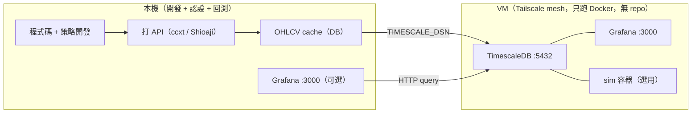
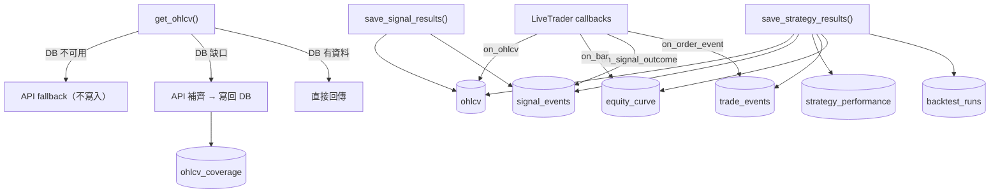

# quant-strategy-lab

量化策略研究與即時監控平台。自建回測引擎 ([librae](librae/README.md)) + 策略框架 + TimescaleDB + Grafana。

---

## 架構



- **本機**：策略開發、回測、對 Shioaji/ccxt 的認證與資料抓取都在這裡做。抓到的 OHLCV 會快取進 DB，避免重複打 API。
- **VM**：只裝 Docker，跑 TimescaleDB + Grafana（+ 想常駐的 sim 容器）。**不 clone repo**，靠 Tailscale 私有網路連線，密碼/程式碼都不落地到 VM 之外的地方。
- **Grafana**：可以在本機開（幾乎不吃資源，直接查遠端 DB），也可以放 VM 上。

---

## Quick Start（本機）

```bash
git clone git@github-quant-strategy:awwesomeman/quant-strategy-lab.git
cd quant-strategy-lab
python3.12 -m venv .venv && .venv/bin/pip install -e .

cp .env.example .env   # 填入 TIMESCALE_DSN、密碼；若要跑 Shioaji 再填 SHIOAJI_*（只在本機填，不上 VM）
```

---

## VM 部署（DB + Grafana，經 Tailscale）

VM 上完全不放程式碼，只跑 `deploy/` 目錄同一份 `docker-compose.yml`：

```bash
# 1. 一次性：在 VM 上裝 Tailscale，取得私有 mesh IP
./deploy/bootstrap_tailscale.sh <user>@<vm-host>

# 2. 部署：把 deploy/ + Grafana provisioning + .env 同步過去，啟動 timescaledb + grafana
./deploy/cloud_deploy.sh <user>@<tailscale-ip>
```

`cloud_deploy.sh` 只 rsync `deploy/` 和 `app/grafana/provisioning/`，VM 上除了這兩個資料夾和 `.env` 之外沒有任何 repo 內容——之後要更新 dashboard 或 schema，重跑一次這支腳本即可，不需要 SSH 上去手動改。

本機接上遠端 DB：
```bash
export TIMESCALE_DSN="postgresql://quant:<密碼>@<tailscale-ip>:5432/quant"
psql "$TIMESCALE_DSN" -c "SELECT 1"   # 驗證連線
```

用 GUI 工具查資料（例如 VS Code 的 PostgreSQL extension、TablePlus）也是接同一組連線資訊：host 填 `<tailscale-ip>`、port `5432`、user/password/db 跟 `.env` 的 `POSTGRES_PASSWORD` 一致——走 Tailscale mesh，不需要另外開防火牆port。

### 讓策略常駐 VM（sim 容器，一樣不用 clone repo）

`sim_start.sh` 平常在本機用時會直接 `docker build` 整個 repo；要放到沒有 repo 的 VM 上跑，改成本機 build + push、VM 只 pull：

```bash
# 本機：build 一次、push 到 registry（策略程式碼改了才需要重跑）
# .env 設 SIM_IMAGE=ghcr.io/<github-user>/quant-sim，並 docker login ghcr.io 一次
./deploy/build_push_sim.sh

# VM 上（deploy/ 已經被 cloud_deploy.sh 同步過去，.env 也有 SIM_IMAGE）：
cd deploy && ./sim_start.sh trendpullback 60
```

`sim_start.sh` 看到 `.env` 有 `SIM_IMAGE` 就會改成 `docker pull` 而不是本地 build——VM 上完全不需要原始碼。沒設 `SIM_IMAGE` 時行為不變（本機 build，適合本機測試）。

---

## 策略開發流程

所有 runner 統一用 `RunConfig` + `run_dispatch()`：

```python
# run.py 標準結構
def run_backtest(cfg: RunConfig) -> None: ...
def run_realtime(cfg: RunConfig) -> None: ...

def main() -> None:
    from librae.cli import run_dispatch
    run_dispatch(STRATEGY_NAME, __file__, run_backtest, run_realtime)
```

`config.yaml` 定義參數，CLI 可覆蓋（`--mode`, `--dry-run`, `--no-db`, `--poll-seconds` 等）。

**新增策略**：複製 `strategies/trendpullback/`，改 `strategy.py`（決策邏輯）、`utils.py`（特徵 + 訊號）、`config.yaml`（參數）。`config.yaml` 通常不用寫 `market`/`data_source`——只要 symbol 已經在 `librae/config/symbols.yaml` 登記，就會自動解析（登記了還手動寫且兩邊對不上會直接報錯，避免兩份設定悄悄分歧）；沒登記的一次性實驗 symbol，才在 `config.yaml` 顯式指定。`market: tw_futures` 會自動走 Shioaji，`market: crypto` 走 ccxt——不需要自己組 adapter。

**訊號研究**（不需要完整回測引擎，只評估指標預測力）：複製 `strategies/experiments/kdj_oversold/` 同樣模式。`strategies/experiments/` 不分子資料夾，一個資料夾一個探索過的想法，見 `strategies/experiments/README.md`。

---

## 策略回測

```bash
python -m strategies.trendpullback.run --mode backtest
```

- 引擎用 next-bar execution：bar[i] 產生決策、bar[i+1] 的價格成交，避免 look-ahead bias。
- `get_ohlcv()` 是 DB-first + API fallback：資料庫有就直接讀，缺口才補打 API 再寫回 DB（cache 依 symbol/timeframe/data_source 追蹤覆蓋區間，不會整段重抓）。
- 支援 long/short、同方向加碼（scaling）、部分平倉。
- 結果（`config_hash`/`params`/`start`~`end` 都存進 `backtest_runs`）+ 完整 equity/trade 明細寫入 DB，Grafana 用 `$run_id` 切換查看。

> **已知限制**：crypto（`binance_spot`）已註冊好 `get_ohlcv` 的 fetcher，可以直接回測。Shioaji（`tw_futures`）目前**還沒有**註冊對應的歷史資料 fetcher，`get_ohlcv(..., data_source="shioaji")` 會直接報錯——現階段 Shioaji 只有 sim/live 路徑接通（見下），回測歷史資料還要另外補 fetcher。

---

## 策略模擬 / 實盤（sim & live）

```bash
# sim：本地 bookkeeping、不下真實單，Telegram 照樣推播訊號
python -m strategies.trendpullback.run --mode sim --poll-seconds 60

# live：需另外傳 order_adapter（crypto）或 market: tw_futures（自動用 Shioaji 下單）
python -m strategies.trendpullback.run --mode live --poll-seconds 60
```

- **`--poll-seconds` 必填**，sim/live 都沒有隱性預設值——要自己設成貼近策略 `timeframe` 的秒數（例如 M5 策略設 60s 內，太大會漏抓完成的 K 棒；太小則浪費 API 呼叫）。沒設會直接報錯，不會偷偷用舊的 60 秒。
- 兩種市場都是**輪詢（poll）＋比對最後一根 K 棒時間戳**的 bar-driven 設計，不是 WebSocket/snapshot 訂閱：crypto 打 ccxt `fetch_ohlcv`（Binance REST `/klines`），Shioaji 打 `kbars()`——兩邊資料源跟 backtest 一致，才不會出現「backtest 賺錢、live 對不上」的落差。
- `market: tw_futures` 時 `LiveTrader` 會自動建立一組已認證的 `ShioajiAdapter`，同時當市場資料來源和下單通道（live 模式）；`SHIOAJI_*` 只在本機 `.env` 設定，VM 上不需要也不該有。
- 常駐在 VM 上跑：見上面「讓策略常駐 VM」，`./deploy/sim_start.sh trendpullback 60` / `./deploy/sim_stop.sh trendpullback`。
- 掛掉偵測：`scripts/check_heartbeat.py --loop`，`backtest_runs.last_heartbeat` 超過 `3 × poll_seconds` 沒更新就用 Telegram 告警。

---

## 資料流



## DB Schema（7 張表）

| 表 | 用途 | 寫入時機 |
|---|---|---|
| `ohlcv` | 共享市場資料（cache） | `get_ohlcv()` 自動寫入 |
| `ohlcv_coverage` | 追蹤 `ohlcv` 已快取的區間，避免重複打 API | `get_ohlcv()` 補完缺口後自動寫入 |
| `signal_events` | 訊號發射記錄 | backtest: `save_signal_results()` / sim: `on_signal_event` |
| `backtest_runs` | Run metadata + params + config_hash | `save_strategy_results()` |
| `equity_curve` | 每 period 淨值 | 同上 |
| `trade_events` | 部位生命週期事件（open/add/reduce/close） | 同上 |
| `strategy_performance` | 聚合 KPI | 同上 |

重建 DB：
```bash
psql "$TIMESCALE_DSN" -c "DROP SCHEMA public CASCADE; CREATE SCHEMA public;"
psql "$TIMESCALE_DSN" -f deploy/timescale_init.sql
```

---

## Grafana 儀表板

| Dashboard | 用途 | 切換變數 |
|---|---|---|
| **Signal** | 訊號預測力：forward return, MFE/MAE, cumulative return | `$mode`, `$run_id`, `$n`, `$k` |
| **Strategy** | 策略績效：equity curve, drawdown, trades | `$mode`, `$run_id` |

兩個 dashboard 都由以下指令生成（改完 `app/grafana/generate_dashboards.py` 的 panel 定義後重跑，Grafana 每 30 秒自動 reload，不需重啟)：

```bash
python -m app.grafana.generate_dashboards
```

本機開發用（只跑 Grafana，連遠端 DB）：
```bash
cd deploy && docker compose -f docker-compose.local.yml up -d
```

---

## 常用指令

| 指令 | 說明 |
|------|------|
| `pytest tests/ -q` | 跑測試 |
| `python -m strategies.trendpullback.run --mode backtest` | 策略回測 |
| `python -m strategies.trendpullback.run --mode sim --poll-seconds 60` | 策略模擬（不下真單） |
| `python -m strategies.trendpullback.run --mode live --poll-seconds 60` | 策略實盤 |
| `./deploy/build_push_sim.sh` | 本機 build + push sim image（策略程式碼改了才需要） |
| `./deploy/sim_start.sh trendpullback 60` / `sim_stop.sh trendpullback` | 啟停常駐 sim 容器（本機或 VM 上執行皆可） |
| `python scripts/check_heartbeat.py --loop` | 監控 sim/live 是否掛掉 |
| `python -m app.grafana.generate_dashboards` | 重新產生 Grafana JSON |

---

## 設定檔總覽

| 檔案 | 設定什麼 | 是否進 git |
|------|---------|-----------|
| `.env.example` → `.env`（專案根目錄） | secrets + DB 連線 + Grafana + Telegram + Shioaji（本機專用） | `.env.example` 進，`.env` 不進 |
| `librae/config/markets.yaml` | 市場成本 + 保證金參數 | yes |
| `librae/config/symbols.yaml` | symbol → market/data_source 對應 | yes |
| `strategies/*/config.yaml` | 策略參數 + 通知 | yes |
| `strategies/experiments/*/config.yaml` | 實驗參數 | yes |
| `deploy/timescale_init.sql` | DB schema | yes |

---

## 相關文件

- [`librae/README.md`](librae/README.md) — 引擎架構、API、類型系統
- [`docs/decisions/`](docs/decisions/) — 架構決策記錄
- [`docs/plans/`](docs/plans/) — 執行計劃
