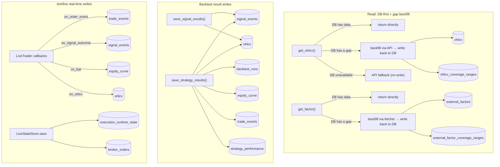

# Architecture & Naming Conventions

> **Document purpose**: this is a **living, current-state document** — it reflects the system's architecture and naming conventions as they are today, and gets edited in place as the code evolves.
> This is the opposite of `docs/decisions/` (a point-in-time record of a decision, never rewritten after the fact) — this file only ever carries "what is true now"; the *why* behind a naming rule lives in the corresponding decision doc, cross-referenced from here.
>
> When you add/change a table, column, or a `db/` read/write function, **you must update this document in the same change**. If a naming rule itself changes (as opposed to adding a new entry), add a new decision doc under `docs/decisions/` explaining why, as appropriate.
>
> **Scope**: engine layering, the DB access layer, and naming conventions — not deployment/ops. `scripts/`/`app/`/`deploy/` are optional ops tooling (Grafana, Docker, VM scripts), deliberately not architecture; see [Optional infrastructure](docs/guides/optional-infrastructure.md) instead.
>
> **Language**: this repo is English-only outside `docs/` (which stays in the language it was originally written in — mixing languages mid-document isn't worth the churn). Keep descriptions concise and to the point — a one-line WHY beats a paragraph; link to `docs/decisions/` for the full history instead of re-explaining it here.

## System layering overview

```
brokers (broker/exchange adapters)  →  librae (core → backtest / live)  →  db (timescale_writer / timescale_reader)
```

- `brokers/`: one flat adapter per broker/exchange (`ShioajiAdapter`, `CryptoAdapter`, `IBKRAdapter`), exposing market/account methods plus the live order lifecycle described below.
- `librae/core/`: shared strategy/portfolio types and pure execution functions. Deterministic bar matching serves backtest/sim; `apply_execution_fill` serves confirmed live fills.
- `librae/backtest/engine.py`: bar-by-bar backtest engine, produces `BacktestOutput` (the DB-persistence dataclasses defined in `librae/backtest/schema.py`: RunMetadata/EquityCurvePoint/OrderEventRecord/StrategyMetrics).
- `librae/live/engine.py`: the real-time polling engine for sim/live mode — sim uses deterministic bar fills; live submits through a broker adapter and applies normalized execution reports.
- `db/timescale_writer.py` / `db/timescale_reader.py` / `db/timescale_state.py`: the sole DB access layer — upper layers use analytics helpers or the runtime store, never raw SQL; schema is defined in `db/timescale_init.sql`.

Layering details in `docs/decisions/2026-03-26-platform-architecture.md` (a historical decision doc — the current state has since replaced the old execution layer it describes with librae).

## Broker Adapter Design (`brokers/`)

- One flat adapter class per broker/exchange (`ShioajiAdapter`, `CryptoAdapter`, `IBKRAdapter`), **duck-typed, no shared ABC**. Market/account signatures include `fetch_ohlcv`, `get_position`, and `info`; live order lifecycle signatures are `prepare_order`, `place_order`, `find_order`, `get_order`, `list_open_orders`, and `cancel_order`.
- `data_source` and `data_adapter` describe where bars come from; `broker` describes where orders go. Live execution never infers a broker from a symbol, market, or data source. Supply `RunConfig.broker`, a per-symbol `instrument_overrides[symbol]["broker"]`, or an injected `order_adapter`; an unresolved route fails at startup. An explicitly selected broker may reuse the same adapter session as market data.
- `prepare_order` runs before durable queueing and network I/O. It applies CCXT precision plus amount/price/notional limits, Shioaji whole-lot and price-limit rules, or IBKR `ContractDetails` size increments/minimums/minimum tick. A quantity that rounds below the venue minimum fails; it is never silently submitted as zero.
- `place_order` is an order/execution-report boundary, not a boolean acknowledgement. `LiveExecutor` normalizes submitted, accepted, partial, filled, cancelled, and rejected states. A filled response must provide order id, requested/filled quantity, average execution price, broker execution timestamp, and explicit cash-currency fee/commission (zero is valid). A position snapshot must never be used to invent the missing fill price, fee, or timestamp.
- CCXT's unified order shape is normalized directly; base-currency fees are converted at the reported average price, while an unrelated fee currency fails closed. Shioaji and IBKR may initially return only an acknowledgement, so their adapters retain/query the broker trade object and enrich cumulative fills from deals/fills. If execution time or explicit commission is not yet available, the report remains invalid and no local fill is invented from order price or `CostModel`.
- `brokers/base.py` only provides pieces that are genuinely shared and byte-for-byte identical: static metadata, credential loading, completed-bar filtering, and canonical order validation/rounding. `CredentialConfig.from_env(prefix)` uses `{PREFIX}_{FIELD}` (e.g. `SHIOAJI_API_KEY`, `BINANCE_API_KEY`). `CryptoAdapter`/`CryptoCredentials` are exchange-agnostic (they pick a CCXT backend via `exchange_id`); only Binance is wired up today, using `BINANCE_*` as the prefix — adding a second crypto exchange means reusing the same class with a different prefix (e.g. `OKX_*`), no changes to the shared logic needed.
- OHLCV returns a uniform schema: `[ts, open, high, low, close, volume]`, with `ts` as the UTC-aware bar-start datetime; timeframe-string conversion is shared via `librae/core/utils.py` (`interval_to_timedelta` etc.), not reimplemented per adapter.
- Where a type constraint is needed, use `typing.Protocol`, **declared minimally at the call site** rather than a hierarchy covering unrelated capabilities. `librae/live/executor.py`'s `OrderAdapter` contains only the six lifecycle calls the executor uses; market data/account methods remain separately duck-typed.
- An async-ABC layering was tried once (`MarketDataAdapter`/`OrderAdapter`/`AccountAdapter` plus a `MarketHub` for unified dispatch — see `docs/decisions/2026-03-26-market-adapter-architecture.md`), and removed because Shioaji's auth model (stateful login+CA) and CCXT's (stateless per-call REST) diverge too much, and no adapter ever actually used that layering. **The current state is flat duck-typed classes — don't reintroduce a cross-broker shared hierarchy.**
- `IBKRAdapter` covers both US stocks and futures through one class, same pattern as `ShioajiAdapter` covering TW futures + stocks: stocks are SMART-routed by symbol alone, futures need an explicit `security_type="FUT"` + `exchange` (e.g. `"CME"` for ES/NQ, `"NYMEX"` for CL, `"COMEX"` for GC — futures aren't SMART-routed). Resolves to the nearest non-expired contract month via `reqContractDetails` (front month, not back-adjusted) — same "always trade/quote whatever's current" behavior as `ShioajiAdapter`'s `TXFR1`-style rolling alias.

## Backtest Engine Design (`librae/`)

Backtest and live-trading engine. Provides one strategy decision interface, position management, cost simulation, and performance metrics. Backtest/sim share deterministic bar-fill logic; live shares sizing and portfolio state types but applies only confirmed external execution fills.

### Layout

```
librae/
├── core/                     shared domain model (pure computation, no I/O)
│   ├── strategy.py           Strategy, OrderIntent, PortfolioTargets, Context, Position, PositionState, Fill
│   ├── executor.py           simulated matching plus apply_execution_fill for externally confirmed fills
│   ├── cost_model.py         CostModel (commission / slippage / tax / contract multiplier / margin)
│   ├── metrics.py            performance metrics + on-demand trade/signal outcome analysis
│   ├── run_config.py         RunConfig + ExecutionPolicy + RiskPolicy — typed run parameters
│   └── utils.py              generate_run_id, infer_timeframe, to_ccxt, to_canonical
│
├── backtest/                 backtest runtime
│   ├── engine.py             Backtest — bar-by-bar execution + optional position snapshots + build_output()
│   ├── schema.py             BacktestOutput, RunMetadata, StrategyMetrics, OrderEventRecord, PositionSnapshotPoint
│   └── charts.py             plot_trades — overlays order_events entries/exits via lightweight-charts (pure rendering, no recomputation, for local research; [extra: viz])
│
├── live/                     real-time / sim runtime
│   ├── engine.py             LiveTrader — data-driven multi-symbol polling events
│   ├── executor.py           OrderRequest/ExecutionReport + LiveExecutor normalization
│   └── state.py              restart checkpoint types + LiveStateStore protocol
│
└── config/                   configuration management
    ├── market_config.py      MarketConfig dataclass + built-in market registry (costs, tick size, margin rates)
    └── symbols.py            SymbolInfo dataclass + built-in symbol registry (symbol → market/data_source/multiplier)

# Outside librae, at the same level as db/ and brokers/ — reference implementations (swappable, see "Dependency direction" below)
notifications/                Telegram push notifications (TelegramAdapter + TelegramCredentials)
orchestration/cli.py          shared CLI parser + config YAML merging (build_config/run_dispatch)
```

`librae/core/trading_calendar.py` owns session labels and session-aligned
resampling; `librae/core/liquidity.py` owns lagged completed-session ADV.
Neither belongs in a broker adapter or strategy. `librae/config/symbols.py`
owns each instrument's `calendar_id`.

### Dependency direction

```
backtest/ ──→ core/
live/     ──→ core/
```

`backtest/` and `live/` have no direct dependency on each other — shared execution logic lives in `core/`. Broker, persistence, and notification implementations remain constructor-injected and lazy-imported. Simulation can run standalone with `config.no_db=True`; live additionally requires an explicit broker route or injected order adapter plus a durable state store (see `docs/plans/refactor_librae_decouple.md`).

### Execution flow (strategy → engine → output)

This is a different thing from the "Data flow" section below: that one is about the read/write pipeline between DB tables; this one is the call sequence within a single run, from strategy code to the final result.

```
Strategy ETL (utils.py)  →  DataFrame (MultiIndex + signal columns)
                              ↓
Strategy logic (strategy.py)  →  on_bar(ctx) → list[OrderIntent] | PortfolioTargets
                              ↓
Engine (engine.py)     →  execute_order_intents / execute_portfolio_targets
                              ↓
Output (build_output)  →  BacktestOutput (metrics + equity/position/allocation facts + events)
```

The lifecycle terminology and breaking migration are recorded in
[`2026-07-28-strategy-decision-execution-naming.md`](docs/decisions/2026-07-28-strategy-decision-execution-naming.md).
Run configuration, metadata, and shared-type SSOT decisions are recorded in
[`2026-07-28-run-contract-ssot.md`](docs/decisions/2026-07-28-run-contract-ssot.md).

### Usage

#### Backtest

```python
from librae import Backtest, Strategy, OrderIntent, Context, RunConfig


# 1. Define a strategy
class MyStrategy(Strategy):
    def on_bar(self, ctx: Context) -> list[OrderIntent]:
        if ctx.positions.get(ctx.symbol):
            if ctx.bar.get("exit_signal"):
                return [OrderIntent(action="close", symbol=ctx.symbol)]
            return []
        if ctx.bar.get("entry_signal"):
            return [OrderIntent(action="long", symbol=ctx.symbol)]
        return []


# 2. Run the engine (a RunConfig is usually built via orchestration.cli.build_config())
df = fetch_and_prepare(symbol, months)  # your own ETL
bt = Backtest(data=df, strategy=MyStrategy(), config=config)
bt.add_benchmark(df.xs(symbol, level="symbol")["close"])
bt.run()

# 3. Get the result
output = bt.build_output()  # BacktestOutput
```

**Data format**: a MultiIndex DataFrame `(symbol, datetime)` + raw, unshifted
OHLCV + point-in-time feature columns. A strategy observes completed bar T and
the engine owns the execution delay, so an intent is first eligible on T+1.
Callers must not pre-shift prices or signals to model that delay; doing so
delays execution twice. Feature construction remains the caller's
responsibility and must not use information unavailable at T.

**Unshifted is a timing contract, not a price-adjustment flag.** The engine
cannot infer whether OHLCV is adjusted. Execution-oriented tests should
normally supply historically observable, unadjusted prices. Librae currently
has no ledger model for splits, dividends/coupons, futures rolls, FX/base
currency conversion, cash yield, or settlement lag. Adjusted/continuous
series can be research inputs, but using them as fill prices makes the
cash-and-position simulation economically incomplete.

The backtest boundary fails fast on malformed input. Index levels must be
exactly `(symbol, datetime)`; `(symbol, datetime)` pairs are unique; timestamps
are timezone-aware and increasing within each symbol; and `config.symbols`, when
provided, exactly matches the symbols in the frame. Required OHLCV values are
numeric and finite, prices are positive, every bar satisfies
`low <= open/close <= high`, and volume is non-negative. Validation never
sorts, forward/backward-fills, clips, or otherwise repairs data because those
operations can change the point-in-time research sample and must remain
explicit ETL decisions.

For an `OrderIntent`, a numeric `fill_price` is a one-eligible-bar limit order. A
buy fills when the bar's low reaches the limit and a sell fills when its high
does; a gap through receives the opening price. An unreached limit expires
after that bar and is logged. `PortfolioTargets.fill_price` accepts only a bar
field name because one numeric price cannot describe a multi-symbol basket;
use per-symbol `OrderIntent`s for limits.

#### Multi-asset / stock-picking strategies

The engine is portfolio-level by design (`positions` is a `dict[symbol]`, and `equity_curve`/`metrics` are both portfolio-level); `on_bar()` can return `OrderIntent`s for multiple different symbols within the same bar, with no changes needed to the engine/executor/schema. One thing to watch: `OrderIntent.quantity=None` defaults to spending all available cash (a single-asset convenience default) — when opening multiple positions in the same bar you must size each `quantity` yourself (see the `OrderIntent.quantity` docstring in `strategy.py`), otherwise the first OrderIntent will consume all the cash.

For allocation strategies, return one `PortfolioTargets` instead:

```python
from librae import PortfolioTargets

return PortfolioTargets(
    weights={"AAA": 0.50, "BBB": 0.45},
    fill_price="open",
    reason="monthly allocation",
)
```

The strategy timestamps the target implicitly by returning it for `ctx.ts`
(bar T). The engine resolves it on T+1 using each symbol's actual fill price and
portfolio equity at those same execution prices. The default `open` is the
earliest next-bar execution assumption. An explicit `close` means an order
eligible for the next bar's close; it is valid only when that order type and
timing are intentional, and it is not interchangeable with an open fill.
Positive weights are long, negative weights are short, and a held symbol
omitted from `weights` targets zero. Reductions and closes execute first in
symbol order, then additions. If entry costs exceed available cash, all
addition quantities receive one common scale factor so symbol ordering does not
starve later assets.

Weights need not sum to one; any remainder stays in cash. When
`Backtest(..., record_position_snapshots=True)` is enabled,
`BacktestOutput.position_snapshots` contains quantity, signed market value, and
signed realized weight (`market_value / equity`) for every open position on
every event. `BacktestOutput.allocation_snapshots` adds target weight, achieved
weight, and drift for every configured symbol. Both are opt-in because
retaining O(events × configured symbols) facts can be expensive for a large
universe.

The configured symbol set is static; point-in-time availability is dynamic.
The engine advances over the union of actually observed completed bars.
`ctx.symbols` is the configured universe, while `ctx.available_symbols` and
`ctx.bars` contain only real current bars. This supports late starts, early
ends, suspensions, and missing observations without guessing why data is
absent. A last-known close is a valuation mark only: it cannot trigger an
execution, stop, signal, or holding-age increment.

For stock selection, configure a survivorship-bias-free candidate superset and
provide point-in-time membership or eligibility as an input feature. The
strategy filters the current eligible observations before ranking or
optimization and returns a complete `PortfolioTargets`; an omitted holding is
therefore targeted to zero. Librae does not synthesize membership history or
silently add/remove subscriptions. A runtime universe/subscription lifecycle
is a missing engine capability, not behavior that strategy code should emulate.

Per-symbol `OrderIntent`s become eligible on that symbol's next observed bar.
`PortfolioTargets` is intentionally synchronous: the basket waits for current
bars from every non-zero target and currently held symbol, and is never
silently replaced. Use per-symbol order intents for asynchronous cross-market
execution.

Execution then deliberately diverges:

- **Backtest/sim:** an OrderIntent decided at T is eligible on that symbol's next
  observed raw bar. Bar fields, one-bar numeric limits, stops, take-profit,
  liquidation, and estimated costs belong to this deterministic simulation
  model.
- **Live:** each batch of newly completed bars is an event and its ready intent
  is submitted immediately. A delayed symbol may create a second event with
  the same timestamp. Current prices may size requests but local execution
  facts come only from broker reports.

OHLCV caches are sorted and deduplicated. The runtime replays every cached bar
newer than its durable per-symbol watermark in timestamp order and advances
that watermark only after successful processing. A late symbol at the same
timestamp is processed with any same-timestamp bars already present in cache,
so a waiting target basket can become executable. An older event that would
rewind the global clock fails explicitly. If a backtest still holds a symbol
without a real bar at the final
timestamp, forced liquidation fails explicitly rather than fabricating a fill
from its last mark.

This is a **data-driven event clock**, not a calendar-driven event generator.
Input timestamps must be timezone-aware and every adapter/ETL path must use
the same convention: `ts` is the UTC bar-start instant. A bar becomes eligible
only after its interval close; fixed-duration bars use `ts + timeframe`, while
calendar-aligned bars use the actual segment/session close. Adapters drop a
final still-forming interval. Keeping the vendor's bar start avoids shifting
shortened or session-ending bars to an invented duration.

`SymbolInfo.calendar_id` is the SSOT for mapping an observed timestamp to its
trading-session label. The built-ins use `24/7`, `XNYS`, and `XTAIFEX`;
unregistered instruments set `instrument_overrides[symbol]["calendar_id"]`.
Standard IDs are resolved by `exchange_calendars`. `XTAIFEX` (15:00 night
open) and `XTAIFEX_1725` (17:25 night open) are Librae extensions that label a
Taiwan-futures night session with its following regular-session date.
Shioaji's epoch correction remains adapter-specific and is not a calendar.

Calendars own session labeling and resampling boundaries only. The engine
still does not manufacture bars or infer suspensions, vendor outages,
settlement days, or missing observations. The current TAIFEX implementation
uses XTAI trading dates as its holiday-session source; users requiring a
product-specific exceptional closure must provide already filtered data.
Cross-market baskets must provide coherent event labels; broker submissions
remain sequential reductions-then-additions, not exchange-level atomic.
`PortfolioTargets` expresses a desired portfolio state, not a transactional
all-or-none order.

Acknowledgement is not execution. Submitted/accepted/cancelled/rejected
reports never mutate positions. A partial report commits only its confirmed
fill delta. Submitted, accepted, and partial orders remain in a durable,
serial queue and are polled before another strategy decision. Repeated
cumulative reports are idempotent; filled quantity, notional, commission,
slippage, and tax can only advance. Cancelled/rejected orders halt dependent
work. Operational/error halts cancel tracked strategy orders. A drawdown
breach instead clears the pending strategy decision and keeps its emergency
reduce/close queue active until broker reports reach a terminal state,
including across restart. The runtime also rejects live bar-field fills
(`"open"`/`"close"`),
`PortfolioTargets.fill_price`, and local stop/take-profit parameters; those
cannot be inferred later from a completed range. Protective orders require a
broker-native implementation.

Incremental cache retention is capped by `warmup_periods` (an injected warmup
fetcher may provide more initial history). This implementation favors
daily/session correctness over high-frequency throughput; lower strategy
frequency reduces load but does not remove clock/order-state synchronization
requirements.

#### Local trade-chart viewer

Use after `pip install -e ".[viz]"`. Purely renders the `order_events` already computed by `build_output()` — it doesn't re-simulate or recompute, so the numbers are guaranteed to match the `strategy_performance` table (the SSOT, see "Multi-asset / stock-picking strategies" above).

```python
from librae.backtest.charts import plot_trades, plot_trades_by_run_id

ohlcv = df.xs(symbol, level="symbol")  # a single symbol's OHLCV
plot_trades(
    ohlcv, output.order_events, symbol
)  # right after a backtest run, output already in hand

plot_trades_by_run_id(
    run_id
)  # or: skip rerunning the backtest, read a persisted run straight from the DB
```

`plot_trades_by_run_id` reads via `db.timescale_reader.load_trade_events`/`load_ohlcv` — the same source as any other downstream tool querying the `trade_events`/`ohlcv` tables, so it can never drift.

#### Trade outcome analysis

`librae/core/metrics.py` is the SSOT for reconstructing analytics lifecycles
from canonical `open`/`add`/`reduce`/`close` events. A position lifecycle is
one per-symbol `0 → N → 0` interval; a realized exit is each `reduce` or
`close`. These are deliberately different populations. Incomplete
end-of-sample lifecycles are reported but excluded from completed-lifecycle
summaries.

Trade analytics require `Mapping[str, pd.DataFrame]`, with one sorted, unique,
timezone-aware OHLCV frame per event symbol. Horizons advance by subsequent
observed bars of that symbol, never by a portfolio-wide row shift. The public
fact/summary split is:

| Analysis | Facts | Summary weight |
|---|---|---|
| Actual lifecycle excursion | `compute_trade_lifecycle_outcomes` | equal completed lifecycles, pooled and per symbol |
| Hypothetical post-entry envelope | `compute_trade_entry_outcomes` | equal `open`/`add` anchors at each valid horizon, pooled and per symbol |

MFE/MAE are gross, direction-adjusted percentage-point price excursions;
costs and notional-weighted portfolio risk remain separate metrics. Adds
change the weighted-average basis prospectively, while reductions preserve
it. Full high/low ranges count only between events. On an event bar, analytics
use explicit fill-price state observations because OHLCV cannot establish
whether the bar extrema occurred before or after the fill. Exact intrabar
excursion therefore requires finer-grained data.

#### Execution policy, risk controls, and portfolio diagnostics

Fill-field and liquidity assumptions have one typed source:
`RunConfig.execution`. `build_config()` defaults to next-open simulation and a
10% per-symbol bar-volume cap in every mode. Direct `Backtest(...)`
construction resolves the same `ExecutionPolicy()` defaults; unlimited
liquidity therefore requires an explicit `max_volume_participation_rate=None`.
Backtest/sim enforce configured liquidity caps in the fill model. Live uses
them for request sizing, then lets broker execution reports determine actual
fills. Emergency live exits bypass local caps so the broker owns partial-fill
truth.

```python
from librae import ExecutionPolicy, RiskPolicy, RunConfig

config = RunConfig(
    ...,
    execution=ExecutionPolicy(
        default_fill_price="open",
        max_volume_participation_rate=0.1,
        # Optional session-level cap; both fields must be set together.
        adv_lookback_sessions=20,
        max_adv_participation_rate=0.01,
    ),
    risk=RiskPolicy(
        max_position_weight=0.3,  # 30% of latest known equity
        max_gross_exposure=1.2,  # reject targets above 120% gross
        max_net_exposure=1.0,  # reject targets above 100% absolute net
        max_drawdown_rate=0.2,  # liquidate and halt after a 20% drawdown
    ),
    params={"lookback": 20},  # strategy logic only
)
```

`execution`, `risk`, and `params` are separate SSOTs. Putting execution or
risk keys in `params` raises immediately; the engine never reparses a
free-form strategy dictionary for portfolio controls.

- `default_fill_price`: backtest/sim fallback for decisions without an
  explicit fill field. It is not used to manufacture live executions.
- `max_volume_participation_rate`: one cumulative per-symbol volume budget per
  simulated data event across entries, additions, reductions, ordinary
  closes, stops, modeled liquidation, drawdown exits, and terminal exits.
  Missing volume rejects the fill. Constrained exits are explicit partial
  fills and retain the remaining position for a later observed bar. Once
  stop-market or liquidation has triggered, its remainder stays an active
  market exit. A terminal backtest that cannot finish exits raises.
- `adv_lookback_sessions` + `max_adv_participation_rate`: optional session
  capacity budget. ADV is the mean total volume of exactly N completed trading
  sessions before the active session; it never contains active-session volume.
  D1 treats each row as one session. Intraday aggregates observed bars using
  the symbol's `calendar_id`, which is required at startup. Missing warmup
  rejects fills. Bar-volume and ADV usage are tracked separately, so available
  quantity is `min(bar cap - filled this bar, ADV cap - filled this session)`.
  This avoids granting the full ADV budget again on every intraday bar. No
  intraday volume-profile estimate is needed: the current-bar cap remains the
  local liquidity constraint. Sim/live `warmup_periods` must retain enough
  bars to cover N full sessions. The pair is disabled by default.
- `max_position_weight`: both new entries and adds get capped (fills are recomputed with commission/slippage/tax after capping) — this isn't an outright rejection.
- `max_gross_exposure` / `max_net_exposure`: validate `PortfolioTargets` before mutation and raise on a breach; targets are not implicitly normalized. These are target constraints, not guarantees against later price drift or broker slippage.
- `max_drawdown_rate`: once detected from a completed bar, backtest/sim queues a market exit for each open position and fills it at the next observed bar open (subject to the normal volume cap); it never observes a close and fills at that same close. Live submits immediate market closes and books only confirmed broker fills. Both persist the halt across restart. Live emergency exits remain active while halted and must reach a broker terminal state before `reset_halt()` is allowed. After operator review, `reset_halt()` starts a new risk epoch and resets the equity peak to current equity.
- Volume-aware slippage (`CostModel.volume_impact_ticks`) is independent of this switch and also defaults to off: as long as volume data is supplied and that market/symbol's `volume_impact_ticks > 0` (set via `market_config.py`/`symbols.py`/`cost_overrides`), slippage scales linearly with the fill's share of that bar's volume, regardless of whether a cap is configured.

Every `EquityCurvePoint` contains gross exposure, net exposure, concentration,
and one-way turnover (`sum(abs(traded notional)) / ending equity`) for its
event. Gross exposure is the engine's gross-leverage measure. `StrategyMetrics`
aggregates total turnover, average/maximum gross exposure, maximum absolute net
exposure, and maximum concentration. With a benchmark, tracking error is the
annualized sample standard deviation of active period returns and information
ratio is annualized mean active return divided by that standard deviation.
`AllocationSnapshotPoint` provides attribution-ready target/achieved facts;
return attribution by factor, sector, or decision remains strategy/research
code because the engine has no classification model.

#### Margin / liquidation simulation

`CostModel.maintenance_margin_rate` (default 0 = off, following the same "belongs to the market/instrument, not `config.params`" convention as `volume_impact_ticks`, configured via `market_config.py`/`symbols.py`/`cost_overrides`). In backtest/sim, `resolve_stop_exit` checks every bar whether a position has hit the modeled liquidation price; if so it force-closes with `REASON_LIQUIDATION`, using conservative gap-through logic. The liquidation check takes priority over stop-loss/take-profit. Live does not replay this completed-bar touch as a market order: venue margin/liquidation and broker-native protective orders are authoritative.

The formula is a simplified isolated-margin approximation (ignoring fees/funding rates, matching the existing simplification level of this engine's margin model): long `entry*(1 + maintenance_margin_rate - margin_rate)`, short `entry*(1 - maintenance_margin_rate + margin_rate)`. Spot (`margin_rate=1.0`) never triggers unless `maintenance_margin_rate` is set.

`margin_rate`/`maintenance_margin_rate` are always a fraction of notional, never an absolute currency figure — there's no config field for e.g. "NT$636,000 initial margin" directly; a caller converts from the exchange's published absolute figure to a ratio before setting it (see `market_config.py`'s `tw_futures` entry for a worked example). Treated as static for the whole run — see `docs/plans/enhance_librae_real_trade.md`'s item B for why, and its known blind spots.

#### Reconciliation (live only)

Startup reconciliation runs automatically when `LiveTrader.run()` starts and
is a no-op in sim mode:

- **Orders**: restore the checkpoint first, recover placement-attempted orders
  by deterministic client id, poll tracked orders, then compare the broker's
  open orders on configured symbols. An untracked order is treated as an
  orphan: do not guess ownership or invent a fill; halt for operator review.
- **Positions**: `get_position(symbol)` is called only for this strategy's
  configured symbols; it is not described as a complete account snapshot. A
  restored checkpoint keeps its entry time and accumulated costs, while broker
  side/quantity is a reconciliation assertion. A mismatch or unreadable
  configured-symbol snapshot halts. Only a first run with no checkpoint adopts
  broker exposure as a safety baseline. Crypto spot uses base-asset balance
  inventory, not the derivatives-only positions endpoint. Since a spot balance
  has no broker average cost, it can validate quantity against a restored
  checkpoint but cannot seed a first-run cost basis; that case halts for
  operator action. Ordinary spot also rejects opening/adding a short, while a
  sell that reduces or closes owned inventory remains valid.
- **Cash** (`_reconcile_cash`, for adapters exposing `get_balance()`): warns
  only, never overwrites. A Telegram alert fires once discrepancy exceeds
  `LiveTrader.CASH_RECONCILE_TOLERANCE_PCT` (default 1%). Broker free/total
  semantics vary by account mode, so blindly overwriting can corrupt a valid
  ledger.

During a run, `ExecutionReport` is the only source that changes the local
position ledger. `execution_runtime_state` atomically checkpoints the cycle
timestamp, per-symbol bar watermarks, pending intent, cash, positions, last
prices, equity peak, halt/risk counters, and active order queue. Runtime-state
schema v4 is intentionally breaking: older checkpoints are rejected and require
an explicit migration or removal. `broker_orders` keeps completed
and active order facts for audit/idempotency without growing the checkpoint.
Placement-attempted is saved before network I/O, so an ambiguous timeout is
looked up rather than blindly retried. Analytics callbacks remain projections;
they are not broker fill truth. The state key is `mode:config_hash`; run only
one active process for a key. Multi-process leader election is deliberately
outside this small polling engine rather than hidden behind an in-process lock.

#### Data staleness detection (live only)

Checked on every poll cycle — unlike reconciliation above, not just once at startup. `_check_staleness` compares the latest bar's timestamp against the current time; an alert only fires once the gap exceeds `(LiveTrader.STALE_DATA_TOLERANCE_BARS + 1) * timeframe` (default tolerance=2, i.e. 3 timeframes with no new data) — the `+1` accounts for the fact that even with a perfectly healthy feed, a closed bar's timestamp is naturally about one timeframe behind the current time, which is expected and shouldn't count as stale. Purely a monitoring feature — it never halts trading or blocks new entries, so it's an always-on engine constant, following the same design rationale as `CONSECUTIVE_ERROR_THRESHOLD`; the difference is that `CONSECUTIVE_ERROR_THRESHOLD` only catches fetches that raise exceptions, while this one catches fetches that succeed but return data that's stopped updating (the exchange API silently stuck). Edge-triggered: fires once on the fresh→stale transition, not every cycle; once data recovers it re-arms, and the next stale period will alert again.

#### Sim monitoring

```python
from librae.live.engine import LiveTrader

trader = LiveTrader(
    strategy=MyStrategy(),
    feature_fn=prepare_signals,  # the same ETL pipeline
    config=config,  # a RunConfig (usually built via orchestration.cli.build_config())
)
trader.run()  # DB writes, Telegram, heartbeat, KPI updates all handled by the engine
```

Analytics callbacks, `notifier`, `order_adapter`, and `state_store` are independently injectable. `config.no_db=True` disables default DB callbacks/state and notifications; simulation can remain standalone, while live must receive a durable `state_store` explicitly. The order adapter is still required for live regardless of DB settings.

#### Mode comparison

| | Backtest | Shadow sim (`mode=sim`) | Paper broker (`mode=live`) | Live broker |
|---|---|---|---|---|
| Data source | historical OHLCV | polled OHLCV | broker/vendor OHLCV | broker/vendor OHLCV |
| Decision timing | completed T | completed T | completed T | completed T |
| Execution timing | simulated on eligible T+1 | simulated on eligible T+1 | submit after T decision | submit after T decision |
| Fill truth | raw T+1 bar + `CostModel` | raw T+1 bar + `CostModel` | paper `ExecutionReport` only | broker `ExecutionReport` only |
| Non-final order | one-bar intent expires | one-bar intent expires | durable cumulative order lifecycle | durable cumulative order lifecycle |
| Restart | new run | restore when state is enabled | restore and reconcile | restore and reconcile |

#### Use-case capability matrix

| Use case | Backtest | Shadow sim | Paper/live execution |
|---|---|---|---|
| Single asset | Supported research | Simplified bar simulation | Broker-confirmed lifecycle; adapter/account readiness is external |
| Arbitrage | Research-only OHLCV approximation | Research-only | Requires an explicit native multi-leg venue/adapter capability; currently unsupported |
| Portfolio optimization | Strategy-owned optimizer; configured candidate universe with point-in-time eligibility | Simplified sequential basket | Sequential, non-atomic, adapter-dependent |
| Asset allocation | Supported under single-currency/data-event assumptions | Simplified | FX, income, corporate actions, and settlement remain unsupported ledger features |
| Dynamic stock universe | Upstream point-in-time membership/eligibility | Candidate set is static | Runtime subscription lifecycle is not engine-managed |
| Short borrow/funding | User-supplied costs only; no locate ledger | Not modeled | Broker/account responsibility; no engine borrow ledger |

Daily strategy frequency reduces throughput requirements but not timestamp,
data, order, and restart synchronization requirements. The observed-data event
clock remains the boundary: calendars label supplied bars but do not generate
events.

#### Ownership and capability boundaries

| Concern | Current owner | Boundary |
|---|---|---|
| Alpha, covariance, objective, optimizer, and rebalance schedule | Strategy | These define strategy semantics. The engine does not hide a default optimizer. |
| Target validation, cash scaling, reduce-before-add ordering, broker outcomes, and diagnostics | Engine | Execution correctness is shared across strategies and is not delegated to user code. |
| Point-in-time membership, eligibility, corporate actions, and adjusted inputs | Upstream data pipeline | The engine validates supplied observations but does not invent historical facts. |
| Runtime symbol discovery and market-data subscription changes | Not implemented | This requires an explicit engine lifecycle before live dynamic universes are supported. |
| Atomic multi-leg execution | Not implemented | Atomicity is a venue/broker capability and cannot be inferred from OHLCV bars or generic sequential orders. |

Do not model generic multi-leg execution as a boolean on the current basket
path. If a concrete broker use case requires it, add a capability-advertised
order contract: an adapter either submits one venue-native combo/spread order
or rejects it before any leg is sent. Best-effort sequential or hedged legging
is a different execution mode and must define timeout, cancel, and unwind
semantics explicitly; it must never be reported as atomic. Cross-venue
atomicity generally cannot be guaranteed.

#### Intentional defaults and resiliency fallbacks

The repository-wide fallback rule is: defaults may express an explicit
research convention or preserve transport availability, but may not invent a
financial/execution fact.

- Direct `Backtest(...)` construction without a config or cost model uses
  `CostModel.zero()` and next-open fills as a documented research default.
  Production-like research should pass an explicit cost model.
- A registered spot instrument may derive multiplier `1.0`; contract
  multipliers, broker routes, currencies, and unresolved execution prices are
  never guessed.
- The live OHLCV cache may serve the last successfully fetched history after a
  transient fetch error. It does not create a new bar or fill, and staleness
  monitoring remains active.
- Optional/not-computable analytics are `None`: Sharpe with zero sample
  volatility, Sortino without negative excess returns, Calmar with zero
  drawdown, information ratio with zero tracking error, profit factor without
  losses, and payoff ratio without both wins and losses. A zero numerator over
  a valid denominator remains `0.0`. Equity, benchmark, and weighting curves
  must instead contain finite positive denominators; invalid inputs fail
  explicitly and are never repaired with an epsilon. Missing OHLCV volume,
  prepared order quantity/limit price, broker fill price/time/fee, or persisted
  runtime facts likewise fail instead of becoming zero or an entry-price proxy.

### Core types

#### Strategy layer

| Type | Description |
|------|------|
| `Strategy` | abstract base class, implements `on_bar(ctx) -> list[OrderIntent] \| PortfolioTargets` |
| `Context` | immutable event snapshot: ts, configured symbols, current bar/bars, available_symbols, positions, cash, equity, callback period_index |
| `StrategyDecision` | return type: `list[OrderIntent] \| PortfolioTargets`; `[]` means no decision |
| `PositionSide` / `OrderAction` / `PositionEventType` | canonical literals reused by strategy, execution, live, and persistence schemas |
| `OrderIntent` | symbol-level instruction: `action` = long / short / close |
| `PortfolioTargets` | timestamped portfolio weights: next-bar resolution in backtest/sim, immediate market-order sizing in live |
| `Position` | frozen position (what the strategy sees): symbol, side, entry_price, quantity, unrealized_pnl |
| `PositionState` | mutable position (engine-internal): tracks periods_held, entry_commission, entry_slippage, entry_tax, total_entry_cost |

#### Execution layer

| Type | Description |
|------|------|
| `Fill` | fill report: price, quantity, commission, slippage, tax |
| `OrderRequest` | live broker request: client id, canonical + venue symbol, side/quantity, position effect, market or limit, submission time |
| `ExecutionReport` | normalized live state: submitted/accepted/partial/filled/cancelled/rejected plus confirmed execution facts |
| `TradeResult` | completed trade: full entry/exit info + PnL + periods_held |
| `TradePnL` | PnL breakdown: gross_pnl, net_pnl, commission, slippage, tax |
| `CostModel` | cost model (frozen): multiplier, commission_rate, slippage_ticks, tick_size, tax, long/short_margin_rate, volume_impact_ticks (extra ticks at 100% bar participation, default 0 = off), maintenance_margin_rate (default 0 = liquidation simulation off) |
| `ExecutionPolicy` | run-wide default fill field, current-bar participation cap, and optional session-level lagged-ADV capacity cap |
| `RiskPolicy` | optional engine-level position, exposure, and drawdown limits; every value is a ratio |

#### Output layer

| Type | Description |
|------|------|
| `BacktestOutput` | top-level container (frozen): run_metadata + equity_curve + order_events + metrics + position_snapshots + allocation_snapshots |
| `RunMetadata` | run_id, strategy, symbols, timeframe, mode, data source, and start/end/run timestamps |
| `StrategyMetrics` | returns/risk/cost metrics plus turnover, exposure, concentration, tracking error, and information ratio |
| `OrderEventRecord` | position lifecycle event (open/add/reduce/close) |
| `EquityCurvePoint` | per-event equity/return/drawdown/benchmark plus gross/net exposure, concentration, and turnover |
| `PositionSnapshotPoint` | per-bar position quantity, signed market value, and realized weight |
| `AllocationSnapshotPoint` | per-event target weight, achieved weight, and drift for one symbol |

#### Shared functions

| Function | Description |
|------|------|
| `simulate_fill(intent, price, cash, cost_model)` | build a deterministic simulated fill |
| `calc_equity(cash, positions, ...)` | calculate mark-to-market equity and the immutable strategy snapshot |
| `execute_order_intents(intents, ...)` | deterministic simulated intent matching; also reused on a copy for live request sizing |
| `execute_portfolio_targets(targets, ...)` | deterministic weight sizing and reduce-then-add planning |
| `apply_execution_fill(...)` | apply an externally confirmed price/quantity/cost/timestamp without re-simulating it |
| `close_position(pos, exit_price, cost_model)` | close-out PnL + proceeds |
| `queue_market_exit_all(positions, reason=...)` | queues completed-bar risk decisions for the next observed open |
| `liquidate_all(positions, bars, ts, ...)` | liquidity-aware terminal close under the documented end-of-run convention |
| `scale_into_position(pos, fill, cost_model)` | add to a position in the same direction (weighted-average entry) |
| `reduce_position(pos, closed_qty)` | pro-rate position state after a partial close |
| `calc_trade_pnl(...)` | single-trade PnL breakdown |
| `compute_all(equity_values, timestamps, trade_pnls, ...)` | performance calculation (QuantStats adapter) |
| `side_multiplier(side)` | `"long"` → +1.0, `"short"` → -1.0 |

### Design decisions

- **Primitive signature**: `compute_all()` accepts `Sequence[float]` / `Sequence[datetime]` rather than depending on `BacktestResult`, so the live engine can call it directly too.
- **Lazy import**: `quantstats` is imported lazily inside `compute_all()`, keeping `import librae` under 1s; `db`/`brokers`/`notifications` follow the same pattern, see "Dependency direction" above.
- **PositionState in core**: backtest and live share the same mutable position type, tracking `total_entry_cost` to avoid float drift when scaling.
- **Pre-computed bars**: `_precompute_bars()` converts the DataFrame to a dict-of-dicts once up front, avoiding a per-bar `to_dict()` call in the hot loop.
- **Frozen dataclasses**: `BacktestOutput`, `StrategyMetrics`, `OrderEventRecord`, `CostModel`, etc. are all frozen to guarantee immutability.
- **Unified margin-rate formula**: `margin_rate` = the fraction of notional that actually leaves available cash. On entry, `cash -= notional * margin_rate + costs`; on exit, `proceeds = notional * margin_rate + gross_pnl - exit_costs`; equity's `mtm += unrealized + notional * margin_rate`. One formula covers spot (1.0), US short selling (0.5, Reg T), Taiwan margin short selling (0.9), and futures (0.067). Callers can override the default via `cost_overrides`.

### Config API

> For installation extras and environment-loading behavior, see [Getting started](docs/getting-started.md). This section is the internal code-level Config API.

#### MarketConfig (market costs)

Default source: `librae/config/market_config.py`'s built-in registry; you can also bypass it entirely and pass in your own (common when using librae as an external package):

```python
from librae.config.market_config import get_market
from librae.core.cost_model import CostModel

market = get_market("crypto")            # → MarketConfig (from librae's built-in registry)
cost_model = CostModel.from_market(market, multiplier=1.0)

# Or: register your own markets, with no dependency on librae's built-in registry
my_markets = {"my_market": MarketConfig(name="my_market", commission_rate=0.001, ...)}
market = get_market("my_market", markets=my_markets)
cost_model = CostModel.from_config(config, markets=my_markets)
```

#### Per-symbol overrides (`RunConfig.symbol_overrides`)

`CostModel.from_config(config, symbol=...)` resolves one symbol's cost model with priority: explicit `override=` > `config.symbol_overrides[symbol]` > `config.cost_overrides` (run-wide fallback) > the built-in symbol registry (`spot` auto-`multiplier=1.0`, `contract_*` required-explicit) > market-level defaults. `symbol` defaults to `config.symbol` (`symbols[0]`) when omitted.

`Backtest.__init__` calls this once per symbol in the run (not just `config.symbol`) whenever `config=` is used and no explicit `cost_model=` override is given — a multi-asset run mixing symbols with different multipliers (e.g. `tw_futures`: TXFR1=200 + MXFR1=50 in the same run) gets each symbol's own multiplier automatically, not just the first symbol's applied to everyone.

```python
config = RunConfig(
    ...,
    symbols=["TXFR1", "MXFR1"],
    market="tw_futures",
    symbol_overrides={"MXFR1": {"multiplier": 55.0}},  # override just this one symbol
)
```

This is the mechanism for registering a symbol librae doesn't know about (`pip install`ed with nothing to edit, or a one-off backtest) — `symbol_overrides={"MYSYM": {"multiplier": 1.0}}` needs no file, no path parameter, nothing beyond the `RunConfig` you're already passing to `Backtest`/`LiveTrader`.

Routing metadata is intentionally separate from accounting overrides:

```yaml
strategy:
  symbols: [MU]
  market: us_equity
  data_source: ibkr
  broker: ibkr              # explicit execution choice; no symbol fallback
  instrument_overrides:
    MU:
      data_adapter: ibkr
      venue_symbol: MU
      currency: USD
      security_type: STK
```

For a multi-broker run, omit the run-wide `broker` and set
`instrument_overrides.<symbol>.broker` for every symbol. Registered symbol
metadata may supply market/data identifiers and contract economics, but never
selects an execution broker. An unregistered live symbol must explicitly
declare `instrument_type` and `currency`; an IBKR route must also declare
`security_type` and a futures `exchange`. These are execution/accounting facts,
so they are not guessed from multiplier, market name, or ticker shape.

`LiveTrader` currently has one cash ledger and therefore requires all resolved
instruments to share one accounting currency. A mixed-currency run fails at
construction rather than summing unlike currencies; FX/base-currency
conversion remains a separate explicit model in PR 5 / Issue #18.

#### TelegramAdapter (notifications)

Source: behavior is configured from the caller's `config.yaml` `telegram:` block (passed in via `RunConfig.telegram_config`), secrets come from env vars. `librae` itself has no dependency on this package — `LiveTrader` only lazy-imports it to build a default implementation when nothing was explicitly overridden and `config.no_db=False`.

```python
from notifications.config import TelegramConfig
from notifications.telegram import TelegramAdapter, TelegramCredentials

config = TelegramConfig.from_dict(yaml_dict.get("telegram", {}))
creds = TelegramCredentials.from_env("TELEGRAM")
adapter = TelegramAdapter(config=config, credentials=creds)
```

`TelegramAdapter` methods and their corresponding flags (defined in `notifications/config.py`):

| Method | Flag | Default |
|------|------|------|
| `send_signal()` | `notifications.signal` | `True` |
| `send_startup()` / `send_shutdown()` | `notifications.startup` | `True` |
| `send_alert()` | `notifications.error` | `True` |
| `send_status()` | `notifications.status.enabled` | `False` |

#### LiveTrader callback signatures (writing your own db sink or notifier)

`LiveTrader`'s constructor injection points (summarized in [Optional infrastructure](docs/guides/optional-infrastructure.md)) are duck-typed. Only the two stateful boundaries have minimal call-site `Protocol`s: `OrderAdapter` in `librae/live/executor.py` and `LiveStateStore` in `librae/live/state.py`. This table is the actual call signature for each.

| Param | Called as |
|---|---|
| `on_bar` | `on_bar(run_id, ts, equity, drawdown, period_return)` — once per processed market-data event |
| `on_order_event` | `on_order_event(event)` — an `OrderEventRecord`; fires on open/add/reduce/close |
| `on_ohlcv` | `on_ohlcv(symbol, timeframe, bar, ts)` — `bar` is a dict of OHLCV fields |
| `on_signal_outcome` | `on_signal_outcome(symbol, ts, signal, price)`; exits pass an extra `signal_type="exit"` kwarg |
| `on_heartbeat` | `on_heartbeat(run_id)` |
| `warmup_fetcher` | `warmup_fetcher(symbol, tf_ccxt, limit) -> pd.DataFrame` |
| `order_adapter` | `prepare_order(signal)`, `place_order(signal)`, `find_order(client_order_id, symbol)`, `get_order(order_id, symbol)`, `list_open_orders(symbol)`, `cancel_order(order_id, symbol)`; all order results follow the cumulative execution-report contract above |
| `state_store` | `load(state_key) -> LiveRuntimeState \| None`; `save(state, orders=())` atomically checkpoints state and upserts changed order facts |
| `notifier` | not a plain callable — needs an `.enabled: bool` attribute plus the 5 methods below, each invoked via `getattr(notifier, method_name)(**kwargs)` on a background thread (fire-and-forget) |

`notifier`'s 5 methods, with their exact kwargs:

| Method | kwargs |
|---|---|
| `send_signal` | `strategy, symbol, side, price` |
| `send_startup` | `strategy, symbol, mode, run_id` |
| `send_shutdown` | `strategy, symbol, reason` |
| `send_alert` | `title, message` |
| `send_status` | `strategy, symbol, equity, drawdown, daily_pnl, position` |

Callbacks, `warmup_fetcher`, `notifier`, and `state_store` use `_UNSET` to distinguish a caller override from default wiring. Under `config.no_db=True`, DB callbacks/state and notifications default to `None`; live then rejects construction unless a store is explicitly injected. Otherwise callbacks come from `db.timescale_writer`, state from `db.timescale_state`, and notifications from `notifications.telegram`.

#### parse_with_config (CLI + YAML merging)

A strategy's `run.py` uses this set of functions to merge CLI args with config.yaml.
Nested blocks like `telegram` are automatically split off as a dict, bypassing argparse.

```python
from orchestration.cli import base_parser, parse_with_config, setup_logging

p = base_parser("My strategy")
args = parse_with_config(p, config_path=Path(__file__).parent / "config.yaml")
# args.mode, args.dry_run      ← runtime flags (argparse)
# args.strategy                ← dict from config.yaml's strategy: block
# args.telegram                ← dict from config.yaml's telegram: block
```

## Data flow

Three independent data flows, each drawn as its own subgraph (a node with the same name in different subgraphs represents the same table — they're split apart just to avoid crossing lines; the actual schema is defined by "Database design conventions" below). `get_ohlcv()`/`get_factor()` are external callers (not in this repo) — this only diagrams their read/write interface against `db/`.



## Database design conventions

### Table naming rules

| Type | Rule | Example |
|---|---|---|
| Discrete event/record table (each row is one independently-occurring event or record) | plural | `backtest_runs`, `trade_events`, `signal_events`, `ohlcv_coverage_ranges` |
| Domain term for a continuous time series as a whole (each row is one point in the series, but the table name refers to the series itself) | keep the domain's conventional singular term | `equity_curve`, `ohlcv` |
| Singleton state table (one current snapshot per key) | singular | `execution_runtime_state` |

### Timestamp naming rules

**`ts` is reserved exclusively for a hypertable's time dimension column** (the partition key on `ohlcv`/`equity_curve`/`trade_events`/`signal_events`, representing "when this row happened").
**Every other point-in-time metadata field uses the `_at` suffix**, consistently — even when it's a query range filter parameter (e.g. `load_ohlcv(started_at=..., ended_at=...)`), to avoid the same root word being called `ts` in one function signature and something else in another.

| Field | Meaning | Where it appears |
|---|---|---|
| `started_at` | start of a run's data range | `backtest_runs`, `RunMetadata`, `load_ohlcv()` query params |
| `ended_at` | end of a run's data range | same as above |
| `run_at` | when the run was executed/created | `backtest_runs`, `RunMetadata` |
| `entry_at` | when a position was entered | `trade_events`, `Position`, `PositionState`, `TradeResult`, `OrderEvent`, `OrderEventRecord` |
| `exit_at` | when a trade was exited | `TradeResult` |
| `last_heartbeat_at` | last time the running process reported itself alive | `backtest_runs` |
| `range_started_at` | start of a cache coverage range | `ohlcv_coverage_ranges` |
| `range_ended_at` | end of a cache coverage range | `ohlcv_coverage_ranges` |

### Current 12 tables

| Table | Purpose | PK / FK | Hypertable |
|---|---|---|---|
| `backtest_runs` | run hub and resolved strategy/execution/performance configuration, 1 row / run | PK `run_id` | no |
| `equity_curve` | per-event equity, return, drawdown, exposure, concentration, and turnover | FK `run_id` → `backtest_runs` CASCADE | yes (`ts`) |
| `trade_events` | position lifecycle events (open/add/reduce/close) | FK `run_id` (nullable) | yes (`ts`) |
| `strategy_performance` | aggregated performance, cost, benchmark, and portfolio diagnostics, 1 row / run | PK+FK `run_id` → `backtest_runs` CASCADE | no |
| `ohlcv` | shared market data (`get_ohlcv()` cache) | no FK | yes (`ts`) |
| `signal_events` | signal-quality monitoring (the strategy's raw signals, not fill records) | FK `run_id` (nullable) | yes (`ts`) |
| `ohlcv_coverage_ranges` | tracks `get_ohlcv()`'s cache coverage ranges (one row per range) | no FK | no |
| `external_factors` | third-party factor data (funding rate, open interest, ...) — a long table with a uniform schema, so new data sources need no migration; `get_factor()` writes to it automatically | no FK (unique index: ts+symbol+factor_name+source+instrument_type) | yes (`ts`) |
| `external_factor_coverage_ranges` | tracks `get_factor()`'s cache coverage ranges, same mechanism as `ohlcv_coverage_ranges` | no FK | no |
| `factor_registry` | one row per `factor_name` — its update frequency + source, domain knowledge written once via `write_factor_registry()`, not inferred from `ts` gaps (unreliable for sparsely-sampled factors) | PK `factor_name` | no |
| `execution_runtime_state` | latest durable sim/live checkpoint, one row per strategy state key | PK `state_key`, FK `run_id` → `backtest_runs` CASCADE | no |
| `broker_orders` | durable broker order lifecycle records | PK `state_key` + `client_order_id` | no |

`backtest_runs.symbols` is a JSON array and is the run-universe SSOT; there is
no separate primary-symbol column. Single-asset convenience remains
`RunConfig.symbol` in memory. The table stores `params`, `execution_policy`,
`risk_policy`, and `perf_params` in separate JSONB columns so strategy logic,
fill assumptions, portfolio limits, and reporting options cannot drift into
one untyped bag.

`signal_events` and `ohlcv` are the source facts for signal-quality analysis.
Forward return, MFE, and MAE are derived on demand: local callers use
`compute_signal_outcomes()` on one symbol at a time, while the optional Grafana
dashboard uses its PostgreSQL query path. Both follow the same observed-bar,
direction, zero-floor excursion, and unit-conversion contract; no derived
outcome table is maintained.

### Handling quantity ambiguity

If a single record holds both "the quantity filled in this event" and "the remaining position size after the event," it's forbidden to call both `quantity` generically — the name itself must disambiguate. Standardized on:

- `fill_quantity` — the quantity filled in this event
- `remaining_quantity` — the remaining position size after the event

**Only make this distinction on types that actually hold both** (the `trade_events` table, `OrderEvent`, `OrderEventRecord`). Types with a single quantity field (`Position.quantity`, `PositionState.quantity`, `Fill.quantity`, `OrderIntent.quantity`, `TradeResult.quantity`) keep `quantity` unchanged — there's no ambiguity there, so no need to match this pattern.

### Scalar counts are never plural

An integer count representing "how many bars this has been held" is always `periods_held`, never a plural form (plurals are too easy to misread as a list). Applied consistently everywhere this concept appears: `trade_events.periods_held`, `Position.periods_held`, `PositionState.periods_held`, `TradeResult.periods_held`, `OrderEvent.periods_held`, `OrderEventRecord.periods_held`.

### Return-rate naming

`period_return` / `benchmark_period_return`: the return for each bar, not tied to any specific frequency word (never a root like `1d`) — `timeframe` can be any frequency (1h/4h/1d), so the name shouldn't imply a fixed daily cadence.

## Python function naming conventions

### `db/timescale_writer.py` (five verb categories, documented in that file's module docstring)

```
write_*   — single-table INSERT/UPSERT (may include type/timezone normalization), writes a full row
update_*  — single-table partial UPDATE, updates only some fields of an existing row
merge_*   — single-table read-modify-write consolidation logic (e.g. merging ranges), beyond a plain UPSERT
save_*    — multi-table transactional coordinator; may extract/transform data from a broader input
refresh_* — recomputes derived/aggregate data from other tables and upserts the result
```

Decision criteria: **single-table vs. multi-table** decides between `write_`/`save_`; **writing a full row vs. partially updating an existing one** decides between `write_`/`update_`; **whether existing data must be read first to decide what to write** (rather than a plain UPSERT) means `merge_`; **whether it re-aggregates from other tables** means `refresh_`.

Examples: `save_backtest_output` (writes 5 tables in one go, a multi-table coordinator), `write_trade_event` (single-table full-row write), `update_heartbeat` (single-table partial update of one field), `merge_ohlcv_coverage_ranges` (must read existing ranges first to decide the merge result), `refresh_performance` (recomputes KPIs from `equity_curve` + `trade_events` and writes them back to `strategy_performance`).

**Duplicate-data conflict handling**: `write_ohlcv()`/`write_external_factor()`'s SQL both use `ON CONFLICT (...) DO NOTHING` — when the same primary key (ts + symbol + timeframe/factor_name + data_source/source + instrument_type) already exists, a newly-fetched value is simply discarded and the old value in the DB stays put (the earliest write wins, not the latest). This is deliberate: a backtest needs to reproduce "the number as it was seen at the time," so a later correction from the data source must never silently rewrite a past point-in-time snapshot — the same point-in-time-correctness principle applies to any ingestion layer built on top of `db/` (e.g. fundamentals data, where the earliest-disclosed value should win the same way).

### `db/timescale_reader.py` (three verb categories, documented in that file's module docstring)

```
get_*    — a single scalar / small object query (an id, a dict, a list of tuples)
load_*   — a batch query returning a DataFrame, for analysis/dashboard use
derive_* — computes a differently-shaped result from existing data; not a direct read of a raw table
```

Examples: `get_run_by_config_hash` (returns a dict), `load_trade_events` (returns a DataFrame), `derive_trade_signals` (reconstructs an entry/exit signal sequence *from* `trade_events` — it does **not** read the `signal_events` table; these two are easy to conflate, hence the deliberate use of `derive_` instead of `load_` to remind the caller this is derived data, not the original raw signal).

## Maintenance rules

1. When adding/changing a table, column, or a read/write function in `db/timescale_writer.py`/`db/timescale_reader.py`, update the corresponding section of this document in the same change.
2. When a new field raises a boundary judgment call ("is this name ambiguous," "should this use `_at`"), follow the criteria in "Handling quantity ambiguity" / "Timestamp naming rules" above rather than deciding case by case.
3. If a naming rule itself needs to change (as opposed to simply adding an entry), open a new decision doc under `docs/decisions/` explaining why; once this file is updated it should only reflect the final current state, with no explanation of the old rule retained.
