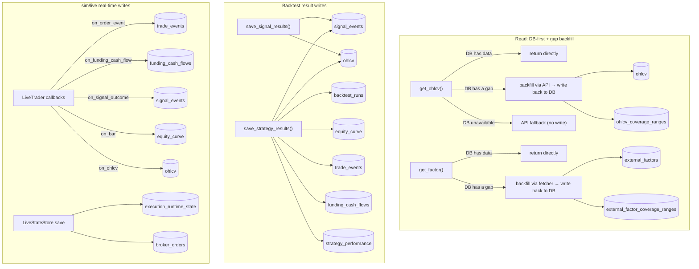

# Architecture & Naming Conventions

> **Purpose**: this is the living current-state architecture. Historical
> rationale stays in `docs/decisions/`.
>
> **Scope**: engine layering, the DB access layer, and naming conventions.
> Optional Grafana, Docker, and VM operations are documented in
> `docs/guides/optional-infrastructure.md`. Usage examples and runtime
> behavior are documented in `docs/guides/engine-usage.md`.
>
> **Language**: use English outside `docs/`; preserve each existing document's
> language. Keep current-state descriptions concise.

## Compatibility Policy Before 1.0

No downstream compatibility contract is currently declared. Until either
Librae 1.0.0 is released or an interface freeze is explicitly declared, the
repository optimizes for one clear current contract: functional, API,
configuration, persistence-shape, and test contracts may break when that keeps
the code simpler and easier to maintain.

- Keep only the current contract in production code and `tests/`. Update or
  remove stale expectations instead of adding deprecated aliases, dual-format
  parsers, compatibility branches, or migration shims.
- Tests may assert that an obsolete or malformed shape is rejected, but must
  not preserve the obsolete behavior as a supported path. Generate
  non-current-version cases relative to the current serialized version rather
  than maintaining a historical version list.
- Persisted development data and runtime checkpoints may require explicit
  external migration or removal. Never silently default a missing field from
  an older shape.

After either gate, compatibility, deprecation, and migration requirements must
be defined explicitly before further breaking changes.

## Product position and system boundaries

Librae is a dependency-light, bar-based strategy engine with two first-class
workflows:

1. deterministic in-memory backtests from caller-prepared point-in-time data;
2. restartable polling runtimes whose live portfolio state changes only from
   broker-confirmed execution reports.

The shared kernel owns strategy decisions, positions, accounting, simulated
execution, risk checks, and result schemas. It deliberately does not own data
vendor ingestion, strategy-specific feature engineering, broker-native product
semantics, infrastructure selection, or operator policy. A caller may use only
the backtest engine, or compose live adapters and optional infrastructure
through explicit constructor injection.

| Layer | Owns | Extension boundary |
|---|---|---|
| `librae/core`, `backtest`, `live` | Canonical bars, strategy decisions, accounting, execution state, risk, results | Documented public types and small call-site protocols |
| Caller/strategy project | Point-in-time data preparation, features, strategy semantics, instrument and cost configuration | Prepared DataFrames, strategy classes, injected callables and adapters |
| Reference integrations | Broker SDKs, TimescaleDB, Telegram, Grafana, CLI and deployment examples | Optional extras that may be used, replaced, or omitted |

Librae is not a general ingestion platform, streaming/tick engine, broker
abstraction framework, cross-account ledger, or hosted trading platform.
Supporting those concerns would require different clocks, data semantics, and
operational guarantees; they stay outside the kernel until a concrete engine
contract exists. Strict canonical inputs are intentional: extensibility means
normalizing at an explicit boundary, not making the engine guess arbitrary
data or broker shapes.

The dependency direction is:

```
librae/orchestration -> librae public contracts
librae/orchestration -> librae/brokers       -> librae public contracts
librae/orchestration -> librae/db            -> librae public contracts
librae/orchestration -> librae/notifications -> librae public contracts
librae/app           -> librae/db schema
librae/backtest      -> librae/core
librae/live          -> librae/core
```

Layering details in `docs/decisions/2026-03-26-platform-architecture.md`
describe the historical decision; this document remains the current source of
truth.

### Integration registration and package ownership

Automatic plugin discovery is not a supported extension boundary. Installing
an integration does not import or register it: caller-owned orchestration
explicitly imports the selected package and passes a factory, callback,
notifier, or state store. An unused integration therefore cannot break
`import librae`, and a selected integration's import or construction failure
stays at the composition boundary.

Static integration contracts live in `librae.integrations`; offline bar,
order-adapter, and execution-report checks live in `librae.testing`. Reference
implementations live in the regular `librae.brokers`, `librae.db`,
`librae.notifications`, `librae.orchestration`, and `librae.app` packages.
The distribution exposes only the `librae` top-level namespace. The former
repository-level imports are intentionally unsupported and have no
compatibility aliases. The ownership decision and migration constraints are
recorded in
`docs/decisions/2026-07-30-integration-discovery-and-packaging.md`.

## Data acquisition and ownership boundary

| Mode | Supplied by | Librae does | Librae does not |
|---|---|---|---|
| Backtest | Caller-prepared DataFrame | Validate OHLCV/features and run deterministic events | Read TimescaleDB or call a broker/vendor API |
| Sim | Injected `LiveTrader.adapter` or orchestration factory | Poll completed-bar snapshots and retain a rolling history | Subscribe to streaming ticks or ingest third-party factors |
| Live | Same as sim | Poll bars, submit orders, and require durable runtime state | Treat analytics storage as execution state |

The engine's default sim/live warm-up calls its injected adapter directly.
DB-first history plus API gap filling is a caller-owned policy injected through
`warmup_fetcher`; it is not a hidden engine fallback. The repository's
`librae.orchestration.live.build_live_trader()` factory supplies the built-in broker,
TimescaleDB, and Telegram integrations and accepts explicit third-party
adapter factories, notifier, and state store instances. Direct `LiveTrader`
construction never imports reference integrations. Sim may run in memory,
while live always requires an explicitly injected durable `state_store`.

Database-backed backtest reuse is opt-in. `config_hash` identifies resolved
engine configuration only; it does not identify caller-owned strategy code or
input data. A caller that wants cache reuse supplies one immutable
`backtest_revision` covering both, and persistence derives a separate
`backtest_cache_key` from that revision and `config_hash`. Without a revision,
the backtest executes and persists as a new run; this is a first-class
no-cache mode, not a legacy compatibility path. Librae does not inspect Git or
hash caller data implicitly.

Live checkpoint compatibility follows the same ownership boundary but uses a
separate `runtime_revision`. It is an opaque identity supplied by the caller's
orchestration and is not part of `RunConfig` or `config_hash`. Live mode
requires it, persists it in the checkpoint, and rejects a missing or different
identity before broker reconciliation or order work. The engine does not
inspect Git, package metadata, or container images to derive it.

Backtest callers may use `librae.normalize_bars()` to explicitly map common
DataFrame layouts into the canonical `(symbol, datetime)` UTC index. The
helper preserves feature columns; `Backtest` itself does not infer column
names, timestamps, symbols, or data-source semantics.

`timeframe` defines the completed strategy bar and data-event clock.
`poll_seconds` independently defines the runtime loop cadence: each cycle may
refresh active orders, run due reconciliation/heartbeat work, and check the
completed-bar endpoint. Sim/live makes it explicit and warns when it is slower
than one bar. A faster poll does not create a strategy event or an intrabar
PnL/risk mark; only a newly completed bar does. Streaming market-data
subscriptions and an independent quote-driven risk clock are not implemented.
Third-party data is joined point-in-time by the caller and returned as extra
columns from the same adapter snapshot; see
[External market data and factors](docs/guides/external-data.md).

## Broker Adapter Design (`librae/brokers/`)

- One flat adapter class per observed broker-product protocol
  (`ShioajiAdapter`, `CryptoAdapter`, `IBKRAdapter`), **duck-typed, no shared
  ABC**. A genuinely separate product API may have a focused adapter:
  `BinanceStocksAdapter` exposes only its currently implemented catalog/quote
  capabilities and is not presented as an OHLCV/order adapter. Market/account
  signatures include `fetch_ohlcv` and `info`; the public live
  `OrderAdapter` contract includes `get_position(PositionRequest)` plus
  `prepare_order`, `place_order`, `find_order`, `get_order`,
  `list_open_orders`, and `cancel_order`.
- `data_source` and `data_adapter` describe where bars come from; `broker` describes where orders go. Live execution never infers a broker from a symbol, market, or data source. Supply `RunConfig.broker`, a per-symbol `instrument_overrides[symbol]["broker"]`, or an injected `order_adapter`; an unresolved route fails at startup. An explicitly selected broker may reuse the same adapter session as market data.
- Cross-broker behavior is generalized only at an observed engine boundary. `LiveExecutor` builds one broker-neutral `PositionRequest` from the configured canonical/venue identity, currency, security type, exchange, `contract_month`/`continuous_alias`, and `CostModel.multiplier`; every adapter accepts that request and returns the same position shape. Contract lookup, broker-native symbol syntax, CCXT balance conventions, Shioaji direction enums, and IBKR `conId`/`avgCost` handling stay inside the concrete adapter. Add a shared field or helper only when more than one real adapter needs the same semantic; do not create broker hierarchies or speculative capability abstractions.
- `prepare_order` runs before durable queueing and network I/O. It applies CCXT precision plus amount/price/notional limits, Shioaji whole-lot and price-limit rules, or IBKR `ContractDetails` size increments/minimums/minimum tick. A quantity that rounds below the venue minimum fails; it is never silently submitted as zero.
- `place_order` is an order/execution-report boundary, not a boolean acknowledgement. `LiveExecutor` normalizes submitted, accepted, partial, filled, cancelled, and rejected states. A filled response must provide order id, requested/filled quantity, average execution price, broker execution timestamp, and explicit cash-currency fee/commission (zero is valid). A non-flat position snapshot must provide finite side/quantity and a positive average price; missing fields never mean flat or zero. A position snapshot must never be used to invent the missing fill price, fee, or timestamp.
- CCXT's unified order shape is normalized directly; base-currency fees are converted at the reported average price, while an unrelated fee currency fails closed. Shioaji and IBKR may initially return only an acknowledgement, so their adapters retain/query the broker trade object and enrich cumulative fills from deals/fills. If execution time or explicit commission is not yet available, the report remains invalid and no local fill is invented from order price or `CostModel`.
- `librae/brokers/base.py` only provides pieces that are genuinely shared and byte-for-byte identical: static metadata, credential loading, completed-bar filtering, and canonical order validation/rounding. `CredentialConfig.from_env(prefix)` uses `{PREFIX}_{FIELD}` (e.g. `SHIOAJI_API_KEY`, `BINANCE_API_KEY`). `CryptoAdapter`/`CryptoCredentials` are exchange-agnostic (they pick a CCXT backend via `exchange_id`); only Binance is wired up today, using `BINANCE_*` as the prefix — adding a second crypto exchange means reusing the same class with a different prefix (e.g. `OKX_*`), no changes to the shared logic needed.
- OHLCV returns a uniform schema: `[ts, open, high, low, close, volume]`, with `ts` as the UTC-aware bar-start datetime; timeframe-string conversion is shared via `librae/core/utils.py` (`interval_to_timedelta` etc.), not reimplemented per adapter.
- Where a type constraint is needed, use `typing.Protocol`, **declared minimally
  at the call site** rather than a hierarchy covering unrelated capabilities.
  Third-party packages import the stable façade in `librae.integrations`;
  optional balance reconciliation is a separate `BalanceReader` capability.
- An async-ABC layering was tried once (`MarketDataAdapter`/`OrderAdapter`/`AccountAdapter` plus a `MarketHub` for unified dispatch — see `docs/decisions/2026-03-26-market-adapter-architecture.md`), and removed because Shioaji's auth model (stateful login+CA) and CCXT's (stateless per-call REST) diverge too much, and no adapter ever actually used that layering. **The current state is flat duck-typed classes — don't reintroduce a cross-broker shared hierarchy.**
- Futures have one broker-neutral selection rule: a dated monthly/quarterly instrument must set exactly one of `contract_month="YYYYMM"` (an exact expiry) or `continuous_alias=True` (a deliberately dynamic contract). `symbol` is the opaque, unique engine/position key and is never parsed; use a readable key such as `ES_202609` when holding multiple expiries. `venue_symbol` is the broker-facing root or native contract code. Adapters translate those common facts into their native representation instead of forcing one broker's symbol grammar on every broker.
- IBKR consumes a product root in `venue_symbol` plus the separate `contract_month`. Shioaji and CCXT may instead require an exact broker-native contract code in `venue_symbol`; they still receive the common month/alias identity, but the adapter does not parse or reconstruct proprietary symbol syntax. This is one semantic interface with broker-specific resolution, not one universal ticker format.
- `IBKRAdapter` covers US stocks and futures. Stocks are SMART-routed by
  symbol; futures require `security_type="FUT"` and an exchange. Exact
  contracts use `contract_month`; only `continuous_alias=True` selects the
  nearest non-expired contract. Reconciliation matches the stable `conId`, and
  `CostModel.multiplier` must match the broker contract multiplier.
- The configured Shioaji engine account route is Taiwan futures.
  `prepare_order` rejects stock (`STK`) contracts outright — stock cash and
  reconciliation semantics are not supported; stock market data remains
  available via `fetch_ohlcv`. Futures R1/R2 contracts require `continuous_alias=True`;
  exact contracts use a non-alias `venue_symbol` and matching
  `contract_month`. Position reconciliation checks alias and target codes
  through `futopt_account`.
- `CryptoAdapter` keeps the CCXT unified symbol as `venue_symbol`. A delivery future must set `contract_month`, checked against CCXT market `expiry`; spot and perpetual markets cannot carry that field. Binance continuous klines remain a data/research API and are explicitly rejected by order/position paths instead of being mistaken for an orderable contract.

### Broker symbol discovery

`librae.available_symbols()` queries the selected broker's current catalog; it
does not copy thousands of changeable venue symbols into the built-in registry.
It returns immutable `AvailableSymbol` values with a suggested canonical key,
the adapter-facing and native symbols, instrument/asset class, expiry, current
contract rank, and verified multiplier/tick metadata when the venue supplies
them. Query matching is exact against broker id, unified symbol, base, or
base+quote so `query="MU"` cannot silently select `MUU`.

- Binance crypto discovery uses public CCXT `load_markets()` data and needs no
  API key. `asset_class="equity", kind="perpetual"` is the TradFi perpetual
  pool. Binance Stocks is a separate `/sapi/v1/equity/*` product:
  `kind="spot", asset_class="equity"` uses its API-key-authenticated
  `exchangeInfo` catalog and plain tickers such as `MU`/`GOOGL` (the website's
  `EQ_GOOGL` is a page route, not the API symbol). Its current REST API exposes
  latest quotes but no historical OHLCV, so discovery does not fabricate a
  built-in `RunConfig` bar route. Binance discovery requires an explicit
  `kind`; spot discovery also requires `asset_class` so separate product
  catalogs are never silently omitted.
- Shioaji discovery uses the authenticated session's
  `contracts.futures(root)` result, including exact contracts and native R1/R2
  aliases.
- IBKR discovery uses the connected read-only TWS/Gateway session's
  `reqContractDetails`. Futures require an exchange.

`contract_rank=0/1` identifies the current nearest/next listed exact contract
in that catalog snapshot. Selecting such a dated result pins its
`contract_month`; it does not roll later. A venue-native R1/R2 result has
`continuous_alias=True` and may change its target. This distinction prevents a
discovery convenience from silently changing live exposure.

Discovery can feed an adapter directly without YAML:

```python
from librae.brokers.crypto_adapter import CryptoAdapter
from librae import available_symbols

binance = CryptoAdapter(exchange_id="binance")
btc = available_symbols(
    "binance",
    query="BTCUSDT",
    kind="perpetual",
    asset_class="crypto",
    adapter=binance,
)
btc_perpetual = btc[0]
bars = binance.fetch_ohlcv(
    btc_perpetual.venue_symbol,
    "1h",
    limit=500,
    **btc_perpetual.market_data_kwargs(),
)
```

For a `RunConfig`, use `candidate.canonical_symbol`,
`candidate.instrument_override()`, and `candidate.cost_override()` to build the
two existing per-symbol maps programmatically. Discovery never guesses
commission, tax, margin policy, account, or trading calendar.

### Broker API compatibility

Broker integration compatibility has two independently maintained boundaries:

- `pyproject.toml` declares the tested SDK API family with both lower and upper
  bounds (`ccxt`, `shioaji`, `ib-async`); `uv.lock` pins the exact repository
  development/deployment versions. SDK contract tests construct and call the
  concrete SDK surfaces Librae depends on. An SDK range update is therefore an
  explicit compatibility change with tests, not an incidental install-time
  upgrade.
- Broker-hosted REST/socket API versions are not Python packages and do not
  belong in TOML. Versioned endpoint paths and adapter parsers are maintained
  in code. For example, Binance Stocks records official schema `1.0.0` and
  calls `/sapi/v1/equity/*`; broker changelogs plus integration/contract tests
  govern upgrades. If a broker provides no version negotiation, Librae must
  fail on an incompatible response shape rather than silently reinterpret it.

Librae owns compatibility of its adapters with the declared SDK and broker API
contracts. Users own credentials, account permissions, jurisdiction/product
eligibility, broker-side enablement, and upgrades made outside the lockfile.

## Engine design (`librae/`)

### Layout

```
librae/
├── core/                     shared domain model (pure computation, no I/O)
│   ├── strategy.py           Strategy, OrderIntent, PortfolioWeights, Context, Position, PositionState, Fill
│   ├── executor.py           simulated matching plus apply_execution_fill for externally confirmed fills
│   ├── cost_model.py         CostModel (commission / slippage / tax / contract multiplier / margin)
│   ├── metrics.py            performance metrics + on-demand trade/signal outcome analysis
│   ├── run_config.py         RunConfig + ExecutionPolicy + RiskPolicy — typed run parameters
│   └── utils.py              generate_run_id, infer_timeframe, to_ccxt, to_canonical
│
├── artifacts.py              format-neutral manifest + tabular research/export boundary
├── data.py                   explicit caller-side bar normalization
├── integrations.py           stable public protocols and broker value types
├── testing.py                offline third-party adapter conformance helpers
│
├── backtest/                 backtest runtime
│   ├── engine.py             Backtest — bar-by-bar execution + optional position snapshots + build_output()
│   ├── result.py             raw side-effect-free backtest result models
│   ├── schema.py             BacktestOutput, RunMetadata, StrategyMetrics, OrderEventRecord, PositionSnapshotPoint
│   └── charts.py             plot_kbars — overlays order_events entries/exits via lightweight-charts (pure rendering, no recomputation, for local research; [extra: viz])
│
├── live/                     real-time / sim runtime
│   ├── engine.py             LiveTrader — data-driven multi-symbol polling events
│   ├── executor.py           OrderRequest/ExecutionReport + LiveExecutor normalization
│   └── state.py              restart checkpoint types + LiveStateStore protocol
│
└── config/                   configuration management
    ├── market_config.py      MarketConfig dataclass + built-in market registry (costs, tick size, margin rates)
    └── symbols.py            SymbolInfo dataclass + built-in symbol registry (symbol → market/data_source/multiplier)
```

`librae/core/trading_calendar.py` owns session labels and session-aligned
resampling; `librae/core/liquidity.py` owns lagged completed-session ADV.
Neither belongs in a broker adapter or strategy. `librae/config/symbols.py`
owns each instrument's `calendar_id`. Package dependencies follow
[Product position and system boundaries](#product-position-and-system-boundaries).

### Execution flow (strategy → engine → output)

This is a different thing from the "Data flow" section below: that one is about the read/write pipeline between DB tables; this one is the call sequence within a single run, from strategy code to the final result.

```
Strategy ETL (utils.py)  →  DataFrame (MultiIndex + signal columns)
                              ↓
Strategy logic (strategy.py)  →  on_bar(ctx) → list[OrderIntent] (optionally group_id-tagged) | PortfolioWeights
                              ↓
Engine (engine.py)     →  execute_order_intents / execute_portfolio_weights
                              ↓
Output (build_output)  →  BacktestOutput (metrics + equity/position/allocation facts + events)
```

The lifecycle terminology and breaking migration are recorded in
[`2026-07-28-strategy-decision-execution-naming.md`](docs/decisions/2026-07-28-strategy-decision-execution-naming.md).
Run configuration, metadata, and shared-type SSOT decisions are recorded in
[`2026-07-28-run-contract-ssot.md`](docs/decisions/2026-07-28-run-contract-ssot.md).

### Usage

Concrete usage examples and runtime behavior (backtest/live call patterns,
execution policy, risk controls, funding, reconciliation, staleness
detection, monitoring) moved to
[`docs/guides/engine-usage.md`](docs/guides/engine-usage.md) to keep this
document scoped to layering, boundaries, and naming conventions.

### Core types

#### Strategy layer

| Type | Description |
|------|------|
| `Strategy` | abstract base class, implements `on_bar(ctx) -> list[OrderIntent] \| PortfolioWeights` |
| `Context` | immutable event snapshot: current bars, positions, one account snapshot, and callback period index |
| `StrategyDecision` | return type: `list[OrderIntent] \| PortfolioWeights`; `[]` means no decision |
| `PositionSide` / `OrderAction` / `PositionEventType` | canonical literals reused by strategy, execution, live, and persistence schemas |
| `OrderIntent` | symbol-level instruction: `action` = long / short / close; `group_id` ties it to other intents in the same decision that must fill together atomically; `time_in_force` (`day`/`gtc`/`ioc`/`fok`) is a live-only broker hint, ignored by backtest/sim |
| `PortfolioWeights` | timestamped portfolio weights: next-bar resolution in backtest/sim, immediate market-order sizing in live |
| `Position` | frozen position (what the strategy sees): symbol, side, entry_price, quantity, unrealized_pnl |
| `PositionState` | mutable position (engine-internal): tracks periods_held, entry_commission, entry_slippage, entry_tax, total_entry_cost |

#### Execution layer

| Type | Description |
|------|------|
| `Fill` | fill report: price, quantity, commission, slippage, tax |
| `OrderRequest` | live broker request: client id, canonical + venue symbol, side/quantity, position effect, market or limit, submission time, time_in_force (resolved to `ioc`/`day` by order type when unset) |
| `PositionRequest` | broker-neutral live reconciliation identity: canonical + venue symbol, currency, multiplier, and concrete routing fields |
| `ExecutionReport` | normalized live state: submitted/accepted/partial/cancel_pending/filled/cancelled/rejected plus confirmed execution facts |
| `TradeResult` | completed trade: full entry/exit info + PnL + periods_held |
| `TradePnL` | PnL breakdown: gross_pnl, net_pnl, commission, slippage, tax |
| `CostModel` | cost model (frozen): multiplier, commission_rate, slippage_ticks, tick_size, tax, long/short_margin_rate, volume_impact_ticks (extra ticks at 100% bar participation, default 0 = off), maintenance_margin_rate (default 0 = liquidation simulation off) |
| `ExecutionPolicy` | run-wide default fill field, liquidity caps, validated warmup retention, and optional local live-order timeout |
| `RiskPolicy` | optional engine-level position, exposure, drawdown, order-notional, and live limit-price controls |
| `RuntimePolicy` | sim/live polling cadence, reconciliation cadence, and market-data worker count; excluded from execution identity |

#### Output layer

| Type | Description |
|------|------|
| `BacktestOutput` | run metadata, one account's performance, currency-labelled order events, and optional position/allocation snapshots |
| `TabularArtifact` | versioned manifest plus logical DataFrames for caller-selected local serialization |
| `AccountPerformance` | one account's currency, initial cash, final equity, net PnL, equity curve, and metrics |
| `RunMetadata` | run_id, strategy, symbols, timeframe, mode, data source, and start/end/run timestamps |
| `StrategyMetrics` | generic period-return, trade, risk, cost, turnover, exposure, and concentration metrics |
| `OrderEventRecord` | position lifecycle event (open/add/reduce/close); commission/slippage/tax belong only to that execution, while close/reduce records also persist their prorated entry costs for exact KPI refresh |
| `EquityCurvePoint` | per-event equity, return, drawdown, gross/net exposure, concentration, and turnover |
| `PositionSnapshotPoint` | per-bar position quantity, signed market value, and realized weight |
| `AllocationSnapshotPoint` | per-event target weight, achieved weight, and drift for one symbol |

#### Shared functions

| Function | Description |
|------|------|
| `simulate_fill(intent, price, cash, cost_model)` | build a deterministic simulated fill |
| `calc_equity(cash, positions, ...)` | calculate mark-to-market equity and the immutable strategy snapshot |
| `execute_order_intents(intents, ...)` | deterministic simulated intent matching; also reused on a copy for live request sizing |
| `execute_portfolio_weights(targets, ...)` | deterministic weight sizing and reduce-then-add planning |
| `apply_execution_fill(...)` | apply an externally confirmed price/quantity/cost/timestamp without re-simulating it |
| `close_position(pos, exit_price, cost_model)` | close-out PnL + proceeds |
| `available_metrics(kind=...)` | list supported summary or series metric names without computing them |
| `summarize_performance(period_returns, ...)` | selectable full-sample metrics over caller-aligned return columns; no annualization |
| `compute_performance_series(period_returns, ...)` | selectable return, wealth, cumulative-return, and drawdown paths |
| `queue_market_exit_all(positions, reason=...)` | queues completed-bar risk decisions for the next observed open |
| `liquidate_all(positions, bars, ts, ...)` | liquidity-aware terminal close under the documented end-of-run convention |
| `scale_into_position(pos, fill, cost_model)` | add to a position in the same direction (weighted-average entry) |
| `reduce_position(pos, closed_qty)` | pro-rate position state after a partial close |
| `calc_trade_pnl(...)` | single-trade PnL breakdown |
| `compute_all(equity_values, timestamps, trade_pnls, ...)` | dependency-light performance calculation |
| `side_multiplier(side)` | `"long"` → +1.0, `"short"` → -1.0 |

### Design decisions

- **Primitive signature**: `compute_all()` accepts `Sequence[float]` / `Sequence[datetime]` rather than depending on `BacktestResult`, so the live engine can call it directly too.
- **Optional integrations, caller-owned reporting**: core metrics use NumPy;
  exchange calendars, CLI YAML, DB, broker, and notification dependencies are
  loaded only by their opt-in features. `librae/core/metrics.py` computes
  (DataFrames/primitives, no chart dependency); charting/HTML reports on top
  of that are not a librae feature at all — `librae.plot_kbars` (K-line/marker
  overlay) is the one chart librae ships, since there is essentially one
  correct way to draw it. See `examples/trade_report.py` for the caller-owned
  pattern and
  [Product position and system boundaries](#product-position-and-system-boundaries).
- **PositionState in core**: backtest and live share the same mutable position type, tracking `total_entry_cost` to avoid float drift when scaling.
- **Pre-computed bars**: `_precompute_bars()` converts the DataFrame to a dict-of-dicts once up front, avoiding a per-bar `to_dict()` call in the hot loop.
- **Immutable engine output**: frozen result dataclasses use tuple collections in engine-produced `BacktestOutput`; `Context` and `PortfolioWeights.weights` expose read-only mappings. Mutable `PositionState` remains internal.
- **Unified margin-rate formula**: `margin_rate` = the fraction of notional that actually leaves available cash. On entry, `cash -= notional * margin_rate + costs`; on exit, `proceeds = notional * margin_rate + gross_pnl - exit_costs`; equity's `mtm += unrealized + notional * margin_rate`. One formula covers spot (1.0), US short selling (0.5, Reg T), Taiwan margin short selling (0.9), and futures (0.067). Callers can override the default via `cost_overrides`.

### Config API

> For installation extras and environment-loading behavior, see [Getting started](docs/getting-started.md). This section is the internal code-level Config API.

#### Engine configuration and repository options

`RunConfig` contains only inputs that define engine behavior, results, or live
runtime policy. `librae.orchestration.cli.build_run()` returns it together with a
`RunOptions` value for repository-owned behavior such as TimescaleDB wiring,
dry-run notification suppression, caller-owned backtest revision, and
replacement of an existing cached run. Direct library users can construct
`RunConfig` without importing the orchestration package.

#### MarketConfig (market costs)

Default source: `librae/config/market_config.py`'s built-in registry; you can also bypass it entirely and pass in your own (common when using librae as an external package):

```python
from librae.config.market_config import get_market
from librae.core.cost_model import CostModel

market = get_market("crypto")            # → MarketConfig (from librae's built-in registry)
cost_model = CostModel.from_market(market, multiplier=1.0)

# Or: register your own markets, with no dependency on librae's built-in registry
my_markets = {"my_market": MarketConfig(name="my_market", commission_rate=0.001, ...)}
market = get_market("my_market", markets=my_markets)
cost_model = CostModel.from_config(config, markets=my_markets)
```

#### Per-symbol overrides (`RunConfig.symbol_cost_overrides`)

`CostModel.from_config(config, symbol=...)` resolves one symbol's cost model with priority: explicit `override=` > `config.symbol_cost_overrides[symbol]` > `config.cost_overrides` (run-wide fallback) > the built-in symbol registry (`spot` auto-`multiplier=1.0`, `contract_*` required-explicit) > market-level defaults. `symbol` defaults to `config.symbol` (`symbols[0]`) when omitted.

`Backtest.__init__` calls this once per symbol in the run (not just `config.symbol`) whenever `config=` is used and no explicit `cost_model=` override is given — a multi-asset run mixing symbols with different multipliers (e.g. `tw_futures`: TXFR1=200 + MXFR1=50 in the same run) gets each symbol's own multiplier automatically, not just the first symbol's applied to everyone.

```python
config = RunConfig(
    ...,
    symbols=["TXFR1", "MXFR1"],
    market="tw_futures",
    symbol_cost_overrides={"MXFR1": {"multiplier": 55.0}},  # override just this one symbol
)
```

This is the mechanism for registering a symbol librae doesn't know about (`pip install`ed with nothing to edit, or a one-off backtest) — `symbol_cost_overrides={"MYSYM": {"multiplier": 1.0}}` needs no file, no path parameter, nothing beyond the `RunConfig` you're already passing to `Backtest`/`LiveTrader`.

Routing metadata is intentionally separate from accounting overrides:

```yaml
strategy:
  symbols: [MU]
  account:
    account_id: ibkr_main
    currency: USD
    initial_cash: 100000
  market: us_equity
  data_source: ibkr
  broker: ibkr              # explicit execution choice; no symbol fallback
  instrument_overrides:
    MU:
      data_adapter: ibkr
      venue_symbol: MU
      currency: USD
      security_type: STK
```

An exact IBKR future keeps engine identity separate from venue resolution:

```yaml
strategy:
  symbols: [ES_202609]       # opaque, unique engine/position key
  market: us_futures
  data_source: ibkr
  broker: ibkr
  instrument_overrides:
    ES_202609:
      data_adapter: ibkr
      venue_symbol: ES       # broker product root
      currency: USD
      instrument_type: contract_quarterly
      security_type: FUT
      exchange: CME
      contract_month: "202609"
  symbol_cost_overrides:
    ES_202609:
      multiplier: 50
```

For a rolling route, omit `contract_month` and set
`continuous_alias: true`. For two expiries, configure two unique canonical
symbols (for example `ES_202609` and `ES_202612`); no code infers expiry from
those names.

For a multi-broker run, omit the run-wide `broker` and set
`instrument_overrides.<symbol>.broker` for every symbol. Registered symbol
metadata may supply market/data identifiers and contract economics, but never
selects an execution broker. An unregistered live symbol must explicitly
declare `instrument_type` and `currency`; an IBKR route must also declare
`security_type` and a futures `exchange`. These are execution/accounting facts,
so they are not guessed from multiplier, market name, or ticker shape.

One run maps its single account to one order-adapter instance. Separate broker
accounts or currencies require separate `RunConfig` and runner instances so
reconciliation cannot double-count balances or imply shared funding. A caller
may group those runs for UI or database reporting, but combined PnL, Sharpe,
drawdown, and reporting-currency conversion remain caller-owned.

#### TelegramAdapter (notifications)

Source: behavior is configured from the caller's `config.yaml` `telegram:`
block (held by `RunOptions.telegram_config` and passed explicitly to the
orchestration factory), and secrets come from environment variables.
`librae.orchestration.live.build_live_trader()` builds this reference notifier;
`LiveTrader` only receives the resulting object.

```python
from librae.notifications.config import TelegramConfig
from librae.notifications.telegram import TelegramAdapter, TelegramCredentials

config = TelegramConfig.from_dict(yaml_dict.get("telegram", {}))
creds = TelegramCredentials.from_env("TELEGRAM")
adapter = TelegramAdapter(config=config, credentials=creds)
```

`TelegramAdapter` methods and their corresponding flags (defined in `librae/notifications/config.py`):

| Method | Flag | Default |
|------|------|------|
| `send_signal()` | `notifications.signal` | `True` |
| `send_startup()` / `send_shutdown()` | `notifications.startup` | `True` |
| `send_alert()` | `notifications.error` | `True` |
| `send_status()` | `notifications.status.enabled` | `False` |

#### LiveTrader callback signatures (writing your own db sink or notifier)

`LiveTrader`'s constructor injection points (summarized in `docs/guides/optional-infrastructure.md`) use small protocols or exact callback aliases. They are defined in `librae/live/interfaces.py`, `librae/live/executor.py`, and `librae/live/state.py`. This table is the actual call signature for each.

| Param | Called as |
|---|---|
| `adapter` | callable `adapter(symbol, timeframe, limit, *, drop_incomplete=False) -> pd.DataFrame`, a concrete object with `fetch_ohlcv`, or a per-symbol mapping; UTC `ts` + OHLCV are required and extra point-in-time columns are preserved |
| `on_bar` | `on_bar(run_id, ts, account_id, currency, equity, drawdown, period_return, gross_exposure, net_exposure, concentration, turnover)` |
| `on_order_event` | `on_order_event(event, sequence)` — an `OrderEvent` plus its restart-stable sequence; fires on open/add/reduce/close |
| `on_funding_cash_flow` | `on_funding_cash_flow(cash_flow)` — a `FundingCashFlow`; simulation only |
| `on_ohlcv` | `on_ohlcv(symbol, timeframe, bar, ts)` — `bar` is a dict of OHLCV fields |
| `on_signal_outcome` | `on_signal_outcome(symbol, ts, signal, price)`; exits pass an extra `signal_type="exit"` kwarg |
| `on_heartbeat` | `on_heartbeat(run_id)` |
| `on_performance` | `on_performance(run_id, account_id)` after a close/reduce/funding event and the current equity callback |
| `warmup_fetcher` | `warmup_fetcher(symbol, tf_ccxt, limit) -> pd.DataFrame` |
| `order_adapter` | `prepare_order(signal)`, `place_order(signal)`, `find_order(client_order_id, symbol)`, `get_order(order_id, symbol)`, `list_open_orders(symbol)`, `cancel_order(order_id, symbol)`, plus mandatory live reconciliation `get_position(PositionRequest)`; all order results follow the cumulative execution-report contract above |
| `state_store` | `load(state_key) -> LiveRuntimeState \| None`; `save(state, orders=())` atomically checkpoints state and upserts changed order facts |
| `runtime_revision` | caller-owned opaque code/image identity; required in live mode and checked against restored state before broker access |
| `notifier` | not a plain callable — needs an `.enabled: bool` attribute plus the 5 methods below, each invoked via `getattr(notifier, method_name)(**kwargs)` on a background thread (fire-and-forget) |
| `status_interval_periods` | optional positive polling-period count for status notifications; scheduling is independent of notifier transport configuration |

`notifier`'s 5 methods, with their exact kwargs:

| Method | kwargs |
|---|---|
| `send_signal` | `strategy, symbol, side, price` |
| `send_startup` | `strategy, symbol, mode, run_id` |
| `send_shutdown` | `strategy, symbol, reason` |
| `send_alert` | `title, message` |
| `send_status` | `strategy, symbol, equity, drawdown, daily_pnl, position` |

All integrations default to `None` in direct `LiveTrader` construction except
the required market-data adapter. Live mode rejects construction without an
order adapter and durable state store. The orchestration factory is the only
place that selects the repository's built-in implementations.

#### parse_with_config (CLI + YAML merging)

A strategy's `run.py` uses this set of functions to merge CLI args with config.yaml.
Nested blocks like `telegram` are automatically split off as a dict, bypassing argparse.

```python
from librae.orchestration.cli import base_parser, parse_with_config, setup_logging

p = base_parser("My strategy")
args = parse_with_config(p, config_path=Path(__file__).parent / "config.yaml")
# args.mode, args.dry_run      ← runtime flags (argparse)
# args.strategy                ← dict from config.yaml's strategy: block
# args.telegram                ← dict from config.yaml's telegram: block
```

## Optional reference database flows

These are optional persistence integrations, not the engine's acquisition
path. `get_ohlcv()`/`get_factor()` are external, caller-owned functions (not
shipped by Librae); the first subgraph only illustrates how such a data layer
could use the reference `librae/db/` primitives. The other subgraphs show optional
engine result/runtime writes.



## Database design conventions

### Table naming rules

| Type | Rule | Example |
|---|---|---|
| Discrete event/record table (each row is one independently-occurring event or record) | plural | `backtest_runs`, `trade_events`, `signal_events`, `ohlcv_coverage_ranges` |
| Domain term for a continuous time series as a whole (each row is one point in the series, but the table name refers to the series itself) | keep the domain's conventional singular term | `equity_curve`, `ohlcv` |
| Singleton state table (one current snapshot per key) | singular | `execution_runtime_state` |

### Timestamp naming rules

**`ts` is reserved exclusively for a hypertable's time dimension column** (the partition key on `ohlcv`/`equity_curve`/`trade_events`/`funding_cash_flows`/`signal_events`, representing "when this row happened").
**Every other point-in-time metadata field uses the `_at` suffix**, consistently — even when it's a query range filter parameter (e.g. `load_ohlcv(started_at=..., ended_at=...)`), to avoid the same root word being called `ts` in one function signature and something else in another.

| Field | Meaning | Where it appears |
|---|---|---|
| `started_at` | start of a run's data range | `backtest_runs`, `RunMetadata`, `load_ohlcv()` query params |
| `ended_at` | end of a run's data range | same as above |
| `run_at` | when the run was executed/created | `backtest_runs`, `RunMetadata` |
| `entry_at` | when a position was entered | `trade_events`, `Position`, `PositionState`, `TradeResult`, `OrderEvent`, `OrderEventRecord` |
| `exit_at` | when a trade was exited | `TradeResult` |
| `last_heartbeat_at` | last time the running process reported itself alive | `backtest_runs` |
| `range_started_at` | start of a cache coverage range | `ohlcv_coverage_ranges` |
| `range_ended_at` | end of a cache coverage range | `ohlcv_coverage_ranges` |

### Current 13 tables

| Table | Purpose | PK / FK | Hypertable |
|---|---|---|---|
| `backtest_runs` | run hub and resolved strategy/execution/risk configuration, 1 row / run | PK `run_id` | no |
| `equity_curve` | currency-labeled per-account equity, return, drawdown, exposure-state, concentration, and turnover | unique `(run_id, account_id, ts)`; `run_id` FK → `backtest_runs` CASCADE | yes (`ts`) |
| `trade_events` | currency-labeled account position lifecycle events (open/add/reduce/close), including exit execution costs and prorated entry costs on closes | FK `run_id` (nullable) | yes (`ts`) |
| `funding_cash_flows` | applied perpetual-funding rate, mark, position, multiplier, and account cash flow | unique `(run_id, account_id, symbol, ts)`; `run_id` FK → `backtest_runs` CASCADE | yes (`ts`) |
| `strategy_performance` | currency-labeled generic period, trade, PnL, cost, and portfolio diagnostics, 1 row / account / run | PK `(run_id, account_id)`; `run_id` FK → `backtest_runs` CASCADE | no |
| `ohlcv` | shared market data (`get_ohlcv()` cache) | no FK | yes (`ts`) |
| `signal_events` | signal-quality monitoring (the strategy's raw signals, not fill records) | FK `run_id` (nullable) | yes (`ts`) |
| `ohlcv_coverage_ranges` | tracks `get_ohlcv()`'s cache coverage ranges (one row per range) | no FK | no |
| `external_factors` | third-party factor data (funding rate, open interest, ...) — a long table with a uniform schema, so new data sources need no migration; `get_factor()` writes to it automatically | no FK (unique index: ts+symbol+factor_name+source+instrument_type) | yes (`ts`) |
| `external_factor_coverage_ranges` | tracks `get_factor()`'s cache coverage ranges, same mechanism as `ohlcv_coverage_ranges` | no FK | no |
| `factor_registry` | one row per `factor_name` — its update frequency + source, domain knowledge written once via `write_factor_registry()`, not inferred from `ts` gaps (unreliable for sparsely-sampled factors) | PK `factor_name` | no |
| `execution_runtime_state` | latest durable sim/live checkpoint, one row per strategy state key | PK `state_key`, FK `run_id` → `backtest_runs` CASCADE | no |
| `broker_orders` | durable broker order lifecycle records | PK `state_key` + `client_order_id` | no |

`backtest_runs.symbols` is a JSON array and is the run-universe SSOT; there is
no separate primary-symbol column. Single-asset convenience remains
`RunConfig.symbol` in memory. The table stores `params`, `execution_policy`,
and `risk_policy` in separate JSONB columns so strategy logic, fill
assumptions, and portfolio limits cannot drift into one untyped bag.
`config_hash` remains a non-unique configuration identity for analysis.
`backtest_revision` records the caller-owned code/data fingerprint, and the
nullable unique `backtest_cache_key` is the only backtest deduplication
identity. Sim/live state continues to use `mode:config_hash`.

`signal_events` and `ohlcv` are the source facts for signal-quality analysis.
Forward return, MFE, and MAE are derived on demand: local callers use
`compute_signal_outcomes()` on one symbol at a time, while the optional Grafana
dashboard uses its PostgreSQL query path. Both follow the same observed-bar,
direction, zero-floor excursion, and unit-conversion contract; no derived
outcome table is maintained.

### Handling quantity ambiguity

When one record holds both values, distinguish:

- `fill_quantity` — the quantity filled in this event
- `remaining_quantity` — the remaining position size after the event

Types with only one quantity keep the name `quantity`.

### Scalar counts are never plural

Use `periods_held` for the scalar number of bars a position was held.

### Return-rate naming

`period_return`: the return for each observation, not tied to any specific
frequency word. A timeframe can be 1h, 4h, 1d, or caller-defined, so the name
must not imply a daily or annual convention.

## Python database helper conventions

Exact prefix definitions live beside the implementation in
[`timescale_writer.py`](librae/db/timescale_writer.py) and
[`timescale_reader.py`](librae/db/timescale_reader.py). Writer helpers
distinguish single-table writes, partial updates, read-modify-write merges,
multi-table saves, and aggregate refreshes. Reader helpers distinguish small
lookups, DataFrame loads, and derived results.

Backtest and signal-result persistence serialize writers for the same
non-null `backtest_cache_key` with a transaction-scoped PostgreSQL advisory
lock. After taking the lock, a normal duplicate writer skips the complete run
without writing partial child rows. An explicit force recompute deletes and
replaces the prior canonical run for that cache key in the same transaction,
so rollback restores the prior run if the replacement fails. A null key means
cache reuse is disabled and does not serialize otherwise equal configurations.

`write_ohlcv()` and `write_external_factor()` keep the earliest value on a
primary-key conflict. Later source corrections do not silently rewrite stored
point-in-time observations.

## Maintenance rules

1. Update this document with every table or column change. Keep exact helper
   prefixes in the reader and writer module docstrings.
2. Apply the quantity and timestamp naming rules consistently.
3. Record a changed naming rule in `docs/decisions/`, then keep only the new
   current state here.
