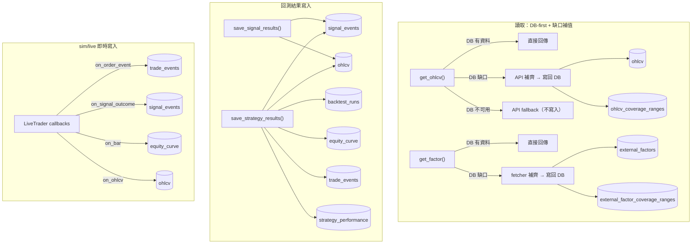

# Architecture & Naming Conventions

> **文件定位**：這是一份**持續更新的現況文件**，反映系統目前的架構與命名慣例，隨程式碼演進直接修改本檔。
> 這與 `docs/decisions/`（決策當下存證、寫下後不回溯修改）性質相反 —— 本檔只承載「現在是什麼」，
> 命名規則背後「為什麼」的決策脈絡留在對應的 decision 文件，本檔用連結交叉引用。
>
> 新增/修改 table、column、`db/` 讀寫函數時，**必須同步更新本文件**。若命名規則本身改變（而非新增條目），
> 視情況在 `docs/decisions/` 補一份新的 decision 記錄「為什麼改」。

## 部署拓樸（本機 / VM / 交易所）


- **本機**：策略開發、回測、資料抓取都在這裡；OHLCV 快取進 DB 避免重複打 API。本機的 Shioaji/Binance key 一律唯讀，不下真單。
- **VM**：只裝 Docker，跑 TimescaleDB + Grafana，可選常駐一個 trade 容器做真實下單（Binance/Shioaji live）。交易 key（含 Shioaji CA 憑證）只存在 VM 上，細節見下方「VM 部署與策略管理」。**不 clone repo**，靠 Tailscale 私有網路連線，密碼/程式碼都不落地到 VM 之外的地方。
- **Grafana**：本機開（幾乎不吃資源，直接查遠端 DB）或放 VM 上皆可。

## 系統分層概覽

```
brokers (券商/交易所 adapter)  →  librae (core → backtest / live)  →  db (timescale_writer / timescale_reader)  →  Grafana / Streamlit
```

- `brokers/`：每個券商/交易所一個 adapter（`ShioajiAdapter`、`CryptoAdapter`），提供 `fetch_ohlcv` / `place_order` / `get_position` / `info`，供 live engine 抓資料與下單。設計細節見下方「Broker Adapter 設計」。
- `librae/core/`：策略執行的共用邏輯（`strategy.py` 定義 Position/Action/Fill，`executor.py` 定義 TradeResult/OrderEvent 與撮合邏輯），backtest 與 live 共用。
- `librae/backtest/engine.py`：逐 bar 回測引擎，產出 `BacktestOutput`（`librae/backtest/schema.py` 定義的 DB 持久化用 dataclass：RunMetadata/EquityCurvePoint/OrderEventRecord/StrategyMetrics）。
- `librae/live/engine.py`：sim/live 模式的即時輪詢引擎，同一份 executor 邏輯，即時寫入 DB，資料/下單透過 `brokers/` adapter。
- `db/timescale_writer.py` / `db/timescale_reader.py`：唯一的 DB 存取層，上層一律透過這裡讀寫，不直接下 SQL。
- Grafana（`app/grafana/generate_dashboards.py` 產生 JSON）與 Streamlit：下游視覺化，直接查詢 TimescaleDB。

分層細節與四層分離的決策脈絡見 `docs/decisions/2026-03-26-platform-architecture.md`（現況已用 librae 取代文件中提到的舊執行層）。

## Broker Adapter 設計（`brokers/`）

- 每個券商/交易所一個扁平 adapter class（`ShioajiAdapter`、`CryptoAdapter`），**duck-typed，不繼承共同 ABC**。共同方法簽章：`fetch_ohlcv(symbol, timeframe, ...) -> pd.DataFrame`、`place_order(signal: dict) -> dict`、`get_position(symbol) -> dict`、`info() -> AdapterInfo`。
- `brokers/base.py` 只提供兩個真正共用、逐字相同的部分：`AdapterInfo`（靜態 metadata）與 `CredentialConfig.from_env(prefix)`（env var 讀取慣例 `{PREFIX}_{FIELD}`，`prefix` 由呼叫端指定，例：`SHIOAJI_API_KEY`、`BINANCE_API_KEY`）。`CryptoAdapter`/`CryptoCredentials` 本身跟交易所無關（靠 `exchange_id` 選 CCXT 後端），目前只接了 Binance，用 `BINANCE_*` 當 prefix；之後加第二個 crypto 交易所，走同一個 class、換一個 prefix（例如 `OKX_*`）即可，不用改共用邏輯。
- OHLCV 回傳統一 schema：`[ts, open, high, low, close, volume]`，`ts` 為 UTC-aware datetime；timeframe 字串轉換共用 `librae/core/utils.py`（`interval_to_timedelta` 等），不在各 adapter 重複實作。
- 需要型別約束時用 `typing.Protocol`，**在呼叫端就近宣告最小介面**，不做涵蓋全部能力的共用介面 —— 例如 `librae/live/executor.py` 的 `OrderAdapter` Protocol 只宣告 `place_order`，因為 executor 只用到這個方法。
- 曾嘗試以 async ABC 分層（`MarketDataAdapter`/`OrderAdapter`/`AccountAdapter`）搭配 `MarketHub` 統一 dispatch（見 `docs/decisions/2026-03-26-market-adapter-architecture.md`），因 Shioaji（stateful login+CA）與 CCXT（stateless per-call REST）的 auth 模型差異太大、且無 adapter 真正使用該分層而移除；**現況以扁平 duck-typed class 為準，不要重新引入跨券商的共用階層**。

## 資料流

三個獨立的資料流各自畫一個子圖（同名節點在不同子圖裡代表同一張表，只是拆開避免線交錯，實際 schema 以下面「資料庫設計規範」為準）：



## 資料庫設計規範

### 資料表命名規則

| 類型 | 規則 | 範例 |
|---|---|---|
| 離散事件/紀錄表（每列代表一次獨立發生的事件或紀錄） | 複數 | `backtest_runs`, `trade_events`, `signal_events`, `ohlcv_coverage_ranges` |
| 代表連續時序整體的領域慣用詞（每列是整體序列的一個點，但表名指稱的是序列本身） | 維持領域單數慣用詞 | `equity_curve`, `ohlcv` |

### 時間戳記命名規則

**`ts` 只保留給 hypertable 的時間維度欄位**（`ohlcv`/`equity_curve`/`trade_events`/`signal_events` 的分區鍵，代表「這一列發生的時間」）。
**所有其他時間點中繼資料一律用 `_at` 後綴**，即使是作為查詢範圍過濾參數（例如 `load_ohlcv(started_at=..., ended_at=...)`）也一致套用，避免同一個字根在不同函式簽章裡時而叫 `ts` 時而叫別的名字。

| 欄位 | 意義 | 出現位置 |
|---|---|---|
| `started_at` | run 的資料區間起點 | `backtest_runs`, `RunMetadata`, `load_ohlcv()` 查詢參數 |
| `ended_at` | run 的資料區間終點 | 同上 |
| `run_at` | run 被執行/建立的時間 | `backtest_runs`, `RunMetadata` |
| `entry_at` | 部位進場時間 | `trade_events`, `Position`, `PositionState`, `TradeResult`, `OrderEvent`, `OrderEventRecord` |
| `exit_at` | 交易出場時間 | `TradeResult` |
| `last_heartbeat_at` | 執行程序最後一次回報存活的時間 | `backtest_runs` |
| `range_started_at` | 快取覆蓋區間起點 | `ohlcv_coverage_ranges` |
| `range_ended_at` | 快取覆蓋區間終點 | `ohlcv_coverage_ranges` |

### 現行 9 張表一覽

| 表名 | 用途 | PK / FK | Hypertable |
|---|---|---|---|
| `backtest_runs` | Run 中樞，1 row / run | PK `run_id` | 否 |
| `equity_curve` | 每 bar 淨值 | FK `run_id` → `backtest_runs` CASCADE | 是（`ts`） |
| `trade_events` | 部位生命週期事件（open/add/reduce/close） | FK `run_id`（nullable） | 是（`ts`） |
| `strategy_performance` | 聚合 KPI，1 row / run | PK+FK `run_id` → `backtest_runs` CASCADE | 否 |
| `ohlcv` | 共用市場資料（`get_ohlcv()` cache） | 無 FK | 是（`ts`） |
| `signal_events` | 訊號品質監控（策略原始訊號，非成交紀錄） | FK `run_id`（nullable） | 是（`ts`） |
| `ohlcv_coverage_ranges` | `get_ohlcv()` 快取覆蓋區間追蹤（每列一個 range） | 無 FK | 否 |
| `external_factors` | 第三方因子資料（funding rate、open interest...），一致 schema 的 long table，新資料源不用 migration，`get_factor()` 自動寫入 | 無 FK（unique index: ts+symbol+factor_name+source+instrument_type） | 是（`ts`） |
| `external_factor_coverage_ranges` | `get_factor()` 快取覆蓋區間追蹤，跟 `ohlcv_coverage_ranges` 同一套機制 | 無 FK | 否 |

### 數量歧義處理原則

同一筆紀錄若同時存在「本次成交量」與「事件後剩餘部位量」，禁止用 `quantity` 泛稱兩者 —— 名稱本身要能區分語意。統一用：

- `fill_quantity` — 本次事件的成交量
- `remaining_quantity` — 事件後剩餘部位量

**只在同時持有兩者的類別上做這個區分**（`trade_events` 表、`OrderEvent`、`OrderEventRecord`）。單一數量欄位的類別（`Position.quantity`、`PositionState.quantity`、`Fill.quantity`、`Action.quantity`、`TradeResult.quantity`）維持 `quantity` 不變 —— 它們本身沒有歧義，不需要比照修改。

### 純量計數不可用複數

代表「持有了幾根 bar」的整數計數統一用 `periods_held`，不用複數形式（複數容易誤讀成列表）。套用在所有代表這個概念的欄位/屬性上：`trade_events.periods_held`、`Position.periods_held`、`PositionState.periods_held`、`TradeResult.periods_held`、`OrderEvent.periods_held`、`OrderEventRecord.periods_held`。

### 報酬率命名

`period_return` / `benchmark_period_return`：每個 bar 的報酬率，不綁定特定頻率字眼（不用 `1d` 這類字根）—— `timeframe` 可以是 1h/4h/1d 任何頻率，命名不該暗示固定為日頻。

## Python 函數命名規範

### `db/timescale_writer.py`（五類動詞，寫在該檔案的 module docstring）

```
write_*   — 單表 INSERT/UPSERT（可包含型別/時區正規化），整列寫入
update_*  — 單表局部 UPDATE，只更新既有列的部分欄位
merge_*   — 單表 read-modify-write 整併邏輯（例如區間合併），超出單純 UPSERT 範圍
save_*    — 多表交易性協調器；可能從更廣的輸入中萃取/轉換資料
refresh_* — 從其他表重新計算衍生/聚合資料並 upsert 結果
```

判斷準則：**單表 vs 多表**決定 `write_`/`save_` 二選一；**整列寫入 vs 局部更新既有列**決定 `write_`/`update_`；**是否需要先讀取既有資料才能決定寫入內容**（而非單純 UPSERT）用 `merge_`；**是否從其他表重新聚合**用 `refresh_`。

例：`save_backtest_output`（一次寫 5 張表，多表協調器）、`write_trade_event`（單表整列寫入）、`update_heartbeat`（單表局部更新一個欄位）、`merge_ohlcv_coverage_ranges`（要先讀既有區間才能決定合併結果）、`refresh_performance`（從 `equity_curve` + `trade_events` 重新算 KPI 寫回 `strategy_performance`）。

### `db/timescale_reader.py`（三類動詞，寫在該檔案的 module docstring）

```
get_*    — 單一純量 / 小型物件查詢（id、dict、list of tuples）
load_*   — 回傳 DataFrame 的批次查詢，供分析/dashboard 使用
derive_* — 從既有資料算出不同形狀的結果；不是原始表的直接讀取
```

例：`get_run_by_config_hash`（回傳 dict）、`load_trade_events`（回傳 DataFrame）、`derive_trade_signals`（從 `trade_events`「反推」出進出場訊號序列，**不是**在讀 `signal_events` 表 —— 這兩者容易混淆，命名刻意用 `derive_` 而非 `load_` 來提醒呼叫端這是衍生資料，不是原始訊號）。

## VM 部署與策略管理

VM 上完全不放程式碼，只跑 `deploy/` 目錄同一份 `docker-compose.yml`。

### 從一台全新的 VM 開始

以下三件事要先做完，才能進到下面「部署」的步驟——雲端服務商 GUI 操作因人而異，這裡只列出結果要滿足什麼條件：

1. **SSH 能連進去**：把本機的公鑰（`~/.ssh/id_ed25519.pub` 或等效檔案）加進 VM 的 metadata/authorized_keys。雲端主控台的「貼公鑰」欄位不一定可靠（貼了存了，實際卻沒生效——踩過這個坑，見 `docs/learnings/ERRORS.md`），能用 CLI 寫入 instance metadata 就優先用 CLI，寫完務必實際 `ssh <user>@<vm-ip>` 驗證一次，不要只看主控台顯示「已儲存」。之後一律用這個使用者連線（例如 `jason`）——GCP 主控台的 SSH 按鈕、或省略使用者名稱的 `gcloud compute ssh`，走的是你的 Google 身分（OS Login），會自動帶出另一個帳號（例如 `jasonpanbackup`），看不到 `quant-deploy` 底下的東西。
2. **固定的對外 IP**：預設配發的外部 IP 通常是動態的，重開機會換掉——升級成靜態 IP（雲端主控台的網路設定裡通常叫「保留靜態位址」/"Reserve static address"）。這個 IP 之後會用在：Binance API 白名單、`SHIOAJI_CA_PATH` 所在機器的識別。
3. **裝好 Docker**：`ssh` 進去後 `apt install -y docker.io docker-compose-plugin`（`cloud_deploy.sh`/`trade.sh` 都假設這兩個已經裝好，不會幫你裝）。

**SSH 防火牆**：SSH（`tcp:22`）的來源限制在 IAP（Identity-Aware Proxy）的固定 IP 段，不對整個網際網路開放：

```bash
gcloud compute firewall-rules update default-allow-ssh --source-ranges=35.235.240.0/20
```

平常用 Tailscale mesh IP 的 `ssh <user>@<tailscale-ip>` 不受影響（Tailscale 走額外的虛擬網路介面，跟這條防火牆規則管的實體網卡是兩回事）；Tailscale 連不上時，`gcloud compute ssh <instance> --zone=<zone> --tunnel-through-iap` 走 IAP 通道當緊急備援。直接對公網 IP 的 SSH（沒裝 Tailscale、也不是用 `gcloud` 的裝置）連不進去，這是預期行為。Grafana 的 `librae-grafana`（port 3000）是完全獨立的另一條防火牆規則，維持公開 + 密碼登入，不受這條 SSH 規則影響。

```bash
# 1. 一次性：在 VM 上裝 Tailscale，取得私有 mesh IP
./deploy/bootstrap_tailscale.sh <user>@<vm-host>

# 2. 拿到上一步印出的 tailscale IP 後，本機 .env 設定 TSDB_BIND=<tailscale-ip>
#    （預設 127.0.0.1 只綁 loopback，Tailscale 連不到，DB 等於連不上）

# 3. 部署：把 deploy/ + Grafana provisioning + .env 同步過去，啟動 timescaledb + grafana
./deploy/cloud_deploy.sh <user>@<tailscale-ip>
```

`cloud_deploy.sh` 只 rsync `deploy/` 和 `app/grafana/provisioning/`，VM 上除了這兩個資料夾和 `.env` 之外沒有任何 repo 內容（若要 live 下單，另外還有手動建立、不受這支腳本管理的 `.env.secrets`，見下）——之後要更新 dashboard 或 schema，重跑一次這支腳本即可，不需要 SSH 上去手動改。

本機接上遠端 DB：
```bash
export TIMESCALE_DSN="postgresql://quant:<密碼>@<tailscale-ip>:5432/quant"
psql "$TIMESCALE_DSN" -c "SELECT 1"   # 驗證連線
```

用 GUI 工具查資料（例如 VS Code 的 PostgreSQL extension、TablePlus）也是接同一組連線資訊：host 填 `<tailscale-ip>`、port `5432`、user/password/db 跟 `.env` 的 `POSTGRES_PASSWORD` 一致——走 Tailscale mesh，不需要另外開防火牆port。

Grafana 的 port mapping（`3000:3000`）沒有限制 bind IP，容器內部是對所有介面開放、只靠帳號密碼擋（`GF_AUTH_ANONYMOUS_ENABLED=false`），跟 DB 刻意限制在 Tailscale 不同。外部是否連得到還要看 VM 的雲端防火牆/security group 有沒有開放 3000 對外——用一台沒裝 Tailscale 的裝置打 `http://<vm-公網ip>:3000` 驗證實際曝露範圍。

### 讓策略常駐 VM（sim/live 容器，一樣不用 clone repo）

`trade.sh` 平常在本機用時會直接 `docker build` 整個 repo；要放到沒有 repo 的 VM 上跑，改成本機 build + push、VM 只 pull。

**這是 VM 上跑 `trade.sh` 的必要前置條件，不是可選優化**——VM 上沒有原始碼，`TRADE_IMAGE` 沒設的話 `trade.sh start` 會嘗試本地 `docker build`，但沒有 repo 可以 build，直接失敗。本機開發/測試不受影響（沒設 `TRADE_IMAGE` 就照舊本地 build），只有「要在 VM 上跑」這件事需要先做完下面幾步：

**0. 一次性：GitHub Container Registry 認證**（其他 registry 概念相同，跳過即可）：GitHub 網頁 Settings → Developer settings → Personal access tokens → Tokens (classic) 建一個新 token，勾 `write:packages`（會自動帶 `read:packages`）；本機用它登入一次：

```bash
docker login ghcr.io -u <github 帳號>   # 密碼欄貼 PAT，不要用 GitHub 密碼
```

之後憑證會存在本機 `~/.docker/config.json`，`build_push.sh` 都會沿用，不用每次重登。

```bash
# 1. 本機：.env 設 TRADE_IMAGE=ghcr.io/<github-user>/quant-trade，
#    build 一次、push 到 registry（之後只有策略程式碼改了才需要重跑）
./deploy/build_push.sh

# 2. VM 上（deploy/ 已經被 cloud_deploy.sh 同步過去，.env 也有 TRADE_IMAGE）：
cd deploy && ./trade.sh start trendpullback sim 60    # 訊號推播，不下真單
cd deploy && ./trade.sh start trendpullback live 60   # 真實下單（見下方風險說明）
```

`trade.sh start` 看到 `.env` 有 `TRADE_IMAGE` 就會改成 `docker pull` 而不是本地 build——VM 上完全不需要原始碼。

`live` 模式需要的密鑰放在獨立的 `.env.secrets`（範本 `.env.secrets.example`：`BINANCE_API_KEY`/`BINANCE_API_SECRET` 或 `SHIOAJI_*`，看這台 VM 要跑哪個市場），**不是**會被 `cloud_deploy.sh` 整份覆蓋的 `.env`，只能直接在 VM 上手動建立：

```bash
# 只在真的要下單那台 VM 上做一次（Binance 只需要前兩步）：
ssh <user>@<vm-ip> "mkdir -p ~/quant-deploy/.secrets && chmod 700 ~/quant-deploy/.secrets"

# Shioaji 才需要：把本機的 CA 憑證傳過去，路徑跟 SHIOAJI_CA_PATH 對齊
scp ./.secrets/Sinopac.pfx <user>@<vm-ip>:~/quant-deploy/.secrets/Sinopac.pfx
ssh <user>@<vm-ip> "chmod 600 ~/quant-deploy/.secrets/Sinopac.pfx"

# 兩者都要：建立 .env.secrets，填入真正有交易權限的 key（不要用本機那把唯讀 key）
ssh <user>@<vm-ip>
cd quant-deploy && cp .env.secrets.example .env.secrets && $EDITOR .env.secrets
chmod 600 .env.secrets
```

這樣交易 key 只存在這一台機器：本機不會有它，之後重跑 `cloud_deploy.sh` 更新 dashboard/schema 也不會不小心把 VM 上的 key 蓋成空值。`trade.sh start ... live` 會自動 source `.env` + `.env.secrets`，並依 `.env.secrets` 裡實際存在哪組 key 注入對應的環境變數；有 `SHIOAJI_CA_PATH` 且該檔案存在時，還會把整個 `.secrets/` 唯讀掛進容器。市場本身是策略 `symbol` 在 `librae/config/symbols.yaml` 自動解析出來的（見 README「策略開發流程」），`trade.sh` 不需要另外指定。

Binance key 在交易所後台申請時：VM 這把要開「交易」權限，並把 IP 白名單設成 VM 的**固定外部 IP**（`gcloud compute instances describe <instance> --format='value(networkInterfaces[0].accessConfigs[0].natIP)'` 查得到；不是 Tailscale 的 `100.x.x.x` mesh IP，交易所看到的是實際對外連線來源）。本機如果只是開發/回測，不用申請 key；真的要在本機手動測下單，另外開一把獨立、權限盡量低（唯讀或交易所的測試網/demo）的 key，不要跟 VM 那把共用。

Shioaji 一樣：VM 上放 full 權限 key + CA 憑證，本機日常開發只留一把「唯讀」權限的 key、不要放 CA（`ShioajiAdapter` 沒填 `SHIOAJI_CA_PATH` 會自動進 read-only，下單方法直接拋錯，不怕手滑打到真單 API）。CA 憑證上雲端這件事風險在於：VM 被入侵 = key 外洩；Tailscale 只降低「誰連得到這台 VM」的風險，不降低「VM 本身被攻破」的風險，這是兩回事——是刻意接受的風險換取自動化部署，不是沒考慮過。

常用管理指令：

| 指令 | 說明 |
|------|------|
| `./deploy/build_push.sh` | 本機 build + push trade image（策略程式碼改了才需要） |
| `./deploy/trade.sh start trendpullback sim 60` / `trade.sh stop trendpullback sim` | 啟停常駐 sim 容器（本機或 VM 上執行皆可） |
| `./deploy/trade.sh start trendpullback live 60` / `trade.sh stop trendpullback live` | 啟停常駐 live 容器（真實下單，crypto 限定） |
| `python scripts/check_heartbeat.py --loop` | 監控 sim/live 是否掛掉（`backtest_runs.last_heartbeat` 超過 3 × poll_seconds 沒更新就 Telegram 告警） |

## 維護規則

1. 新增/修改 table、column，或 `db/timescale_writer.py`、`db/timescale_reader.py` 裡的讀寫函數時，同步更新本文件對應章節。
2. 新增欄位如果碰到「這個名字算不算歧義」「該不該用 `_at`」等邊界判斷，對照上面「數量歧義處理原則」「時間戳記命名規則」的準則，而不是逐案自行決定。
3. 若命名規則本身要改變（而非單純新增條目），在 `docs/decisions/` 開一份新的 decision 記錄改動原因，本檔案改完後只反映最終現況，不保留舊規則的說明。
