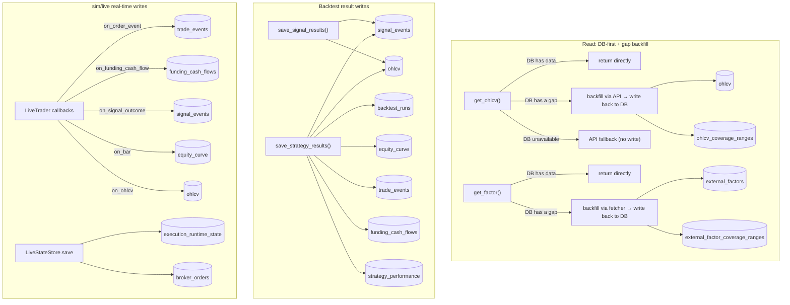

# Architecture & Naming Conventions

> **Document purpose**: this is a **living, current-state document** — it reflects the system's architecture and naming conventions as they are today, and gets edited in place as the code evolves.
> This is the opposite of `docs/decisions/` (a point-in-time record of a decision, never rewritten after the fact) — this file only ever carries "what is true now"; the *why* behind a naming rule lives in the corresponding decision doc, cross-referenced from here.
>
> When you add/change a table, column, or a `db/` read/write function, **you must update this document in the same change**. If a naming rule itself changes (as opposed to adding a new entry), add a new decision doc under `docs/decisions/` explaining why, as appropriate.
>
> **Scope**: engine layering, the DB access layer, and naming conventions — not deployment/ops. `scripts/`/`app/`/`deploy/` are optional ops tooling (Grafana, Docker, VM scripts), deliberately not architecture; see [Optional infrastructure](docs/guides/optional-infrastructure.md) instead.
>
> **Language**: this repo is English-only outside `docs/` (which stays in the language it was originally written in — mixing languages mid-document isn't worth the churn). Keep descriptions concise and to the point — a one-line WHY beats a paragraph; link to `docs/decisions/` for the full history instead of re-explaining it here.

## Compatibility Policy Before 1.0

Until either Librae 1.0.0 is released or an interface freeze is explicitly
declared, every functional, API, configuration, persistence-shape, and test
contract change is treated as breaking:

- Keep only the current contract in production code and `tests/`. Update or
  remove stale expectations instead of adding deprecated aliases, dual-format
  parsers, compatibility branches, or migration shims.
- Tests may assert that an obsolete or malformed shape is rejected, but must
  not preserve the obsolete behavior as a supported path. Generate
  non-current-version cases relative to the current serialized version rather
  than maintaining a historical version list.
- Persisted development data and runtime checkpoints may require explicit
  external migration or removal. Never silently default a missing field from
  an older shape.

After either gate, compatibility, deprecation, and migration requirements must
be defined explicitly before further breaking changes.

## Product position and system boundaries

Librae is a dependency-light, bar-based strategy engine with two first-class
workflows:

1. deterministic in-memory backtests from caller-prepared point-in-time data;
2. restartable polling runtimes whose live portfolio state changes only from
   broker-confirmed execution reports.

The shared kernel owns strategy decisions, positions, accounting, simulated
execution, risk checks, and result schemas. It deliberately does not own data
vendor ingestion, strategy-specific feature engineering, broker-native product
semantics, infrastructure selection, or operator policy. A caller may use only
the backtest engine, or compose live adapters and optional infrastructure
through explicit constructor injection.

| Layer | Owns | Extension boundary |
|---|---|---|
| `librae/core`, `backtest`, `live` | Canonical bars, strategy decisions, accounting, execution state, risk, results | Stable Python types and small call-site protocols |
| Caller/strategy project | Point-in-time data preparation, features, strategy semantics, instrument and cost configuration | Prepared DataFrames, strategy classes, injected callables and adapters |
| Reference integrations | Broker SDKs, TimescaleDB, Telegram, Grafana, CLI and deployment examples | Optional extras that may be used, replaced, or omitted |

Librae is not a general ingestion platform, streaming/tick engine, broker
abstraction framework, cross-account ledger, or hosted trading platform.
Supporting those concerns would require different clocks, data semantics, and
operational guarantees; they stay outside the kernel until a concrete engine
contract exists. Strict canonical inputs are intentional: extensibility means
normalizing at an explicit boundary, not making the engine guess arbitrary
data or broker shapes.

The dependency direction is:

```
orchestration ──→ librae
      ├─────────→ brokers ───────┐
      ├─────────→ db ────────────┼──→ librae public contracts
      └─────────→ notifications ─┘

librae/backtest ──→ librae/core
librae/live     ──→ librae/core
```

- `brokers/`: one flat adapter per broker/exchange (`ShioajiAdapter`, `CryptoAdapter`, `IBKRAdapter`), exposing market/account methods plus the live order lifecycle described below.
- `librae/core/`: shared strategy/portfolio types and pure execution functions. Deterministic bar matching serves backtest/sim; `apply_execution_fill` serves confirmed live fills.
- `librae/backtest/engine.py`: bar-by-bar execution only; raw result models live in `librae/backtest/result.py`, while persistence records live in `librae/backtest/schema.py`.
- `librae/live/engine.py`: the real-time polling engine for sim/live mode — sim uses deterministic bar fills; live submits through a broker adapter and applies normalized execution reports.
- `db/timescale_writer.py` / `db/timescale_reader.py` / `db/timescale_state.py`: the sole DB access layer — upper layers use analytics helpers or the runtime store, never raw SQL; schema is defined in `db/timescale_init.sql`.

Layering details in `docs/decisions/2026-03-26-platform-architecture.md`
describe the historical decision; this document remains the current source of
truth.

## Data acquisition and ownership boundary

| Mode | Supplied by | Librae does | Librae does not |
|---|---|---|---|
| Backtest | Caller-prepared DataFrame | Validate OHLCV/features and run deterministic events | Read TimescaleDB or call a broker/vendor API |
| Sim | Injected `LiveTrader.adapter` or orchestration factory | Poll completed-bar snapshots and retain a rolling history | Subscribe to streaming ticks or ingest third-party factors |
| Live | Same as sim | Poll bars, submit orders, and require durable runtime state | Treat analytics storage as execution state |

The engine's default sim/live warm-up calls its injected adapter directly.
DB-first history plus API gap filling is a caller-owned policy injected through
`warmup_fetcher`; it is not a hidden engine fallback. The repository's
`orchestration.live.build_live_trader()` factory supplies the built-in broker,
TimescaleDB, and Telegram integrations and accepts explicit third-party
adapter factories, notifier, and state store instances. Direct `LiveTrader`
construction never imports reference integrations. Sim may run in memory,
while live always requires an explicitly injected durable `state_store`.

`timeframe` defines the completed strategy bar and data-event clock.
`poll_seconds` independently defines the runtime loop cadence: each cycle may
refresh active orders, run due reconciliation/heartbeat work, and check the
completed-bar endpoint. Sim/live makes it explicit and warns when it is slower
than one bar. A faster poll does not create a strategy event or an intrabar
PnL/risk mark; only a newly completed bar does. Streaming market-data
subscriptions and an independent quote-driven risk clock are not implemented.
Third-party data is joined point-in-time by the caller and returned as extra
columns from the same adapter snapshot; see
[External market data and factors](docs/guides/external-data.md).

## Broker Adapter Design (`brokers/`)

- One flat adapter class per observed broker-product protocol
  (`ShioajiAdapter`, `CryptoAdapter`, `IBKRAdapter`), **duck-typed, no shared
  ABC**. A genuinely separate product API may have a focused adapter:
  `BinanceStocksAdapter` exposes only its currently implemented catalog/quote
  capabilities and is not presented as an OHLCV/order adapter. Market/account
  signatures include `fetch_ohlcv` and `info`; the public live
  `OrderAdapter` contract includes `get_position(PositionRequest)` plus
  `prepare_order`, `place_order`, `find_order`, `get_order`,
  `list_open_orders`, and `cancel_order`.
- `data_source` and `data_adapter` describe where bars come from; `broker` describes where orders go. Live execution never infers a broker from a symbol, market, or data source. Supply `RunConfig.broker`, a per-symbol `instrument_overrides[symbol]["broker"]`, or an injected `order_adapter`; an unresolved route fails at startup. An explicitly selected broker may reuse the same adapter session as market data.
- Cross-broker behavior is generalized only at an observed engine boundary. `LiveExecutor` builds one broker-neutral `PositionRequest` from the configured canonical/venue identity, currency, security type, exchange, `contract_month`/`continuous_alias`, and `CostModel.multiplier`; every adapter accepts that request and returns the same position shape. Contract lookup, broker-native symbol syntax, CCXT balance conventions, Shioaji direction enums, and IBKR `conId`/`avgCost` handling stay inside the concrete adapter. Add a shared field or helper only when more than one real adapter needs the same semantic; do not create broker hierarchies or speculative capability abstractions.
- `prepare_order` runs before durable queueing and network I/O. It applies CCXT precision plus amount/price/notional limits, Shioaji whole-lot and price-limit rules, or IBKR `ContractDetails` size increments/minimums/minimum tick. A quantity that rounds below the venue minimum fails; it is never silently submitted as zero.
- `place_order` is an order/execution-report boundary, not a boolean acknowledgement. `LiveExecutor` normalizes submitted, accepted, partial, filled, cancelled, and rejected states. A filled response must provide order id, requested/filled quantity, average execution price, broker execution timestamp, and explicit cash-currency fee/commission (zero is valid). A non-flat position snapshot must provide finite side/quantity and a positive average price; missing fields never mean flat or zero. A position snapshot must never be used to invent the missing fill price, fee, or timestamp.
- CCXT's unified order shape is normalized directly; base-currency fees are converted at the reported average price, while an unrelated fee currency fails closed. Shioaji and IBKR may initially return only an acknowledgement, so their adapters retain/query the broker trade object and enrich cumulative fills from deals/fills. If execution time or explicit commission is not yet available, the report remains invalid and no local fill is invented from order price or `CostModel`.
- `brokers/base.py` only provides pieces that are genuinely shared and byte-for-byte identical: static metadata, credential loading, completed-bar filtering, and canonical order validation/rounding. `CredentialConfig.from_env(prefix)` uses `{PREFIX}_{FIELD}` (e.g. `SHIOAJI_API_KEY`, `BINANCE_API_KEY`). `CryptoAdapter`/`CryptoCredentials` are exchange-agnostic (they pick a CCXT backend via `exchange_id`); only Binance is wired up today, using `BINANCE_*` as the prefix — adding a second crypto exchange means reusing the same class with a different prefix (e.g. `OKX_*`), no changes to the shared logic needed.
- OHLCV returns a uniform schema: `[ts, open, high, low, close, volume]`, with `ts` as the UTC-aware bar-start datetime; timeframe-string conversion is shared via `librae/core/utils.py` (`interval_to_timedelta` etc.), not reimplemented per adapter.
- Where a type constraint is needed, use `typing.Protocol`, **declared minimally
  at the call site** rather than a hierarchy covering unrelated capabilities.
  Third-party packages import the stable façade in `librae.integrations`;
  optional balance reconciliation is a separate `BalanceReader` capability.
- An async-ABC layering was tried once (`MarketDataAdapter`/`OrderAdapter`/`AccountAdapter` plus a `MarketHub` for unified dispatch — see `docs/decisions/2026-03-26-market-adapter-architecture.md`), and removed because Shioaji's auth model (stateful login+CA) and CCXT's (stateless per-call REST) diverge too much, and no adapter ever actually used that layering. **The current state is flat duck-typed classes — don't reintroduce a cross-broker shared hierarchy.**
- Futures have one broker-neutral selection rule: a dated monthly/quarterly instrument must set exactly one of `contract_month="YYYYMM"` (an exact expiry) or `continuous_alias=True` (a deliberately dynamic contract). `symbol` is the opaque, unique engine/position key and is never parsed; use a readable key such as `ES_202609` when holding multiple expiries. `venue_symbol` is the broker-facing root or native contract code. Adapters translate those common facts into their native representation instead of forcing one broker's symbol grammar on every broker.
- IBKR consumes a product root in `venue_symbol` plus the separate `contract_month`. Shioaji and CCXT may instead require an exact broker-native contract code in `venue_symbol`; they still receive the common month/alias identity, but the adapter does not parse or reconstruct proprietary symbol syntax. This is one semantic interface with broker-specific resolution, not one universal ticker format.
- `IBKRAdapter` covers both US stocks and futures through one class, same pattern as `ShioajiAdapter` covering TW futures + stocks: stocks are SMART-routed by symbol alone, futures need an explicit `security_type="FUT"` + `exchange` (e.g. `"CME"` for ES/NQ, `"NYMEX"` for CL, `"COMEX"` for GC — futures aren't SMART-routed). For an exact contract it queries the root plus `contract_month` and rejects missing or ambiguous matches; it never falls back to another month. Only `continuous_alias=True` resolves the nearest non-expired contract. Cached futures contracts and contract details are revalidated against their IBKR expiry before reuse so a long-running rolling route cannot continue quoting or trading an expired month. Position reconciliation resolves the same contract and matches its stable `conId`; a root such as `ES` alone is intentionally invalid because it cannot select one broker position. `CostModel.multiplier` remains the accounting SSOT and must match the resolved IBKR contract multiplier; IBKR `avgCost` is then divided by that verified multiplier before comparison with the engine's per-unit entry price.
- `ShioajiAdapter` accepts native R1/R2 contracts only when `continuous_alias=True` and considers both alias `code` and resolved `target_code` during order/position reconciliation. An exact contract must use a non-alias `venue_symbol`; the adapter reads Shioaji `FuturesInfo.delivery_month` and rejects a mismatch with `contract_month`. Futures positions explicitly query `futopt_account` (Shioaji otherwise defaults `list_positions()` to the stock account).
- `CryptoAdapter` keeps the CCXT unified symbol as `venue_symbol`. A delivery future must set `contract_month`, checked against CCXT market `expiry`; spot and perpetual markets cannot carry that field. Binance continuous klines remain a data/research API and are explicitly rejected by order/position paths instead of being mistaken for an orderable contract.

### Broker symbol discovery

`librae.available_symbols()` queries the selected broker's current catalog; it
does not copy thousands of changeable venue symbols into the built-in registry.
It returns immutable `AvailableSymbol` values with a suggested canonical key,
the adapter-facing and native symbols, instrument/asset class, expiry, current
contract rank, and verified multiplier/tick metadata when the venue supplies
them. Query matching is exact against broker id, unified symbol, base, or
base+quote so `query="MU"` cannot silently select `MUU`.

- Binance crypto discovery uses public CCXT `load_markets()` data and needs no
  API key. `asset_class="equity", kind="perpetual"` is the TradFi perpetual
  pool. Binance Stocks is a separate `/sapi/v1/equity/*` product:
  `kind="spot", asset_class="equity"` uses its API-key-authenticated
  `exchangeInfo` catalog and plain tickers such as `MU`/`GOOGL` (the website's
  `EQ_GOOGL` is a page route, not the API symbol). Its current REST API exposes
  latest quotes but no historical OHLCV, so discovery does not fabricate a
  built-in `RunConfig` bar route. Binance discovery requires an explicit
  `kind`; spot discovery also requires `asset_class` so separate product
  catalogs are never silently omitted.
- Shioaji discovery uses the authenticated session's
  `contracts.futures(root)` result, including exact contracts and native R1/R2
  aliases.
- IBKR discovery uses the connected read-only TWS/Gateway session's
  `reqContractDetails`. Futures require an exchange.

`contract_rank=0/1` identifies the current nearest/next listed exact contract
in that catalog snapshot. Selecting such a dated result pins its
`contract_month`; it does not roll later. A venue-native R1/R2 result has
`continuous_alias=True` and may change its target. This distinction prevents a
discovery convenience from silently changing live exposure.

Discovery can feed an adapter directly without YAML:

```python
from brokers.crypto_adapter import CryptoAdapter
from librae import available_symbols

binance = CryptoAdapter(exchange_id="binance")
btc = available_symbols(
    "binance",
    query="BTCUSDT",
    kind="perpetual",
    asset_class="crypto",
    adapter=binance,
)
btc_perpetual = btc[0]
bars = binance.fetch_ohlcv(
    btc_perpetual.venue_symbol,
    "1h",
    limit=500,
    **btc_perpetual.market_data_kwargs(),
)
```

For a `RunConfig`, use `candidate.canonical_symbol`,
`candidate.instrument_override()`, and `candidate.cost_override()` to build the
two existing per-symbol maps programmatically. Discovery never guesses
commission, tax, margin policy, account, or trading calendar.

### Broker API compatibility

Broker integration compatibility has two independently maintained boundaries:

- `pyproject.toml` declares the tested SDK API family with both lower and upper
  bounds (`ccxt`, `shioaji`, `ib-async`); `uv.lock` pins the exact repository
  development/deployment versions. SDK contract tests construct and call the
  concrete SDK surfaces Librae depends on. An SDK range update is therefore an
  explicit compatibility change with tests, not an incidental install-time
  upgrade.
- Broker-hosted REST/socket API versions are not Python packages and do not
  belong in TOML. Versioned endpoint paths and adapter parsers are maintained
  in code. For example, Binance Stocks records official schema `1.0.0` and
  calls `/sapi/v1/equity/*`; broker changelogs plus integration/contract tests
  govern upgrades. If a broker provides no version negotiation, Librae must
  fail on an incompatible response shape rather than silently reinterpret it.

Librae owns compatibility of its adapters with the declared SDK and broker API
contracts. Users own credentials, account permissions, jurisdiction/product
eligibility, broker-side enablement, and upgrades made outside the lockfile.

## Engine design (`librae/`)

### Layout

```
librae/
├── core/                     shared domain model (pure computation, no I/O)
│   ├── strategy.py           Strategy, OrderIntent, PortfolioTargets, Context, Position, PositionState, Fill
│   ├── executor.py           simulated matching plus apply_execution_fill for externally confirmed fills
│   ├── cost_model.py         CostModel (commission / slippage / tax / contract multiplier / margin)
│   ├── metrics.py            performance metrics + on-demand trade/signal outcome analysis
│   ├── run_config.py         RunConfig + ExecutionPolicy + RiskPolicy — typed run parameters
│   └── utils.py              generate_run_id, infer_timeframe, to_ccxt, to_canonical
│
├── artifacts.py              format-neutral manifest + tabular research/export boundary
├── integrations.py           stable public protocols and broker value types
├── testing.py                offline third-party adapter conformance helpers
│
├── backtest/                 backtest runtime
│   ├── engine.py             Backtest — bar-by-bar execution + optional position snapshots + build_output()
│   ├── result.py             raw side-effect-free backtest result models
│   ├── schema.py             BacktestOutput, RunMetadata, StrategyMetrics, OrderEventRecord, PositionSnapshotPoint
│   └── charts.py             plot_trades — overlays order_events entries/exits via lightweight-charts (pure rendering, no recomputation, for local research; [extra: viz])
│
├── live/                     real-time / sim runtime
│   ├── engine.py             LiveTrader — data-driven multi-symbol polling events
│   ├── executor.py           OrderRequest/ExecutionReport + LiveExecutor normalization
│   └── state.py              restart checkpoint types + LiveStateStore protocol
│
└── config/                   configuration management
    ├── market_config.py      MarketConfig dataclass + built-in market registry (costs, tick size, margin rates)
    └── symbols.py            SymbolInfo dataclass + built-in symbol registry (symbol → market/data_source/multiplier)

# Outside librae, at the same level as db/ and brokers/ — reference implementations (swappable, see "Dependency direction" below)
notifications/                Telegram push notifications (TelegramAdapter + TelegramCredentials)
orchestration/cli.py          shared CLI parser + config YAML merging (build_run/run_dispatch)
```

`librae/core/trading_calendar.py` owns session labels and session-aligned
resampling; `librae/core/liquidity.py` owns lagged completed-session ADV.
Neither belongs in a broker adapter or strategy. `librae/config/symbols.py`
owns each instrument's `calendar_id`.

### Dependency direction

```
backtest/ ──→ core/
live/     ──→ core/
```

`backtest/` and `live/` have no direct dependency on each other; shared
execution logic lives in `core/`. `LiveTrader` accepts broker, persistence,
notification, and analytics implementations only through constructor
injection. `orchestration/live.py` owns the repository's optional default
wiring. Simulation can run standalone; live additionally requires an explicit
order adapter and durable state store.

### Execution flow (strategy → engine → output)

This is a different thing from the "Data flow" section below: that one is about the read/write pipeline between DB tables; this one is the call sequence within a single run, from strategy code to the final result.

```
Strategy ETL (utils.py)  →  DataFrame (MultiIndex + signal columns)
                              ↓
Strategy logic (strategy.py)  →  on_bar(ctx) → list[OrderIntent] | PortfolioTargets | MultiLegOrder
                              ↓
Engine (engine.py)     →  execute_order_intents / execute_portfolio_targets
                              ↓
Output (build_output)  →  BacktestOutput (metrics + equity/position/allocation facts + events)
```

The lifecycle terminology and breaking migration are recorded in
[`2026-07-28-strategy-decision-execution-naming.md`](docs/decisions/2026-07-28-strategy-decision-execution-naming.md).
Run configuration, metadata, and shared-type SSOT decisions are recorded in
[`2026-07-28-run-contract-ssot.md`](docs/decisions/2026-07-28-run-contract-ssot.md).

### Usage

#### Backtest

```python
from librae import Backtest, Strategy, OrderIntent, Context, RunConfig


# 1. Define a strategy
class MyStrategy(Strategy):
    def on_bar(self, ctx: Context) -> list[OrderIntent]:
        if ctx.positions.get(ctx.symbol):
            if ctx.bar.get("exit_signal"):
                return [OrderIntent(action="close", symbol=ctx.symbol)]
            return []
        if ctx.bar.get("entry_signal"):
            return [OrderIntent(action="long", symbol=ctx.symbol)]
        return []


# 2. Run the engine (a RunConfig is usually built via orchestration.cli.build_run())
df = fetch_and_prepare(symbol, months)  # your own ETL
bt = Backtest(data=df, strategy=MyStrategy(), config=config)
bt.add_benchmark(df.xs(symbol, level="symbol")["close"])
bt.run()

# 3. Get the result
output = bt.build_output()  # BacktestOutput
```

**Data format**: a MultiIndex DataFrame `(symbol, datetime)` + raw, unshifted
OHLCV + point-in-time feature columns. A strategy observes completed bar T and
the engine owns the execution delay, so an intent is first eligible on T+1.
Callers must not pre-shift prices or signals to model that delay; doing so
delays execution twice. Feature construction remains the caller's
responsibility and must not use information unavailable at T.

#### Local artifact boundary

`RunOptions(database_enabled=False)` tells repository orchestration not to
attach TimescaleDB; it never selects another backend or writes a file
implicitly.
`build_market_data_artifact()` and
`build_backtest_artifact()` expose versioned metadata plus logical pandas
tables. Librae owns validation and table shape. The caller owns Parquet,
SQLite, DuckDB, or other serialization details, including paths, overwrite
policy, transactions, partitioning, and retention. There is intentionally no
storage registry or sink hierarchy. See the
[local artifact guide](docs/guides/local-artifacts.md).

Artifacts are for research/export and do not satisfy live mode's durable
state-store, active-order, reconciliation, or lease requirements.

**Unshifted is a timing contract, not a price-adjustment flag.** The engine
cannot infer whether OHLCV is adjusted. Execution-oriented tests should
normally supply historically observable, unadjusted prices. Librae currently
has no ledger model for splits, dividends/coupons, futures rolls, FX/base
currency conversion, cash yield, or settlement lag. Adjusted/continuous
series can be research inputs, but using them as fill prices makes the
cash-and-position simulation economically incomplete.

The backtest boundary fails fast on malformed input. Index levels must be
exactly `(symbol, datetime)`; `(symbol, datetime)` pairs are unique; timestamps
are timezone-aware and increasing within each symbol; and `config.symbols`, when
provided, exactly matches the symbols in the frame. Required OHLCV values are
numeric and finite, prices are positive, every bar satisfies
`low <= open/close <= high`, and volume is non-negative. Validation never
sorts, forward/backward-fills, clips, or otherwise repairs data because those
operations can change the point-in-time research sample and must remain
explicit ETL decisions. Runtime frames use the same OHLCV value validator before
entering the cache; an invalid refresh is logged and cannot create a new event.

For an `OrderIntent`, `limit_price` is a one-eligible-bar limit order. A
buy fills when the bar's low reaches the limit and a sell fills when its high
does; a gap through receives the opening price. An unreached limit expires
after that bar and is logged. Simulated market orders use
`ExecutionPolicy.default_fill_price`; a strategy never embeds a historical bar
field in its decision. `PortfolioTargets` always uses that run-wide simulated
market-fill policy; use per-symbol `OrderIntent`s for limits.

Historical data may additionally provide non-null boolean `can_buy` and
`can_sell` columns as a required pair. The data adapter must normalize
market-specific price limits, halts, auctions, and empty-book states into these
side-level facts. Entry, ordinary close, stop, liquidation, drawdown, and
terminal fills share the rule. Triggered adverse stops/liquidations remain
pending until the required side is tradable; a terminal backtest raises rather
than inventing liquidity. Omitting both columns explicitly means the data
source supplied no side-tradability state. These facts must never be inferred
from the selected execution broker because one broker may route many markets.
Shioaji's per-contract `limit_up`/`limit_down` fields are used only to validate
an outgoing limit price for that resolved venue contract; they are not a
cross-market backtest rule.

OHLCV cannot determine whether an intrabar high or low happened first. A new
position therefore receives same-bar stop/take-profit processing only when its
entry is known at the bar open (the execution policy selects `"open"` or a
limit gaps through at
open). Protection for a resting limit or another non-open field begins on the
next observed bar. This conservative rule prevents a target reached before the
entry from being recorded as profit without introducing an invented intrabar
path model.

#### Account and multi-asset / stock-picking strategies

Each run owns exactly one named account, which is the cash and PnL SSOT for
every configured symbol. The account has one currency and one
cash/equity/risk ledger. `RunConfig.account` and `BacktestOutput.account` are
scalar values; `account_id` remains a stable persistence and reporting key.

Strategies normally use `ctx.cash` and `ctx.equity`; `ctx.account` and
`ctx.account_id` expose the same ledger when its currency or explicit id is
useful. A deployment with separate broker accounts or currencies runs one
Librae engine per account and coordinates them outside the engine. Librae does
not provide FX conversion, transfer, borrowing, settlement, cross-account
netting, or atomic execution across runs.

Within an account the engine is portfolio-level. `on_bar()` can return
`OrderIntent`s for multiple symbols. `OrderIntent.quantity=None` spends the
account's available cash, so multi-symbol decisions should normally use
explicit quantities.

For allocation strategies, return one `PortfolioTargets` instead:

```python
from librae import PortfolioTargets

return PortfolioTargets(
    weights={"AAA": 0.50, "BBB": 0.45},
    reason="monthly allocation",
)
```

The strategy timestamps the target implicitly by returning it for `ctx.ts`
(bar T). The engine resolves it on T+1 using each symbol's actual fill price and
portfolio equity at those same execution prices. The run's `ExecutionPolicy`
selects the simulated fill field; allocation intent does not override execution
semantics.
Positive weights are long, negative weights are short, and a held symbol
omitted from `weights` targets zero. Reductions and closes execute first in
symbol order, then additions. If entry costs exceed available cash, all
addition quantities receive one common scale factor so symbol ordering does not
starve later assets.

`PortfolioTargets` uses the run's single account as its capital base. A
cross-account hedge or arbitrage strategy must coordinate explicitly sized
orders across separate runs; hedge ratios remain strategy-owned.

Weights need not sum to one; any remainder stays in cash. When
`Backtest(..., record_position_snapshots=True)` is enabled,
`BacktestOutput.position_snapshots` contains quantity, signed market value, and
signed realized weight (`market_value / equity`) for every open position on
every event. `BacktestOutput.allocation_snapshots` adds target weight, achieved
weight, and drift for every configured symbol. Both are opt-in because
retaining O(events × configured symbols) facts can be expensive for a large
universe.

#### Static candidate universe and point-in-time selection

Backtest, sim, and live runs use a predeclared candidate universe. For stock
selection, configure a survivorship-bias-free candidate superset and provide
point-in-time membership or eligibility as input data. The strategy filters
the currently eligible observations before ranking or optimization and returns
a complete `PortfolioTargets`; an omitted holding is therefore targeted to
zero.

`ctx.symbols` is the configured universe. `ctx.available_symbols` and
`ctx.bars` contain only symbols with a real current bar, so a temporary missing
observation does not become a universe change. A last-known close is a
valuation mark only and cannot trigger execution, stops, signals, or
holding-age increments.

Runtime discovery of an undeclared instrument is not supported: Librae does
not add or remove symbols, create or cancel market-data subscriptions, or
warm up a newly discovered symbol while a process is running. Those lifecycle
operations require reconfiguration and restart; they are not behavior that
strategy code should emulate.

Per-symbol `OrderIntent`s become eligible on that symbol's next observed bar.
`PortfolioTargets` is intentionally synchronous: the basket waits for current
bars from every non-zero target and currently held symbol, and is never
silently replaced. Use per-symbol order intents for asynchronous cross-market
execution.

#### Related multi-leg order contract

`MultiLegOrder` represents explicitly sized related orders for synchronous
research simulation. It covers spreads, rolls, inventory hedges, and ordered
cross-instrument exposure transitions without encoding strategy-specific
arbitrage types:

Atomic multi-leg execution means the venue accepts the group as one
all-or-none transaction: every leg fills or none does. Separate API requests,
whether serial or concurrent, do not provide that guarantee; compensating
orders can add further exposure instead of restoring a portfolio. Generic live
execution therefore rejects `MultiLegOrder` and halts before sending any leg.
If one venue or broker exposes a native combo order, use that adapter-specific
capability. Cross-venue coordination belongs to a strategy-owned deployment
coordinator with explicit partial-fill and recovery policy.

```python
from librae import MultiLegOrder, OrderIntent

return MultiLegOrder(
    legs=(
        OrderIntent(action="long", symbol="BTCUSDT", quantity=0.10),
        OrderIntent(action="short", symbol="BTCUSDT-PERP", quantity=0.10),
    ),
    reason="spot-perpetual basis",
)
```

Every leg requires an explicit symbol and quantity, symbols cannot repeat, and
tuple order is the simulation order. Backtest/sim waits for one event containing
every leg and executes a synchronous OHLCV approximation. This is useful for
strategy research but does not claim intrabar sequencing, venue atomicity, or
recoverability in production.

Examples include TAIFEX near/next-future/cash-proxy and Binance
spot/perpetual/delivery-future spreads. Every leg in one `MultiLegOrder` belongs
to the run's single account. Cross-account or cross-currency execution requires
separate runs and a strategy-owned coordinator with an explicit FX/valuation
model.

Continuous near/next/quarterly aliases are dynamic identities, not exact
contracts. They are orderable only when the selected adapter implements that
explicit route (for example Shioaji's native `TXFR1` or IBKR front-month
resolution); the repository's Crypto orchestration rejects its research-only
continuous series.
A strategy that needs expiry-stable exposure supplies `contract_month` and a
unique canonical `symbol`. Roll timing remains an upstream strategy decision;
the engine never silently converts an exact contract into a rolling alias.

Execution then deliberately diverges:

- **Backtest/sim:** an OrderIntent decided at T is eligible on that symbol's next
  observed raw bar. Bar fields, one-bar numeric limits, stops, take-profit,
  liquidation, and estimated costs belong to this deterministic simulation
  model.
- **Live:** each batch of newly completed bars is an event and its ready intent
  is submitted immediately. A delayed symbol may create a second event with
  the same timestamp. Current prices may size requests but local execution
  facts come only from broker reports.

OHLCV caches are sorted and deduplicated. Mode-specific backlog handling is
defined under data staleness below. Both modes advance a durable per-symbol
watermark only after successful processing. A late symbol at the same
timestamp is processed with any same-timestamp bars already present in cache,
so a waiting target basket can become executable. An older event that would
rewind the global clock fails explicitly. If a backtest still holds a symbol
without a real bar at the final
timestamp, forced liquidation fails explicitly rather than fabricating a fill
from its last mark.

This is a **data-driven event clock**, not a calendar-driven event generator.
Input timestamps must be timezone-aware and every adapter/ETL path must use
the same convention: `ts` is the UTC bar-start instant. A bar becomes eligible
only after its interval close; fixed-duration bars use `ts + timeframe`, while
calendar-aligned bars use the actual segment/session close. Adapters drop a
final still-forming interval. Keeping the vendor's bar start avoids shifting
shortened or session-ending bars to an invented duration.

`SymbolInfo.calendar_id` is the SSOT for mapping an observed timestamp to its
trading-session label. The built-ins use `24/7`, `XNYS`, and `XTAIFEX`;
unregistered instruments set `instrument_overrides[symbol]["calendar_id"]`.
Standard IDs are resolved by `exchange_calendars`. `XTAIFEX` (15:00 night
open) and `XTAIFEX_1725` (17:25 night open) are Librae extensions that label a
Taiwan-futures night session with its following regular-session date.
Shioaji's epoch correction remains adapter-specific and is not a calendar.

Calendars own session labeling and resampling boundaries only. The engine
still does not manufacture bars or infer suspensions, vendor outages,
settlement days, or missing observations. The current TAIFEX implementation
uses XTAI trading dates as its holiday-session source; users requiring a
product-specific exceptional closure must provide already filtered data.
Cross-market baskets must provide coherent event labels; broker submissions
remain sequential reductions-then-additions, not exchange-level atomic.
`PortfolioTargets` expresses a desired portfolio state, not a transactional
all-or-none order. Live target legs are replanned only after the previous
broker fill is confirmed, using actual cash and positions, so slippage and
confirmed fill outcomes change the remaining quantities instead of preserving a stale
precomputed basket.

Acknowledgement is not execution. Submitted/accepted/`cancel_pending`/cancelled/rejected
reports never mutate positions. A partial report commits only its confirmed
fill delta. Submitted, accepted, and partial orders remain in a durable,
serial queue and are polled before another strategy decision. Repeated
cumulative reports are idempotent; filled quantity, notional, commission,
slippage, and tax can only advance. Cancelled/rejected orders halt dependent
work. While an order remains active, polling still refreshes the OHLCV cache,
heartbeat, and staleness state, but it does not run a new strategy decision.
An optional local wall-clock timeout cancels an over-age order, preserves any
confirmed partial fill, and halts dependent work for review. A non-terminal
cancel acknowledgement remains `cancel_pending` and is reconciled without
issuing duplicate cancel requests. Operational/error
halts cancel tracked strategy orders. A drawdown
breach instead clears the pending strategy decision and keeps its emergency
reduce/close queue active until broker reports reach a terminal state,
including across restart. Local stop/take-profit parameters remain
simulation-only because they cannot be inferred later from a completed range.
Protective live orders require a broker-native implementation.

Every exposure-increasing live fill is checked again against confirmed
position, gross, and net limits. A breach halts dependent execution.

Incremental cache retention is capped by the validated
`ExecutionPolicy.warmup_periods` (default 720; an injected warmup
fetcher may provide more initial history). This implementation favors
daily/session correctness over high-frequency throughput; lower strategy
frequency reduces load but does not remove clock/order-state synchronization
requirements.

#### Local trade-chart viewer

Use after `pip install -e ".[viz]"`. It renders the OHLCV and
`order_events` already present in `BacktestOutput`; it does not re-simulate
fills or recompute PnL. The plotted markers therefore reflect those event
records directly, while aggregate metrics remain owned by
`librae/core/metrics.py`.

```python
from db.charts import plot_trades_by_run_id
from librae.backtest.charts import plot_trades

ohlcv = df.xs(symbol, level="symbol")  # a single symbol's OHLCV
plot_trades(
    ohlcv, output.order_events, symbol
)  # right after a backtest run, output already in hand

plot_trades_by_run_id(
    run_id
)  # or: skip rerunning the backtest, read a persisted run straight from the DB
```

`db.charts.plot_trades_by_run_id` reads persisted `trade_events` and `ohlcv`
rows through `db.timescale_reader`. The database adapter then calls the same
format-neutral renderer as the in-memory form and does not rerun the strategy.

#### Trade outcome analysis

`librae/core/metrics.py` is the SSOT for reconstructing analytics lifecycles
from canonical `open`/`add`/`reduce`/`close` events. A position lifecycle is
one per-symbol `0 → N → 0` interval; a realized exit is each `reduce` or
`close`. These are deliberately different populations. Incomplete
end-of-sample lifecycles are reported but excluded from completed-lifecycle
summaries.

Trade analytics require `Mapping[str, pd.DataFrame]`, with one sorted, unique,
timezone-aware OHLCV frame per event symbol. Horizons advance by subsequent
observed bars of that symbol, never by a portfolio-wide row shift. The public
fact/summary split is:

| Analysis | Facts | Summary weight |
|---|---|---|
| Actual lifecycle excursion | `compute_trade_lifecycle_outcomes` | equal completed lifecycles, pooled and per symbol |
| Hypothetical post-entry envelope | `compute_trade_entry_outcomes` | equal `open`/`add` anchors at each valid horizon, pooled and per symbol |

MFE/MAE are gross, direction-adjusted percentage-point price excursions;
costs and notional-weighted portfolio risk remain separate metrics. Adds
change the weighted-average basis prospectively, while reductions preserve
it. Full high/low ranges count only between events. On an event bar, analytics
use explicit fill-price state observations because OHLCV cannot establish
whether the bar extrema occurred before or after the fill. Exact intrabar
excursion therefore requires finer-grained data.

#### Execution policy, risk controls, and portfolio diagnostics

Fill-field and liquidity assumptions have one typed source:
`RunConfig.execution`. `build_run()` defaults to next-open simulation and a
10% per-symbol bar-volume cap in every mode. Direct `Backtest(...)`
construction resolves the same `ExecutionPolicy()` defaults; unlimited
liquidity therefore requires
`execution=ExecutionPolicy(max_bar_volume_participation_rate=None)`.
When `config=` is supplied, passing a second `execution=` or `risk=` policy is
rejected instead of silently choosing one source.
Backtest/sim enforce configured liquidity caps in the fill model. Live uses
them for request sizing, then lets broker execution reports determine actual
fills. Emergency live exits bypass local caps so the broker owns partial-fill
truth.

```python
from librae import ExecutionPolicy, RiskPolicy, RunConfig

config = RunConfig(
    ...,
    reconciliation_interval_seconds=300,
    market_data_workers=1,
    execution=ExecutionPolicy(
        default_fill_price="open",
        max_bar_volume_participation_rate=0.1,
        # Optional session-level cap; both fields must be set together.
        adv_lookback_sessions=20,
        max_adv_participation_rate=0.01,
        warmup_periods=720,
        # Local fallback, not broker IOC/FOK/GTD.
        live_order_timeout_seconds=120,
    ),
    risk=RiskPolicy(
        max_position_weight=0.3,  # 30% of latest known equity
        max_gross_exposure=1.2,  # reject targets above 120% gross
        max_net_exposure=1.0,  # reject targets above 100% absolute net
        max_drawdown_rate=0.2,  # liquidate and halt after a 20% drawdown
        max_order_notional=25_000,  # reject larger entry/add orders
        max_limit_price_deviation_rate=0.1,  # live limit-price collar
    ),
    params={"lookback": 20},  # strategy logic only
)
```

`execution`, `risk`, and `params` are separate SSOTs. Putting execution or
risk keys in `params` raises immediately; the engine never reparses a
free-form strategy dictionary for portfolio controls.

`RunConfig.runtime.reconciliation_interval_seconds` and
`RunConfig.runtime.market_data_workers` are operational settings rather than
strategy semantics, so they do not change `config_hash`. Fetching is sequential
by default because many vendor SDK
clients are not thread-safe; a value above one opts into bounded per-cycle
concurrency. `LiveTrader.last_cycle_diagnostics` reports per-symbol fetch time,
strategy time, broker-order time, total cycle time, and whether the cycle
exceeded `RunConfig.runtime.poll_seconds`.

- `default_fill_price`: backtest/sim fallback for decisions without an
  explicit fill field. It is not used to manufacture live executions.
- `max_bar_volume_participation_rate`: one cumulative per-symbol volume budget per
  simulated data event across entries, additions, reductions, ordinary
  closes, stops, modeled liquidation, drawdown exits, and terminal exits.
  Missing volume rejects the fill. Constrained exits are explicit partial
  fills and retain the remaining position for a later observed bar. Once
  stop-market or liquidation has triggered, its remainder stays an active
  market exit. A terminal backtest that cannot finish exits raises.
- `adv_lookback_sessions` + `max_adv_participation_rate`: optional session
  capacity budget. ADV is the mean total volume of exactly N completed trading
  sessions before the active session; it never contains active-session volume.
  D1 treats each row as one session. Intraday aggregates observed bars using
  the symbol's `calendar_id`, which is required at startup. Missing warmup
  rejects fills. Bar-volume and ADV usage are tracked separately, so available
  quantity is `min(bar cap - filled this bar, ADV cap - filled this session)`.
  This avoids granting the full ADV budget again on every intraday bar. No
  intraday volume-profile estimate is needed: the current-bar cap remains the
  local liquidity constraint. Sim/live `ExecutionPolicy.warmup_periods` must retain enough
  bars to cover N full sessions. The pair is disabled by default.
- `warmup_periods`: positive live/sim feature-history retention count; it is
  typed engine configuration, not a strategy `params` fallback.
- `live_order_timeout_seconds`: optional live-only local safety timeout measured
  from the persisted wall-clock placement attempt. On expiry the engine first
  refreshes the broker report, requests cancellation only if the order remains
  non-terminal, applies any additional cumulative fill, then halts. `None`
  leaves lifetime to the broker. This is not broker-native time-in-force:
  IOC/FOK/GTD/DAY support remains adapter- and venue-specific.
- `max_position_weight`: both new entries and adds get capped (fills are recomputed with commission/slippage/tax after capping) — this isn't an outright rejection.
- `max_order_notional`: hard-rejects an individual exposure-increasing open or
  add above this account-currency notional after normal position/liquidity
  sizing. Reductions, closes, and emergency exits remain available.
- `max_limit_price_deviation_rate`: in live mode, rejects a broker-normalized
  limit price whose absolute distance from the latest completed close exceeds
  this ratio. Market orders are unaffected because their execution price is
  not known before submission.
- `max_gross_exposure` / `max_net_exposure`: backtest/sim validate every
  complete strategy decision batch (`OrderIntent`, `PortfolioTargets`, or
  `MultiLegOrder`) against staged post-decision positions before mutation.
  Live validates each request in its actual submission order as well as the
  final portfolio, so a later hedge cannot conceal a transient breach. A
  transition that worsens an already-breached limit is rejected before
  submission, while a risk-reducing transition remains allowed. Live
  additionally checks confirmed fills because broker slippage and partial
  fills can differ from the staged request.
  `calculate_signed_position_notionals()` and
  `calculate_position_weights()` are the shared accounting SSOT used by risk
  validation, backtest snapshots, live post-fill checks, and live diagnostics.
- `max_drawdown_rate`: once detected from a completed bar, backtest/sim queues
  market exits for the run's open positions and fills them at the next observed
  bar open (subject to the normal volume cap); it never observes a close and
  fills at that same close. Live submits immediate market closes and books only
  confirmed broker fills. The halt persists across restart, emergency exits
  remain active while halted, and broker orders must reach a terminal state
  before `reset_halt()` is allowed. After operator review, `reset_halt()` starts
  a new risk epoch.
- `LiveTrader.halt(reason)` is the operator kill switch: it persists the halt,
  clears pending strategy decisions, and cancels tracked live broker orders.
  `reset_halt()` is required after review before new entries resume.
- Volume-aware slippage (`CostModel.volume_impact_ticks`) is independent of this switch and also defaults to off: as long as volume data is supplied and that market/symbol's `volume_impact_ticks > 0` (set via `market_config.py`/`symbols.py`/`cost_overrides`), slippage scales linearly with the fill's share of that bar's volume, regardless of whether a cap is configured.

The backtest timeframe is inferred independently for each symbol. Every symbol
with enough observations must agree, while sparse histories must remain
aligned to that interval. The union event clock is never used to infer a
faster, synthetic timeframe for staggered markets.

Performance annualization has a separate explicit SSOT:
`RunConfig.reporting.periods_per_year` is the number of return observations per year
(for example, 252 for daily US-equity bars or 8760 for hourly 24/7 bars).
`build_run()` supplies data-source defaults only for D1. Annualized intraday
or unknown-source runs must set `strategy.perf.periods_per_year`; the engine
never guesses it from sample density.
`RunConfig.reporting.risk_free_rate` is an annual effective rate greater than `-1`.
Performance metrics deannualize positive, zero, and negative rates with the
same compounded-return formula before comparing period returns.

Every `EquityCurvePoint` contains gross exposure, net exposure, concentration,
and one-way turnover (`sum(abs(traded notional)) / ending equity`) for its
event. Gross exposure is the engine's gross-leverage measure. `StrategyMetrics`
aggregates total turnover, average/maximum gross exposure, maximum absolute net
exposure, and maximum concentration. With a benchmark, tracking error is the
annualized sample standard deviation of active period returns and information
ratio is annualized mean active return divided by that standard deviation.
`AllocationSnapshotPoint` provides attribution-ready target/achieved facts;
return attribution by factor, sector, or decision remains strategy/research
code because the engine has no classification model.

#### Perpetual funding cash flows

Backtest and shadow-simulation bars may contain a `funding_rate` observation,
expressed as a decimal rate for that payment. `funding_mark_price` is optional;
the same event's raw `close` is used when it is absent. Missing rates mean no
payment: the engine never forward-fills or fetches them.
When rates come from `external_factors`, the data pipeline exact-joins its
`value` as `funding_rate` on symbol and payment timestamp; an as-of join or
forward fill would turn one payment into repeated charges.

Funding is applied after the event's confirmed simulated fills and stops, and
before its equity snapshot and strategy decision. Positive rates mean longs
pay shorts:

`cash_flow = -side_sign * quantity * mark_price * multiplier * funding_rate`

where `side_sign` is `+1` for long and `-1` for short. Only the confirmed open
quantity at that timestamp participates. Payments update account cash, equity,
returns, and drawdown without changing execution prices or trade PnL.
`FundingCashFlowRecord` and `funding_cash_flows` retain the rate, mark,
quantity, multiplier, side, and realized cash flow for audit.

Paper and live broker modes do not apply these research observations. Broker
balances and exchange funding records remain authoritative. This contract
does not add rate fetching, FX conversion, settlement, transfer, or cross-run
netting.

#### Margin / liquidation simulation

`CostModel.maintenance_margin_rate` (default 0 = off, following the same "belongs to the market/instrument, not `config.params`" convention as `volume_impact_ticks`, configured via `market_config.py`/`symbols.py`/`cost_overrides`). In backtest/sim, `resolve_stop_exit` checks every bar whether a position has hit the modeled liquidation price; if so it force-closes with `REASON_LIQUIDATION`, using conservative gap-through logic. The liquidation check takes priority over stop-loss/take-profit. Live does not replay this completed-bar touch as a market order: venue margin/liquidation and broker-native protective orders are authoritative.

The formula is a simplified isolated-margin approximation: long
`entry*(1 + maintenance_margin_rate - margin_rate)`, short
`entry*(1 - maintenance_margin_rate + margin_rate)`. It does not solve a
venue-specific liquidation threshold from fees or accumulated funding;
funding instead affects cash, equity, and drawdown through the event contract
above. Spot (`margin_rate=1.0`) never triggers unless
`maintenance_margin_rate` is set.

`margin_rate`/`maintenance_margin_rate` are always a fraction of notional, never an absolute currency figure — there's no config field for e.g. "NT$636,000 initial margin" directly; a caller converts from the exchange's published absolute figure to a ratio before setting it (see `market_config.py`'s `tw_futures` entry for a worked example). Treated as static for the whole run — see `docs/plans/enhance_librae_real_trade.md`'s item B for why, and its known blind spots.

#### Reconciliation (live only)

Startup reconciliation runs automatically when `LiveTrader.run()` starts.
When no order or grouped execution is active, the checks repeat every
`reconciliation_interval_seconds`. Reconciliation is a no-op in sim mode:

- **Orders**: restore the checkpoint first, recover placement-attempted orders
  by deterministic client id, poll tracked orders, then compare the broker's
  open orders on configured symbols. An untracked order is treated as an
  orphan: do not guess ownership or invent a fill; halt for operator review.
- **Positions**: `get_position(PositionRequest)` is called only for this strategy's
  configured symbols; it is not described as a complete account snapshot. A
  restored checkpoint keeps its entry time and accumulated costs, while broker
  side/quantity is a reconciliation assertion. A mismatch or unreadable
  configured-symbol snapshot halts. A first run with no checkpoint must be
  flat: broker exposure alone cannot reconstruct the engine's cash, accumulated
  entry costs, or risk epoch, so a non-flat first run halts and requires the
  matching checkpoint or an operator flatten. Crypto spot uses base-asset
  balance inventory, not the derivatives-only positions endpoint. Ordinary
  spot also rejects opening/adding a short, while a sell that reduces or closes
  owned inventory remains valid.
- **Cash** (`_reconcile_cash`, for adapters exposing `get_balance()`): warns
  only, never overwrites. A Telegram alert fires once discrepancy exceeds
  `LiveTrader.CASH_RECONCILE_TOLERANCE_PCT` (default 1%). Broker free/total
  semantics vary by account mode, so blindly overwriting can corrupt a valid
  ledger. A missing capability or unreadable balance is logged explicitly;
  best-effort means non-fatal, not silent.

During a run, `ExecutionReport` is the only source that changes the local
position ledger. `execution_runtime_state` atomically checkpoints the cycle
timestamp, per-symbol bar watermarks, pending intent, cash, positions, last
prices, equity peak, halt/risk counters, target-rebalance lifecycle, funding
watermarks, and active order queue. Runtime-state schema v14 persists the
exact/rolling contract identity nested in active `OrderRequest` values.
Only the current v14 checkpoint is accepted; every older schema requires an
explicit external migration or removal. `_STATE_SCHEMA_VERSION` is the single
code-level version constant and must be bumped whenever the checkpoint or any
persisted nested dataclass changes shape; it is not a business/domain version.
`broker_orders` keeps completed
and active order facts for audit/idempotency without growing the checkpoint.
Placement-attempted and its UTC wall-clock timestamp are saved before network
I/O, so an ambiguous placement outcome is looked up rather than blindly
retried, and local order age survives restart. Analytics callbacks remain projections;
they are not broker fill truth. The state key is `mode:config_hash`. Live mode
holds a PostgreSQL session advisory lock for that key for the process lifetime;
a second process fails before broker reconciliation or order submission.
Custom durable stores provide the equivalent `acquire_lease` /
`release_lease` contract.

#### Data staleness detection (live only)

Checked on every poll cycle, including while an order is active, not just at
startup. `_check_staleness`
compares the latest completed bar timestamp with the UTC clock. A frame is
stale after `(STALE_DATA_TOLERANCE_BARS + 1) * timeframe` (three intervals by
default); the extra interval accounts for the normal age of a completed bar.
The alert is edge-triggered and re-arms after recovery. Sim keeps processing
for deterministic shadow/replay workflows, while live fails closed for that
poll: the stale frame never reaches the strategy or broker.

Live also does not replay an outage backlog into the market. If a fetch returns
multiple bars newer than the durable watermark, only the latest completed bar
is evaluated and the skipped count is alerted. Sim continues to replay every
uncommitted bar. The optional `clock` constructor dependency exists to make
time-based integrations deterministic; production defaults to UTC now.

#### Sim monitoring

```python
from orchestration.live import build_live_trader

trader = build_live_trader(
    strategy=MyStrategy(),
    feature_fn=prepare_signals,  # the same ETL pipeline
    config=config,  # a RunConfig (usually built via orchestration.cli.build_run())
    # options is the companion RunOptions returned by build_run().
    database_enabled=options.database_enabled,
    telegram_config=options.telegram_config,
)
trader.run()
```

The factory composes built-in adapters and, when enabled, TimescaleDB and
Telegram. Advanced callers construct `LiveTrader` directly and inject
`adapter`, `order_adapter`, analytics callbacks, `notifier`, and `state_store`
independently. The engine never selects these implementations from config.

#### Mode comparison

| | Backtest | Shadow sim (`mode=sim`) | Paper broker (`mode=live`) | Live broker |
|---|---|---|---|---|
| Data source | historical OHLCV | polled OHLCV | broker/vendor OHLCV | broker/vendor OHLCV |
| Decision timing | completed T | completed T | completed T | completed T |
| Execution timing | simulated on eligible T+1 | simulated on eligible T+1 | submit after T decision | submit after T decision |
| Fill truth | raw T+1 bar + `CostModel` | raw T+1 bar + `CostModel` | paper `ExecutionReport` only | broker `ExecutionReport` only |
| Funding truth | supplied timestamped bar observations | supplied timestamped bar observations | broker/exchange balance and records | broker/exchange balance and records |
| Non-final order | one-bar intent expires | one-bar intent expires | durable cumulative order lifecycle | durable cumulative lifecycle; optional local timeout/cancel |
| Restart | new run | restore when state is enabled | restore and reconcile | restore and reconcile |

#### Use-case capability matrix

Use this matrix to select an engine workflow, then apply the
[strategy readiness checklist](docs/guides/strategy-readiness.md) before
promoting a strategy between research, shadow simulation, broker paper, and
live capital.

| Use case | Backtest | Shadow sim | Paper/live execution |
|---|---|---|---|
| Single asset | Supported research | Simplified bar simulation | Broker-confirmed lifecycle; adapter/account readiness is external |
| Related multi-leg execution | Synchronous `MultiLegOrder` OHLCV approximation | Synchronous approximation | Generic runner halts before submission; use a venue-native combo or strategy-owned coordinator |
| Portfolio optimization | Strategy-owned optimizer; configured candidate universe with point-in-time eligibility | Simplified sequential basket | Confirmed-fill replanning; sequential and non-atomic |
| Asset allocation | Supported within one account/data-event boundary | Simplified | FX, income, corporate actions, and settlement remain unsupported ledger features |
| Cross-account arbitrage | Separate independent runs; no synchronized engine contract | Same | Strategy-owned external orchestration; no shared funding or atomicity |
| Dynamic stock universe | Point-in-time selection within a predeclared candidate superset | Same predeclared universe | No runtime symbol add/remove, subscription changes, or automatic warm-up |
| Short borrow/funding | Timestamped perpetual funding; borrow costs remain upstream | Same funding contract | Broker/account responsibility; no engine borrow/locate ledger |

Daily strategy frequency reduces throughput requirements but not timestamp,
data, order, and restart synchronization requirements. The observed-data event
clock remains the boundary: calendars label supplied bars but do not generate
events.

#### Ownership and capability boundaries

| Concern | Current owner | Boundary |
|---|---|---|
| Alpha, covariance, objective, optimizer, and rebalance schedule | Strategy | These define strategy semantics. The engine does not hide a default optimizer. |
| Target validation, cash scaling, reduce-before-add ordering, broker outcomes, and diagnostics | Engine | Execution correctness is shared across strategies and is not delegated to user code. |
| Point-in-time membership, eligibility, corporate actions, and adjusted inputs | Upstream data pipeline | The engine validates supplied observations but does not invent historical facts; see [Static candidate universe and point-in-time selection](#static-candidate-universe-and-point-in-time-selection). |
| Runtime symbol discovery and market-data subscription changes | Not implemented | Reconfigure and restart when the predeclared candidate universe changes. |
| Research multi-leg approximation | Engine | `MultiLegOrder` owns explicit quantities and declared simulation order within one observed-data event. |
| Live multi-leg execution | Adapter or deployment | Generic live execution fails closed; venue-native atomicity is explicit and cross-venue recovery policy remains strategy-owned. |

#### Intentional defaults and resiliency fallbacks

The repository-wide fallback rule is: defaults may express an explicit
research convention or preserve transport availability, but may not invent a
financial/execution fact.

- Every fallback must be one of: a documented domain invariant, an explicit
  feature-off state, or a resiliency path that preserves already-confirmed
  state and emits a diagnostic. Missing/invalid configuration and missing
  accounting, risk, position, or execution facts raise an explicit error.
  Catch-and-default behavior at those boundaries is prohibited.
- Direct `Backtest(...)` construction without a config or cost model uses
  `CostModel.zero()` and next-open fills as a documented research default.
  Production-like research should pass an explicit cost model.
- A registered spot instrument may derive multiplier `1.0`; contract
  multipliers, broker routes, currencies, and unresolved execution prices are
  never guessed.
- The live OHLCV cache may serve the last successfully fetched history after a
  transient fetch error. It does not create a new bar or fill, and staleness
  monitoring remains active.
- Omitting both `can_buy` and `can_sell` is the documented feature-off state
  for side-tradability modeling. Providing only one, a null, or a non-boolean
  value is invalid and never defaults to tradable.
- Optional/not-computable analytics are `None`: Sharpe with zero sample
  volatility, Sortino without negative excess returns, Calmar with zero
  drawdown, information ratio with zero tracking error, profit factor without
  losses, and payoff ratio without both wins and losses. A zero numerator over
  a valid denominator remains `0.0`. Equity, benchmark, and weighting curves
  must instead contain finite positive denominators; invalid inputs fail
  explicitly and are never repaired with an epsilon. Missing OHLCV volume,
  prepared order quantity/limit price, broker fill price/time/fee, or persisted
  runtime facts likewise fail instead of becoming zero or an entry-price proxy.

### Core types

#### Strategy layer

| Type | Description |
|------|------|
| `Strategy` | abstract base class, implements `on_bar(ctx) -> list[OrderIntent] \| PortfolioTargets \| MultiLegOrder` |
| `Context` | immutable event snapshot: current bars, positions, one account snapshot, and callback period index |
| `StrategyDecision` | return type: `list[OrderIntent] \| PortfolioTargets \| MultiLegOrder`; `[]` means no decision |
| `PositionSide` / `OrderAction` / `PositionEventType` | canonical literals reused by strategy, execution, live, and persistence schemas |
| `OrderIntent` | symbol-level instruction: `action` = long / short / close |
| `PortfolioTargets` | timestamped portfolio weights: next-bar resolution in backtest/sim, immediate market-order sizing in live |
| `MultiLegOrder` | explicitly sized related legs with a synchronous backtest/sim approximation; rejected by generic live execution |
| `Position` | frozen position (what the strategy sees): symbol, side, entry_price, quantity, unrealized_pnl |
| `PositionState` | mutable position (engine-internal): tracks periods_held, entry_commission, entry_slippage, entry_tax, total_entry_cost |

#### Execution layer

| Type | Description |
|------|------|
| `Fill` | fill report: price, quantity, commission, slippage, tax |
| `OrderRequest` | live broker request: client id, canonical + venue symbol, side/quantity, position effect, market or limit, submission time |
| `PositionRequest` | broker-neutral live reconciliation identity: canonical + venue symbol, currency, multiplier, and concrete routing fields |
| `ExecutionReport` | normalized live state: submitted/accepted/partial/cancel_pending/filled/cancelled/rejected plus confirmed execution facts |
| `TradeResult` | completed trade: full entry/exit info + PnL + periods_held |
| `TradePnL` | PnL breakdown: gross_pnl, net_pnl, commission, slippage, tax |
| `CostModel` | cost model (frozen): multiplier, commission_rate, slippage_ticks, tick_size, tax, long/short_margin_rate, volume_impact_ticks (extra ticks at 100% bar participation, default 0 = off), maintenance_margin_rate (default 0 = liquidation simulation off) |
| `ExecutionPolicy` | run-wide default fill field, liquidity caps, validated warmup retention, and optional local live-order timeout |
| `RiskPolicy` | optional engine-level position, exposure, drawdown, order-notional, and live limit-price controls |
| `ReportingPolicy` | annualization, annual risk-free rate, and observations per year; excluded from execution identity |
| `RuntimePolicy` | sim/live polling cadence, reconciliation cadence, and market-data worker count; excluded from execution identity |

#### Output layer

| Type | Description |
|------|------|
| `BacktestOutput` | run metadata, one account's performance, currency-labelled order events, and optional position/allocation snapshots |
| `TabularArtifact` | versioned manifest plus logical DataFrames for caller-selected local serialization |
| `AccountPerformance` | one account's currency, initial cash, final equity, net PnL, equity curve, and metrics |
| `RunMetadata` | run_id, strategy, symbols, timeframe, mode, data source, and start/end/run timestamps |
| `StrategyMetrics` | returns/risk/cost metrics plus turnover, exposure, concentration, tracking error, and information ratio |
| `OrderEventRecord` | position lifecycle event (open/add/reduce/close); commission/slippage/tax belong only to that execution, while close/reduce records also persist their prorated entry costs for exact KPI refresh |
| `EquityCurvePoint` | per-event equity/return/drawdown/benchmark plus gross/net exposure, concentration, and turnover |
| `PositionSnapshotPoint` | per-bar position quantity, signed market value, and realized weight |
| `AllocationSnapshotPoint` | per-event target weight, achieved weight, and drift for one symbol |

#### Shared functions

| Function | Description |
|------|------|
| `simulate_fill(intent, price, cash, cost_model)` | build a deterministic simulated fill |
| `calc_equity(cash, positions, ...)` | calculate mark-to-market equity and the immutable strategy snapshot |
| `execute_order_intents(intents, ...)` | deterministic simulated intent matching; also reused on a copy for live request sizing |
| `execute_portfolio_targets(targets, ...)` | deterministic weight sizing and reduce-then-add planning |
| `apply_execution_fill(...)` | apply an externally confirmed price/quantity/cost/timestamp without re-simulating it |
| `close_position(pos, exit_price, cost_model)` | close-out PnL + proceeds |
| `queue_market_exit_all(positions, reason=...)` | queues completed-bar risk decisions for the next observed open |
| `liquidate_all(positions, bars, ts, ...)` | liquidity-aware terminal close under the documented end-of-run convention |
| `scale_into_position(pos, fill, cost_model)` | add to a position in the same direction (weighted-average entry) |
| `reduce_position(pos, closed_qty)` | pro-rate position state after a partial close |
| `calc_trade_pnl(...)` | single-trade PnL breakdown |
| `compute_all(equity_values, timestamps, trade_pnls, ...)` | dependency-light performance calculation |
| `side_multiplier(side)` | `"long"` → +1.0, `"short"` → -1.0 |

### Design decisions

- **Primitive signature**: `compute_all()` accepts `Sequence[float]` / `Sequence[datetime]` rather than depending on `BacktestResult`, so the live engine can call it directly too.
- **Optional reports and integrations**: core metrics use NumPy; QuantStats,
  Matplotlib, exchange calendars, CLI YAML, DB, broker, notification, and UI
  dependencies are loaded only by their opt-in features. See "Dependency
  direction" above.
- **PositionState in core**: backtest and live share the same mutable position type, tracking `total_entry_cost` to avoid float drift when scaling.
- **Pre-computed bars**: `_precompute_bars()` converts the DataFrame to a dict-of-dicts once up front, avoiding a per-bar `to_dict()` call in the hot loop.
- **Immutable engine output**: frozen result dataclasses use tuple collections in engine-produced `BacktestOutput`; `Context` and `PortfolioTargets.weights` expose read-only mappings. Mutable `PositionState` remains internal.
- **Unified margin-rate formula**: `margin_rate` = the fraction of notional that actually leaves available cash. On entry, `cash -= notional * margin_rate + costs`; on exit, `proceeds = notional * margin_rate + gross_pnl - exit_costs`; equity's `mtm += unrealized + notional * margin_rate`. One formula covers spot (1.0), US short selling (0.5, Reg T), Taiwan margin short selling (0.9), and futures (0.067). Callers can override the default via `cost_overrides`.

### Config API

> For installation extras and environment-loading behavior, see [Getting started](docs/getting-started.md). This section is the internal code-level Config API.

#### Engine configuration and repository options

`RunConfig` contains only inputs that define engine behavior, results, or live
runtime policy. `orchestration.cli.build_run()` returns it together with a
`RunOptions` value for repository-owned behavior such as TimescaleDB wiring,
dry-run notification suppression, and replacement of an existing persisted
run. Direct library users can construct `RunConfig` without importing the
orchestration package.

#### MarketConfig (market costs)

Default source: `librae/config/market_config.py`'s built-in registry; you can also bypass it entirely and pass in your own (common when using librae as an external package):

```python
from librae.config.market_config import get_market
from librae.core.cost_model import CostModel

market = get_market("crypto")            # → MarketConfig (from librae's built-in registry)
cost_model = CostModel.from_market(market, multiplier=1.0)

# Or: register your own markets, with no dependency on librae's built-in registry
my_markets = {"my_market": MarketConfig(name="my_market", commission_rate=0.001, ...)}
market = get_market("my_market", markets=my_markets)
cost_model = CostModel.from_config(config, markets=my_markets)
```

#### Per-symbol overrides (`RunConfig.symbol_cost_overrides`)

`CostModel.from_config(config, symbol=...)` resolves one symbol's cost model with priority: explicit `override=` > `config.symbol_cost_overrides[symbol]` > `config.cost_overrides` (run-wide fallback) > the built-in symbol registry (`spot` auto-`multiplier=1.0`, `contract_*` required-explicit) > market-level defaults. `symbol` defaults to `config.symbol` (`symbols[0]`) when omitted.

`Backtest.__init__` calls this once per symbol in the run (not just `config.symbol`) whenever `config=` is used and no explicit `cost_model=` override is given — a multi-asset run mixing symbols with different multipliers (e.g. `tw_futures`: TXFR1=200 + MXFR1=50 in the same run) gets each symbol's own multiplier automatically, not just the first symbol's applied to everyone.

```python
config = RunConfig(
    ...,
    symbols=["TXFR1", "MXFR1"],
    market="tw_futures",
    symbol_cost_overrides={"MXFR1": {"multiplier": 55.0}},  # override just this one symbol
)
```

This is the mechanism for registering a symbol librae doesn't know about (`pip install`ed with nothing to edit, or a one-off backtest) — `symbol_cost_overrides={"MYSYM": {"multiplier": 1.0}}` needs no file, no path parameter, nothing beyond the `RunConfig` you're already passing to `Backtest`/`LiveTrader`.

Routing metadata is intentionally separate from accounting overrides:

```yaml
strategy:
  symbols: [MU]
  account:
    account_id: ibkr_main
    currency: USD
    initial_cash: 100000
  market: us_equity
  data_source: ibkr
  broker: ibkr              # explicit execution choice; no symbol fallback
  instrument_overrides:
    MU:
      data_adapter: ibkr
      venue_symbol: MU
      currency: USD
      security_type: STK
```

An exact IBKR future keeps engine identity separate from venue resolution:

```yaml
strategy:
  symbols: [ES_202609]       # opaque, unique engine/position key
  market: us_futures
  data_source: ibkr
  broker: ibkr
  instrument_overrides:
    ES_202609:
      data_adapter: ibkr
      venue_symbol: ES       # broker product root
      currency: USD
      instrument_type: contract_quarterly
      security_type: FUT
      exchange: CME
      contract_month: "202609"
  symbol_cost_overrides:
    ES_202609:
      multiplier: 50
```

For a rolling route, omit `contract_month` and set
`continuous_alias: true`. For two expiries, configure two unique canonical
symbols (for example `ES_202609` and `ES_202612`); no code infers expiry from
those names.

For a multi-broker run, omit the run-wide `broker` and set
`instrument_overrides.<symbol>.broker` for every symbol. Registered symbol
metadata may supply market/data identifiers and contract economics, but never
selects an execution broker. An unregistered live symbol must explicitly
declare `instrument_type` and `currency`; an IBKR route must also declare
`security_type` and a futures `exchange`. These are execution/accounting facts,
so they are not guessed from multiplier, market name, or ticker shape.

One run maps its single account to one order-adapter instance. Separate broker
accounts or currencies require separate `RunConfig` and runner instances so
reconciliation cannot double-count balances or imply shared funding. A caller
may group those runs for UI or database reporting, but combined PnL, Sharpe,
drawdown, and reporting-currency conversion remain caller-owned.

#### TelegramAdapter (notifications)

Source: behavior is configured from the caller's `config.yaml` `telegram:`
block (held by `RunOptions.telegram_config` and passed explicitly to the
orchestration factory), and secrets come from environment variables.
`orchestration.live.build_live_trader()` builds this reference notifier;
`LiveTrader` only receives the resulting object.

```python
from notifications.config import TelegramConfig
from notifications.telegram import TelegramAdapter, TelegramCredentials

config = TelegramConfig.from_dict(yaml_dict.get("telegram", {}))
creds = TelegramCredentials.from_env("TELEGRAM")
adapter = TelegramAdapter(config=config, credentials=creds)
```

`TelegramAdapter` methods and their corresponding flags (defined in `notifications/config.py`):

| Method | Flag | Default |
|------|------|------|
| `send_signal()` | `notifications.signal` | `True` |
| `send_startup()` / `send_shutdown()` | `notifications.startup` | `True` |
| `send_alert()` | `notifications.error` | `True` |
| `send_status()` | `notifications.status.enabled` | `False` |

#### LiveTrader callback signatures (writing your own db sink or notifier)

`LiveTrader`'s constructor injection points (summarized in [Optional infrastructure](docs/guides/optional-infrastructure.md)) use small protocols or exact callback aliases. They are defined in `librae/live/interfaces.py`, `librae/live/executor.py`, and `librae/live/state.py`. This table is the actual call signature for each.

| Param | Called as |
|---|---|
| `adapter` | callable `adapter(symbol, timeframe, limit, *, drop_incomplete=False) -> pd.DataFrame`, a concrete object with `fetch_ohlcv`, or a per-symbol mapping; UTC `ts` + OHLCV are required and extra point-in-time columns are preserved |
| `on_bar` | `on_bar(run_id, ts, account_id, currency, equity, drawdown, period_return, gross_exposure, net_exposure, concentration, turnover)` |
| `on_order_event` | `on_order_event(event, sequence)` — an `OrderEvent` plus its restart-stable sequence; fires on open/add/reduce/close |
| `on_funding_cash_flow` | `on_funding_cash_flow(cash_flow)` — a `FundingCashFlow`; simulation only |
| `on_ohlcv` | `on_ohlcv(symbol, timeframe, bar, ts)` — `bar` is a dict of OHLCV fields |
| `on_signal_outcome` | `on_signal_outcome(symbol, ts, signal, price)`; exits pass an extra `signal_type="exit"` kwarg |
| `on_heartbeat` | `on_heartbeat(run_id)` |
| `on_performance` | `on_performance(run_id, account_id)` after a close/reduce/funding event and the current equity callback |
| `warmup_fetcher` | `warmup_fetcher(symbol, tf_ccxt, limit) -> pd.DataFrame` |
| `order_adapter` | `prepare_order(signal)`, `place_order(signal)`, `find_order(client_order_id, symbol)`, `get_order(order_id, symbol)`, `list_open_orders(symbol)`, `cancel_order(order_id, symbol)`, plus mandatory live reconciliation `get_position(PositionRequest)`; all order results follow the cumulative execution-report contract above |
| `state_store` | `load(state_key) -> LiveRuntimeState \| None`; `save(state, orders=())` atomically checkpoints state and upserts changed order facts |
| `notifier` | not a plain callable — needs an `.enabled: bool` attribute plus the 5 methods below, each invoked via `getattr(notifier, method_name)(**kwargs)` on a background thread (fire-and-forget) |
| `status_interval_periods` | optional positive polling-period count for status notifications; scheduling is independent of notifier transport configuration |

`notifier`'s 5 methods, with their exact kwargs:

| Method | kwargs |
|---|---|
| `send_signal` | `strategy, symbol, side, price` |
| `send_startup` | `strategy, symbol, mode, run_id` |
| `send_shutdown` | `strategy, symbol, reason` |
| `send_alert` | `title, message` |
| `send_status` | `strategy, symbol, equity, drawdown, daily_pnl, position` |

All integrations default to `None` in direct `LiveTrader` construction except
the required market-data adapter. Live mode rejects construction without an
order adapter and durable state store. The orchestration factory is the only
place that selects the repository's built-in implementations.

#### parse_with_config (CLI + YAML merging)

A strategy's `run.py` uses this set of functions to merge CLI args with config.yaml.
Nested blocks like `telegram` are automatically split off as a dict, bypassing argparse.

```python
from orchestration.cli import base_parser, parse_with_config, setup_logging

p = base_parser("My strategy")
args = parse_with_config(p, config_path=Path(__file__).parent / "config.yaml")
# args.mode, args.dry_run      ← runtime flags (argparse)
# args.strategy                ← dict from config.yaml's strategy: block
# args.telegram                ← dict from config.yaml's telegram: block
```

## Optional reference database flows

These are optional persistence integrations, not the engine's acquisition
path. `get_ohlcv()`/`get_factor()` are external, caller-owned functions (not
shipped by Librae); the first subgraph only illustrates how such a data layer
could use the reference `db/` primitives. The other subgraphs show optional
engine result/runtime writes.



## Database design conventions

### Table naming rules

| Type | Rule | Example |
|---|---|---|
| Discrete event/record table (each row is one independently-occurring event or record) | plural | `backtest_runs`, `trade_events`, `signal_events`, `ohlcv_coverage_ranges` |
| Domain term for a continuous time series as a whole (each row is one point in the series, but the table name refers to the series itself) | keep the domain's conventional singular term | `equity_curve`, `ohlcv` |
| Singleton state table (one current snapshot per key) | singular | `execution_runtime_state` |

### Timestamp naming rules

**`ts` is reserved exclusively for a hypertable's time dimension column** (the partition key on `ohlcv`/`equity_curve`/`trade_events`/`funding_cash_flows`/`signal_events`, representing "when this row happened").
**Every other point-in-time metadata field uses the `_at` suffix**, consistently — even when it's a query range filter parameter (e.g. `load_ohlcv(started_at=..., ended_at=...)`), to avoid the same root word being called `ts` in one function signature and something else in another.

| Field | Meaning | Where it appears |
|---|---|---|
| `started_at` | start of a run's data range | `backtest_runs`, `RunMetadata`, `load_ohlcv()` query params |
| `ended_at` | end of a run's data range | same as above |
| `run_at` | when the run was executed/created | `backtest_runs`, `RunMetadata` |
| `entry_at` | when a position was entered | `trade_events`, `Position`, `PositionState`, `TradeResult`, `OrderEvent`, `OrderEventRecord` |
| `exit_at` | when a trade was exited | `TradeResult` |
| `last_heartbeat_at` | last time the running process reported itself alive | `backtest_runs` |
| `range_started_at` | start of a cache coverage range | `ohlcv_coverage_ranges` |
| `range_ended_at` | end of a cache coverage range | `ohlcv_coverage_ranges` |

### Current 13 tables

| Table | Purpose | PK / FK | Hypertable |
|---|---|---|---|
| `backtest_runs` | run hub and resolved strategy/execution/performance configuration, 1 row / run | PK `run_id` | no |
| `equity_curve` | currency-labeled per-account equity, return, drawdown, exposure-state, concentration, and turnover | unique `(run_id, account_id, ts)`; `run_id` FK → `backtest_runs` CASCADE | yes (`ts`) |
| `trade_events` | currency-labeled account position lifecycle events (open/add/reduce/close), including exit execution costs and prorated entry costs on closes | FK `run_id` (nullable) | yes (`ts`) |
| `funding_cash_flows` | applied perpetual-funding rate, mark, position, multiplier, and account cash flow | unique `(run_id, account_id, symbol, ts)`; `run_id` FK → `backtest_runs` CASCADE | yes (`ts`) |
| `strategy_performance` | currency-labeled performance, PnL, cost, benchmark, and portfolio diagnostics, 1 row / account / run | PK `(run_id, account_id)`; `run_id` FK → `backtest_runs` CASCADE | no |
| `ohlcv` | shared market data (`get_ohlcv()` cache) | no FK | yes (`ts`) |
| `signal_events` | signal-quality monitoring (the strategy's raw signals, not fill records) | FK `run_id` (nullable) | yes (`ts`) |
| `ohlcv_coverage_ranges` | tracks `get_ohlcv()`'s cache coverage ranges (one row per range) | no FK | no |
| `external_factors` | third-party factor data (funding rate, open interest, ...) — a long table with a uniform schema, so new data sources need no migration; `get_factor()` writes to it automatically | no FK (unique index: ts+symbol+factor_name+source+instrument_type) | yes (`ts`) |
| `external_factor_coverage_ranges` | tracks `get_factor()`'s cache coverage ranges, same mechanism as `ohlcv_coverage_ranges` | no FK | no |
| `factor_registry` | one row per `factor_name` — its update frequency + source, domain knowledge written once via `write_factor_registry()`, not inferred from `ts` gaps (unreliable for sparsely-sampled factors) | PK `factor_name` | no |
| `execution_runtime_state` | latest durable sim/live checkpoint, one row per strategy state key | PK `state_key`, FK `run_id` → `backtest_runs` CASCADE | no |
| `broker_orders` | durable broker order lifecycle records | PK `state_key` + `client_order_id` | no |

`backtest_runs.symbols` is a JSON array and is the run-universe SSOT; there is
no separate primary-symbol column. Single-asset convenience remains
`RunConfig.symbol` in memory. The table stores `params`, `execution_policy`,
`risk_policy`, and `perf_params` in separate JSONB columns so strategy logic,
fill assumptions, portfolio limits, and reporting options cannot drift into
one untyped bag.

`signal_events` and `ohlcv` are the source facts for signal-quality analysis.
Forward return, MFE, and MAE are derived on demand: local callers use
`compute_signal_outcomes()` on one symbol at a time, while the optional Grafana
dashboard uses its PostgreSQL query path. Both follow the same observed-bar,
direction, zero-floor excursion, and unit-conversion contract; no derived
outcome table is maintained.

### Handling quantity ambiguity

If a single record holds both "the quantity filled in this event" and "the remaining position size after the event," it's forbidden to call both `quantity` generically — the name itself must disambiguate. Standardized on:

- `fill_quantity` — the quantity filled in this event
- `remaining_quantity` — the remaining position size after the event

**Only make this distinction on types that actually hold both** (the `trade_events` table, `OrderEvent`, `OrderEventRecord`). Types with a single quantity field (`Position.quantity`, `PositionState.quantity`, `Fill.quantity`, `OrderIntent.quantity`, `TradeResult.quantity`) keep `quantity` unchanged — there's no ambiguity there, so no need to match this pattern.

### Scalar counts are never plural

An integer count representing "how many bars this has been held" is always `periods_held`, never a plural form (plurals are too easy to misread as a list). Applied consistently everywhere this concept appears: `trade_events.periods_held`, `Position.periods_held`, `PositionState.periods_held`, `TradeResult.periods_held`, `OrderEvent.periods_held`, `OrderEventRecord.periods_held`.

### Return-rate naming

`period_return` / `benchmark_period_return`: the return for each bar, not tied to any specific frequency word (never a root like `1d`) — `timeframe` can be any frequency (1h/4h/1d), so the name shouldn't imply a fixed daily cadence.

## Python function naming conventions

### `db/timescale_writer.py` (five verb categories, documented in that file's module docstring)

```
write_*   — single-table INSERT/UPSERT (may include type/timezone normalization), writes a full row
update_*  — single-table partial UPDATE, updates only some fields of an existing row
merge_*   — single-table read-modify-write consolidation logic (e.g. merging ranges), beyond a plain UPSERT
save_*    — multi-table transactional coordinator; may extract/transform data from a broader input
refresh_* — recomputes derived/aggregate data from other tables and upserts the result
```

Decision criteria: **single-table vs. multi-table** decides between `write_`/`save_`; **writing a full row vs. partially updating an existing one** decides between `write_`/`update_`; **whether existing data must be read first to decide what to write** (rather than a plain UPSERT) means `merge_`; **whether it re-aggregates from other tables** means `refresh_`.

Examples: `save_backtest_output` (writes 5 tables in one go, a multi-table coordinator), `write_trade_event` (single-table full-row write), `update_heartbeat` (single-table partial update of one field), `merge_ohlcv_coverage_ranges` (must read existing ranges first to decide the merge result), `refresh_performance` (recomputes KPIs from `equity_curve` + `trade_events` and writes them back to `strategy_performance`).

Backtest and signal-result persistence serialize writers for the same
non-null `config_hash` with a transaction-scoped PostgreSQL advisory lock.
After taking the lock, a normal duplicate writer skips the complete run
without writing partial child rows. An explicit force recompute deletes and
replaces the prior canonical run in the same transaction, so rollback restores
the prior run if the replacement fails.

**Duplicate-data conflict handling**: `write_ohlcv()`/`write_external_factor()`'s SQL both use `ON CONFLICT (...) DO NOTHING` — when the same primary key (ts + symbol + timeframe/factor_name + data_source/source + instrument_type) already exists, a newly-fetched value is simply discarded and the old value in the DB stays put (the earliest write wins, not the latest). This is deliberate: a backtest needs to reproduce "the number as it was seen at the time," so a later correction from the data source must never silently rewrite a past point-in-time snapshot — the same point-in-time-correctness principle applies to any ingestion layer built on top of `db/` (e.g. fundamentals data, where the earliest-disclosed value should win the same way).

### `db/timescale_reader.py` (three verb categories, documented in that file's module docstring)

```
get_*    — a single scalar / small object query (an id, a dict, a list of tuples)
load_*   — a batch query returning a DataFrame, for analysis/dashboard use
derive_* — computes a differently-shaped result from existing data; not a direct read of a raw table
```

Examples: `get_run_by_config_hash` (returns a dict), `load_trade_events` (returns a DataFrame), `derive_trade_signals` (reconstructs an entry/exit signal sequence *from* `trade_events` — it does **not** read the `signal_events` table; these two are easy to conflate, hence the deliberate use of `derive_` instead of `load_` to remind the caller this is derived data, not the original raw signal).

## Maintenance rules

1. When adding/changing a table, column, or a read/write function in `db/timescale_writer.py`/`db/timescale_reader.py`, update the corresponding section of this document in the same change.
2. When a new field raises a boundary judgment call ("is this name ambiguous," "should this use `_at`"), follow the criteria in "Handling quantity ambiguity" / "Timestamp naming rules" above rather than deciding case by case.
3. If a naming rule itself needs to change (as opposed to simply adding an entry), open a new decision doc under `docs/decisions/` explaining why; once this file is updated it should only reflect the final current state, with no explanation of the old rule retained.
