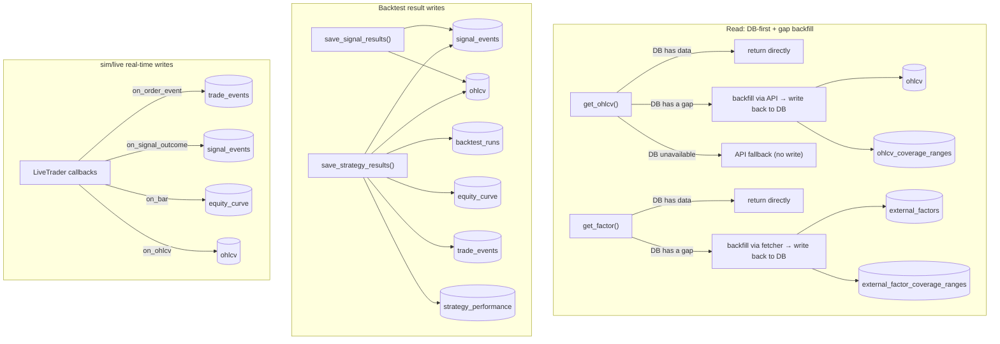

# Architecture & Naming Conventions

> **Document purpose**: this is a **living, current-state document** — it reflects the system's architecture and naming conventions as they are today, and gets edited in place as the code evolves.
> This is the opposite of `docs/decisions/` (a point-in-time record of a decision, never rewritten after the fact) — this file only ever carries "what is true now"; the *why* behind a naming rule lives in the corresponding decision doc, cross-referenced from here.
>
> When you add/change a table, column, or a `db/` read/write function, **you must update this document in the same change**. If a naming rule itself changes (as opposed to adding a new entry), add a new decision doc under `docs/decisions/` explaining why, as appropriate.
>
> **Scope**: engine layering, the DB access layer, and naming conventions — not deployment/ops. `scripts/`/`app/`/`deploy/` are optional ops tooling (Grafana, Docker, VM scripts), deliberately not architecture; see the root [README's "Optional ops examples"](README.md#optional-ops-examples) instead.
>
> **Language**: this repo is English-only outside `docs/` (which stays in the language it was originally written in — mixing languages mid-document isn't worth the churn). Keep descriptions concise and to the point — a one-line WHY beats a paragraph; link to `docs/decisions/` for the full history instead of re-explaining it here.

## System layering overview

```
brokers (broker/exchange adapters)  →  librae (core → backtest / live)  →  db (timescale_writer / timescale_reader)
```

- `brokers/`: one adapter per broker/exchange (`ShioajiAdapter`, `CryptoAdapter`, `IBKRAdapter`), exposing `fetch_ohlcv` / `place_order` / `get_position` / `info` for the live engine to fetch data and place orders. Design details in "Broker Adapter Design" below.
- `librae/core/`: shared strategy-execution logic (`strategy.py` defines Position/Action/Fill, `executor.py` defines TradeResult/OrderEvent and matching logic), shared by backtest and live.
- `librae/backtest/engine.py`: bar-by-bar backtest engine, produces `BacktestOutput` (the DB-persistence dataclasses defined in `librae/backtest/schema.py`: RunMetadata/EquityCurvePoint/OrderEventRecord/StrategyMetrics).
- `librae/live/engine.py`: the real-time polling engine for sim/live mode — the same executor logic, writing to the DB in real time, with data/orders going through a `brokers/` adapter.
- `db/timescale_writer.py` / `db/timescale_reader.py`: the sole DB access layer — upper layers always read/write through here, never issuing raw SQL directly; schema defined in `db/timescale_init.sql`.

Layering details in `docs/decisions/2026-03-26-platform-architecture.md` (a historical decision doc — the current state has since replaced the old execution layer it describes with librae).

## Broker Adapter Design (`brokers/`)

- One flat adapter class per broker/exchange (`ShioajiAdapter`, `CryptoAdapter`, `IBKRAdapter`), **duck-typed, no shared ABC**. Shared method signatures: `fetch_ohlcv(symbol, timeframe, ...) -> pd.DataFrame`, `place_order(signal: dict) -> dict`, `get_position(symbol) -> dict`, `info() -> AdapterInfo`.
- `brokers/base.py` only provides the two pieces that are genuinely shared and byte-for-byte identical: `AdapterInfo` (static metadata) and `CredentialConfig.from_env(prefix)` (the env-var convention `{PREFIX}_{FIELD}`, with `prefix` supplied by the caller — e.g. `SHIOAJI_API_KEY`, `BINANCE_API_KEY`). `CryptoAdapter`/`CryptoCredentials` are themselves exchange-agnostic (they pick a CCXT backend via `exchange_id`); only Binance is wired up today, using `BINANCE_*` as the prefix — adding a second crypto exchange means reusing the same class with a different prefix (e.g. `OKX_*`), no changes to the shared logic needed.
- OHLCV returns a uniform schema: `[ts, open, high, low, close, volume]`, with `ts` as a UTC-aware datetime; timeframe-string conversion is shared via `librae/core/utils.py` (`interval_to_timedelta` etc.), not reimplemented per adapter.
- Where a type constraint is needed, use `typing.Protocol`, **declared minimally at the call site** rather than a single interface covering every capability — e.g. `librae/live/executor.py`'s `OrderAdapter` Protocol only declares `place_order`, because that's the only method the executor actually uses.
- An async-ABC layering was tried once (`MarketDataAdapter`/`OrderAdapter`/`AccountAdapter` plus a `MarketHub` for unified dispatch — see `docs/decisions/2026-03-26-market-adapter-architecture.md`), and removed because Shioaji's auth model (stateful login+CA) and CCXT's (stateless per-call REST) diverge too much, and no adapter ever actually used that layering. **The current state is flat duck-typed classes — don't reintroduce a cross-broker shared hierarchy.**
- `IBKRAdapter` covers both US stocks and futures through one class, same pattern as `ShioajiAdapter` covering TW futures + stocks: stocks are SMART-routed by symbol alone, futures need an explicit `security_type="FUT"` + `exchange` (e.g. `"CME"` for ES/NQ, `"NYMEX"` for CL, `"COMEX"` for GC — futures aren't SMART-routed). Resolves to the nearest non-expired contract month via `reqContractDetails` (front month, not back-adjusted) — same "always trade/quote whatever's current" behavior as `ShioajiAdapter`'s `TXFR1`-style rolling alias.

## Backtest Engine Design (`librae/`)

Backtest and live-trading engine. Provides a full framework for strategy execution, position management, cost simulation, and performance metrics. **Backtest, sim, and live trading share the exact same strategy code, unmodified.**

### Layout

```
librae/
├── core/                     shared domain model (pure computation, no I/O)
│   ├── strategy.py           BaseStrategy, Action, Context, Position, PositionState, Fill
│   ├── executor.py           make_fill, process_actions, calc_trade_pnl, close_position, scale_into_position, reduce_position, liquidate_all
│   ├── cost_model.py         CostModel (commission / slippage / tax / contract multiplier / margin)
│   ├── metrics.py            compute_all (QuantStats adapter)
│   ├── run_config.py         RunConfig — unified run parameters (frozen dataclass)
│   └── utils.py              generate_run_id, infer_timeframe, to_ccxt, to_canonical
│
├── backtest/                 backtest runtime
│   ├── engine.py             Backtest — bar-by-bar execution + build_output()
│   ├── schema.py             BacktestOutput, RunMetadata, StrategyMetrics, OrderEventRecord
│   └── charts.py             plot_trades — overlays order_events entries/exits via lightweight-charts (pure rendering, no recomputation, for local research; [extra: viz])
│
├── live/                     real-time / sim runtime
│   ├── engine.py             LiveTrader — polling loop + signal detection
│   └── executor.py           LiveExecutor (sim notifications / live order placement)
│
└── config/                   configuration management
    ├── market_config.py      MarketConfig dataclass + built-in market registry (cost model, tick_size, multiplier, margin rate)
    └── symbols.py            SymbolInfo dataclass + built-in symbol registry (symbol → market/data_source/multiplier)

# Outside librae, at the same level as db/ and brokers/ — reference implementations (swappable, see "Dependency direction" below)
notifications/                Telegram push notifications (TelegramAdapter + TelegramCredentials)
orchestration/cli.py          shared CLI parser + config YAML merging (build_config/run_dispatch)
```

### Dependency direction

```
backtest/ ──→ core/
live/     ──→ core/
```

`backtest/` and `live/` have no direct dependency on each other — all shared logic lives in `core/`. `db`/`brokers`/`notifications` are never required dependencies of `librae` — `LiveTrader` controls whether it needs them via the `adapter`/`order_adapter`/`cost_model`/`notifier` constructor params plus `cfg.no_db`, falling back to a lazy-imported default implementation (`brokers.*`/`db.timescale_writer`/`notifications.telegram`) only when nothing was injected; pass them explicitly, or set `cfg.no_db=True`, and none of these packages get imported at all (see `docs/plans/refactor_librae_decouple.md`).

### Execution flow (strategy → engine → output)

This is a different thing from the "Data flow" section below: that one is about the read/write pipeline between DB tables; this one is the call sequence within a single run, from strategy code to the final result.

```
Strategy ETL (utils.py)  →  DataFrame (MultiIndex + signal columns)
                              ↓
Strategy logic (strategy.py)  →  on_bar(ctx) → list[Action]
                              ↓
Engine (engine.py)     →  make_fill / close_position → Fill / TradeResult
                              ↓
Output (build_output)  →  BacktestOutput (metrics + equity_curve + trades)
```

### Usage

#### Backtest

```python
from librae import Backtest, BaseStrategy, Action, Context, RunConfig

# 1. Define a strategy
class MyStrategy(BaseStrategy):
    def on_bar(self, ctx: Context) -> list[Action]:
        if ctx.positions.get(ctx.symbol):
            if ctx.bar.get("exit_signal"):
                return [Action(type="close", symbol=ctx.symbol)]
            return []
        if ctx.bar.get("entry_signal"):
            return [Action(type="long", symbol=ctx.symbol)]
        return []

# 2. Run the engine (a RunConfig is usually built via orchestration.cli.build_config())
df = fetch_and_prepare(symbol, months)          # your own ETL
bt = Backtest(data=df, strategy=MyStrategy(), cfg=cfg)
bt.add_benchmark(df.xs(symbol, level="symbol")["close"])
bt.run()

# 3. Get the result
output = bt.build_output()                      # BacktestOutput
```

**Data format**: a MultiIndex DataFrame `(symbol, datetime)` + OHLCV + your own feature columns.

#### Multi-asset / stock-picking strategies

The engine is portfolio-level by design (`positions` is a `dict[symbol]`, and `equity_curve`/`metrics` are both portfolio-level); `on_bar()` can return `Action`s for multiple different symbols within the same bar, with no changes needed to the engine/executor/schema. One thing to watch: `Action.quantity=None` defaults to spending all available cash (a single-asset convenience default) — when opening multiple positions in the same bar you must size each `quantity` yourself (see the `Action.quantity` docstring in `strategy.py`), otherwise the first Action will consume all the cash.

#### Local trade-chart viewer

Use after `pip install -e ".[viz]"`. Purely renders the `order_events` already computed by `build_output()` — it doesn't re-simulate or recompute, so the numbers are guaranteed to match the `strategy_performance` table (the SSOT, see "Multi-asset / stock-picking strategies" above).

```python
from librae.backtest.charts import plot_trades, plot_trades_by_run_id

ohlcv = df.xs(symbol, level="symbol")            # a single symbol's OHLCV
plot_trades(ohlcv, output.order_events, symbol)  # right after a backtest run, output already in hand

plot_trades_by_run_id(run_id)                    # or: skip rerunning the backtest, read a persisted run straight from the DB
```

`plot_trades_by_run_id` reads via `db.timescale_reader.load_trade_events`/`load_ohlcv` — the same source as any other downstream tool querying the `trade_events`/`ohlcv` tables, so it can never drift.

#### Risk controls

Enforced at the engine level — strategies cannot bypass them; all three default to off (`None`). Backtest and live share the same `core.executor.liquidate_all`/`_cap_fill_to_notional`/`_cap_fill_to_volume`.

```python
cfg = RunConfig(..., params={
    "max_position_pct": 0.3,             # single-position notional cap = 30% of latest known equity
    "max_drawdown_pct": 0.2,             # equity down 20% from its peak -> liquidate everything and stop entering permanently
    "max_volume_participation_pct": 0.1, # per-fill cap = 10% of that bar's volume
})
```

- `max_position_pct`: both new entries and adds get capped (fills are recomputed with commission/slippage/tax after capping) — this isn't an outright rejection.
- `max_drawdown_pct`: once triggered, calls `liquidate_all()` to close everything, and stops calling the strategy's `on_bar()` (live keeps polling/monitoring, it just stops entering); triggers once and stays in effect permanently — the run needs to be restarted.
- `max_volume_participation_pct`: caps a single fill (new entry/add) only — it's not cumulative against position size; like `max_position_pct` it caps rather than rejects. Only applies to entries — exits (strategy-driven close, stop-loss/take-profit, force close, drawdown-triggered liquidation) are unaffected.
- Volume-aware slippage (`CostModel.impact_coef`) is independent of this switch and also defaults to off: as long as volume data is supplied and that market/symbol's `impact_coef > 0` (set via `market_config.py`/`symbols.py`/`cost_overrides`), slippage scales linearly with the fill's share of that bar's volume, regardless of whether a cap is configured.

#### Margin / liquidation simulation

`CostModel.maintenance_margin_rate` (default 0 = off, following the same "belongs to the market/instrument, not `cfg.params`" convention as `impact_coef`, configured via `market_config.py`/`symbols.py`/`cost_overrides`). Once set, `resolve_stop_exit` (shared by backtest/live) checks every bar whether a position has hit the liquidation price computed by `CostModel.liquidation_price(entry_price, side)`; if so it force-closes with `REASON_LIQUIDATION`, using the same gap-through logic as `stop_price` (on a gap, take the worse of (liquidation price, bar open)). The liquidation check takes priority over stop-loss/take-profit — if both trigger on the same bar, liquidation (the most conservative outcome an exchange would actually enforce) wins.

The formula is a simplified isolated-margin approximation (ignoring fees/funding rates, matching the existing simplification level of this engine's margin model): long `entry*(1 + maintenance_margin_rate - margin_rate)`, short `entry*(1 - maintenance_margin_rate + margin_rate)`. Spot (`margin_rate=1.0`) never triggers unless `maintenance_margin_rate` is set.

`margin_rate`/`maintenance_margin_rate` are always a fraction of notional, never an absolute currency figure — there's no config field for e.g. "NT$636,000 initial margin" directly; a caller converts from the exchange's published absolute figure to a ratio before setting it (see `market_config.py`'s `tw_futures` entry for a worked example). Treated as static for the whole run — see `docs/plans/enhance_librae_real_trade.md`'s item B for why, and its known blind spots.

#### Reconciliation (live only)

Runs automatically when `LiveTrader.run()` starts; a no-op in `sim` mode (no `order_adapter`):

- **Positions** (`_reconcile_positions`): the broker's `get_position()` is taken as ground truth and overwrites the local `self._positions` — position direction/quantity is unambiguous, and a wrong local position is a real risk to signal decisions.
- **Cash** (`_reconcile_cash`, currently only supported by `CryptoAdapter`/CCXT — other broker adapters without a `get_balance()` are duck-type skipped): warns only, never overwrites. A Telegram alert fires only once the discrepancy exceeds `LiveTrader.CASH_RECONCILE_TOLERANCE_PCT` (default 1%, an engine constant, not `cfg.params`); `self._cash` always stays authoritative from the local ledger — a broker's free/total balance semantics vary by account mode (spot/margin/cross-margin), and blindly overwriting could let a correct local state get corrupted by a misread number.

#### Data staleness detection (live only)

Checked on every poll cycle — unlike reconciliation above, not just once at startup. `_check_staleness` compares the latest bar's timestamp against the current time; an alert only fires once the gap exceeds `(LiveTrader.STALE_DATA_TOLERANCE_BARS + 1) * timeframe` (default tolerance=2, i.e. 3 timeframes with no new data) — the `+1` accounts for the fact that even with a perfectly healthy feed, a closed bar's timestamp is naturally about one timeframe behind the current time, which is expected and shouldn't count as stale. Purely a monitoring feature — it never halts trading or blocks new entries, so it's an always-on engine constant, following the same design rationale as `CONSECUTIVE_ERROR_THRESHOLD`; the difference is that `CONSECUTIVE_ERROR_THRESHOLD` only catches fetches that raise exceptions, while this one catches fetches that succeed but return data that's stopped updating (the exchange API silently stuck). Edge-triggered: fires once on the fresh→stale transition, not every cycle; once data recovers it re-arms, and the next stale period will alert again.

#### Sim monitoring

```python
from librae.live.engine import LiveTrader

trader = LiveTrader(
    strategy=MyStrategy(),
    feature_fn=prepare_signals,     # the same ETL pipeline
    cfg=cfg,                        # a RunConfig (usually built via orchestration.cli.build_config())
)
trader.run()  # DB writes, Telegram, heartbeat, KPI updates all handled by the engine
```

`sink` (DB writes), `notifier` (Telegram), and `order_adapter` (order placement) can each be explicitly overridden with your own implementation in the constructor, or passed as `None` to disable entirely; when `cfg.no_db=True` all three default to off and none of `db`/`brokers`/`notifications` get imported — this is the key design that lets librae be used standalone as a library, without needing TimescaleDB or an exchange SDK installed.

#### Mode comparison

| | Backtest | Sim | Live |
|---|---|---|---|
| Data source | historical OHLCV | real-time OHLCV (polling) | real-time OHLCV |
| Executor | `core.make_fill()` | `LiveExecutor(simulation=True)` | `LiveExecutor(simulation=False)` |
| Order placement | simulated fill | simulated fill + Telegram notification | real order placement |

### Core types

#### Strategy layer

| Type | Description |
|------|------|
| `BaseStrategy` | abstract base class, implements `on_bar(ctx) -> list[Action]` |
| `Context` | immutable snapshot: ts, symbol, symbols, bar, bars, positions, cash, period_index |
| `Action` | strategy intent: `type` = long / short / close / hold |
| `Position` | frozen position (what the strategy sees): symbol, side, entry_price, quantity, unrealized_pnl |
| `PositionState` | mutable position (engine-internal): tracks periods_held, entry_commission, entry_slippage, entry_tax, total_entry_cost |

#### Execution layer

| Type | Description |
|------|------|
| `Fill` | fill report: price, quantity, commission, slippage, tax |
| `TradeResult` | completed trade: full entry/exit info + PnL + periods_held |
| `TradePnL` | PnL breakdown: gross_pnl, net_pnl, commission, slippage, tax |
| `CostModel` | cost model (frozen): multiplier, commission_rate, slippage_ticks, tick_size, tax, long/short_margin_rate, impact_coef (volume-impact coefficient, default 0 = off), maintenance_margin_rate (maintenance margin rate, default 0 = liquidation simulation off) |

#### Output layer

| Type | Description |
|------|------|
| `BacktestOutput` | top-level container (frozen): run_metadata + equity_curve + trades + metrics |
| `RunMetadata` | run_id, strategy, symbol, timeframe, start/end/run timestamps |
| `StrategyMetrics` | performance metrics: total_return, sharpe, sortino, calmar, max_drawdown, win_rate... |
| `OrderEventRecord` | position lifecycle event (open/add/reduce/close) |
| `EquityCurvePoint` | a single point: ts, equity, period_return, drawdown, benchmark_equity |

#### Shared functions

| Function | Description |
|------|------|
| `make_fill(action, price, cash, cost_model)` | simulate a fill (used directly by backtest) |
| `process_actions(actions, ...)` | shared action loop (used by both backtest and live) |
| `close_position(pos, exit_price, cost_model)` | close-out PnL + proceeds |
| `liquidate_all(positions, bars, ts, ...)` | close everything (shared by end-of-run and max-drawdown circuit breaker) |
| `scale_into_position(pos, fill, cost_model)` | add to a position in the same direction (weighted-average entry) |
| `reduce_position(pos, quantity, exit_price, cost_model)` | partial close |
| `calc_trade_pnl(...)` | single-trade PnL breakdown |
| `compute_all(equity_values, timestamps, trade_pnls, ...)` | performance calculation (QuantStats adapter) |
| `direction(side)` | `"long"` → +1.0, `"short"` → -1.0 |

### Design decisions

- **Primitive signature**: `compute_all()` accepts `Sequence[float]` / `Sequence[datetime]` rather than depending on `BacktestResult`, so the live engine can call it directly too.
- **Lazy import**: `quantstats` is imported lazily inside `compute_all()`, keeping `import librae` under 1s; `db`/`brokers`/`notifications` follow the same pattern, see "Dependency direction" above.
- **PositionState in core**: backtest and live share the same mutable position type, tracking `total_entry_cost` to avoid float drift when scaling.
- **Pre-computed bars**: `_precompute_bars()` converts the DataFrame to a dict-of-dicts once up front, avoiding a per-bar `to_dict()` call in the hot loop.
- **Frozen dataclasses**: `BacktestOutput`, `StrategyMetrics`, `OrderEventRecord`, `CostModel`, etc. are all frozen to guarantee immutability.
- **Unified margin-rate formula**: `margin_rate` = the fraction of notional that actually leaves available cash. On entry, `cash -= notional * margin_rate + costs`; on exit, `proceeds = notional * margin_rate + gross_pnl - exit_costs`; equity's `mtm += unrealized + notional * margin_rate`. One formula covers spot (1.0), US short selling (0.5, Reg T), Taiwan margin short selling (0.9), and futures (0.067). Callers can override the default via `cost_overrides`.

### Config API

> For the full list of config sources (env vars, built-in market/symbol registries, CLI parameter table) see [the root README's "Config overview"](../README.md#config-overview). This section only covers the internal code-level API.

#### MarketConfig (market costs)

Default source: `librae/config/market_config.py`'s built-in registry; you can also bypass it entirely and pass in your own (common when using librae as an external package):

```python
from librae.config.market_config import get_market
from librae.core.cost_model import CostModel

market = get_market("crypto")            # → MarketConfig (from librae's built-in registry)
cost_model = CostModel.from_market(market)

# Or: register your own markets, with no dependency on librae's built-in registry
my_markets = {"my_market": MarketConfig(name="my_market", commission_rate=0.001, ...)}
market = get_market("my_market", markets=my_markets)
cost_model = CostModel.from_config(cfg, markets=my_markets)
```

#### Per-symbol overrides (`RunConfig.symbol_overrides`)

`CostModel.from_config(cfg, symbol=...)` resolves one symbol's cost model with priority: explicit `override=` > `cfg.symbol_overrides[symbol]` > `cfg.cost_overrides` (run-wide fallback) > the built-in symbol registry (`spot` auto-`multiplier=1.0`, `contract_*` required-explicit) > market-level defaults. `symbol` defaults to `cfg.symbol` (`symbols[0]`) when omitted.

`Backtest.__init__` calls this once per symbol in the run (not just `cfg.symbol`) whenever `cfg=` is used and no explicit `cost_model=` override is given — a multi-asset run mixing symbols with different multipliers (e.g. `tw_futures`: TXFR1=200 + MXFR1=50 in the same run) gets each symbol's own multiplier automatically, not just the first symbol's applied to everyone.

```python
cfg = RunConfig(
    ..., symbols=["TXFR1", "MXFR1"], market="tw_futures",
    symbol_overrides={"MXFR1": {"multiplier": 55.0}},  # override just this one symbol
)
```

This is the mechanism for registering a symbol librae doesn't know about (`pip install`ed with nothing to edit, or a one-off backtest) — `symbol_overrides={"MYSYM": {"multiplier": 1.0}}` needs no file, no path parameter, nothing beyond the `RunConfig` you're already passing to `Backtest`/`LiveTrader`.

#### TelegramAdapter (notifications)

Source: behavior is configured from the caller's `config.yaml` `telegram:` block (passed in via `RunConfig.telegram_config`), secrets come from env vars. `librae` itself has no dependency on this package — `LiveTrader` only lazy-imports it to build a default implementation when nothing was explicitly overridden and `cfg.no_db=False`.

```python
from notifications.config import TelegramConfig
from notifications.telegram import TelegramAdapter, TelegramCredentials

config = TelegramConfig.from_dict(yaml_dict.get("telegram", {}))
creds = TelegramCredentials.from_env("TELEGRAM")
adapter = TelegramAdapter(config=config, credentials=creds)
```

`TelegramAdapter` methods and their corresponding flags (defined in `notifications/config.py`):

| Method | Flag | Default |
|------|------|------|
| `send_signal()` | `notifications.signal` | `True` |
| `send_startup()` / `send_shutdown()` | `notifications.startup` | `True` |
| `send_alert()` | `notifications.error` | `True` |
| `send_status()` | `notifications.status.enabled` | `False` |

#### LiveTrader callback signatures (writing your own db sink or notifier)

`LiveTrader`'s constructor injection points ("Reference implementations" in the root README) are duck-typed, not formal `Protocol`s (only `order_adapter` has one, in `librae/live/executor.py`) — this table is the actual call signature for each, so you don't have to reverse-engineer them from `librae/live/engine.py` or the `db`/`notifications` reference implementations.

| Param | Called as |
|---|---|
| `on_bar` | `on_bar(run_id, ts, equity, drawdown, period_return)` — once per bar |
| `on_order_event` | `on_order_event(event)` — an `OrderEventRecord`; fires on open/add/reduce/close |
| `on_ohlcv` | `on_ohlcv(symbol, timeframe, bar, ts)` — `bar` is a dict of OHLCV fields |
| `on_signal_outcome` | `on_signal_outcome(symbol, ts, signal, price)`; exits pass an extra `signal_type="exit"` kwarg |
| `on_heartbeat` | `on_heartbeat(run_id)` |
| `warmup_fetcher` | `warmup_fetcher(symbol, tf_ccxt, limit) -> pd.DataFrame` |
| `notifier` | not a plain callable — needs an `.enabled: bool` attribute plus the 5 methods below, each invoked via `getattr(notifier, method_name)(**kwargs)` on a background thread (fire-and-forget) |

`notifier`'s 5 methods, with their exact kwargs:

| Method | kwargs |
|---|---|
| `send_signal` | `strategy, symbol, side, price` |
| `send_startup` | `strategy, symbol, mode, run_id` |
| `send_shutdown` | `strategy, symbol, reason` |
| `send_alert` | `title, message` |
| `send_status` | `strategy, symbol, equity, drawdown, daily_pnl, position` |

All seven params (`on_*`, `warmup_fetcher`, `notifier`) follow the same `_UNSET` sentinel resolution: pass a value explicitly → use it; leave unset and `cfg.no_db=True` → `None` (there's no separate `no_notify` flag — `notifier` is gated by the same `cfg.no_db`); otherwise lazy-import the default (`db.timescale_writer`/`notifications.telegram`).

#### parse_with_config (CLI + YAML merging)

A strategy's `run.py` uses this set of functions to merge CLI args with config.yaml.
Nested blocks like `telegram` are automatically split off as a dict, bypassing argparse.

```python
from orchestration.cli import base_parser, parse_with_config, setup_logging

p = base_parser("My strategy")
args = parse_with_config(p, config_path=Path(__file__).parent / "config.yaml")
# args.mode, args.dry_run      ← runtime flags (argparse)
# args.strategy                ← dict from config.yaml's strategy: block
# args.telegram                ← dict from config.yaml's telegram: block
```

## Data flow

Three independent data flows, each drawn as its own subgraph (a node with the same name in different subgraphs represents the same table — they're split apart just to avoid crossing lines; the actual schema is defined by "Database design conventions" below). `get_ohlcv()`/`get_factor()` are external callers (not in this repo) — this only diagrams their read/write interface against `db/`.



## Database design conventions

### Table naming rules

| Type | Rule | Example |
|---|---|---|
| Discrete event/record table (each row is one independently-occurring event or record) | plural | `backtest_runs`, `trade_events`, `signal_events`, `ohlcv_coverage_ranges` |
| Domain term for a continuous time series as a whole (each row is one point in the series, but the table name refers to the series itself) | keep the domain's conventional singular term | `equity_curve`, `ohlcv` |

### Timestamp naming rules

**`ts` is reserved exclusively for a hypertable's time dimension column** (the partition key on `ohlcv`/`equity_curve`/`trade_events`/`signal_events`, representing "when this row happened").
**Every other point-in-time metadata field uses the `_at` suffix**, consistently — even when it's a query range filter parameter (e.g. `load_ohlcv(started_at=..., ended_at=...)`), to avoid the same root word being called `ts` in one function signature and something else in another.

| Field | Meaning | Where it appears |
|---|---|---|
| `started_at` | start of a run's data range | `backtest_runs`, `RunMetadata`, `load_ohlcv()` query params |
| `ended_at` | end of a run's data range | same as above |
| `run_at` | when the run was executed/created | `backtest_runs`, `RunMetadata` |
| `entry_at` | when a position was entered | `trade_events`, `Position`, `PositionState`, `TradeResult`, `OrderEvent`, `OrderEventRecord` |
| `exit_at` | when a trade was exited | `TradeResult` |
| `last_heartbeat_at` | last time the running process reported itself alive | `backtest_runs` |
| `range_started_at` | start of a cache coverage range | `ohlcv_coverage_ranges` |
| `range_ended_at` | end of a cache coverage range | `ohlcv_coverage_ranges` |

### Current 10 tables

| Table | Purpose | PK / FK | Hypertable |
|---|---|---|---|
| `backtest_runs` | run hub, 1 row / run | PK `run_id` | no |
| `equity_curve` | per-bar equity | FK `run_id` → `backtest_runs` CASCADE | yes (`ts`) |
| `trade_events` | position lifecycle events (open/add/reduce/close) | FK `run_id` (nullable) | yes (`ts`) |
| `strategy_performance` | aggregated KPIs, 1 row / run | PK+FK `run_id` → `backtest_runs` CASCADE | no |
| `ohlcv` | shared market data (`get_ohlcv()` cache) | no FK | yes (`ts`) |
| `signal_events` | signal-quality monitoring (the strategy's raw signals, not fill records) | FK `run_id` (nullable) | yes (`ts`) |
| `ohlcv_coverage_ranges` | tracks `get_ohlcv()`'s cache coverage ranges (one row per range) | no FK | no |
| `external_factors` | third-party factor data (funding rate, open interest, ...) — a long table with a uniform schema, so new data sources need no migration; `get_factor()` writes to it automatically | no FK (unique index: ts+symbol+factor_name+source+instrument_type) | yes (`ts`) |
| `external_factor_coverage_ranges` | tracks `get_factor()`'s cache coverage ranges, same mechanism as `ohlcv_coverage_ranges` | no FK | no |
| `factor_registry` | one row per `factor_name` — its update frequency + source, domain knowledge written once via `write_factor_registry()`, not inferred from `ts` gaps (unreliable for sparsely-sampled factors) | PK `factor_name` | no |

### Handling quantity ambiguity

If a single record holds both "the quantity filled in this event" and "the remaining position size after the event," it's forbidden to call both `quantity` generically — the name itself must disambiguate. Standardized on:

- `fill_quantity` — the quantity filled in this event
- `remaining_quantity` — the remaining position size after the event

**Only make this distinction on types that actually hold both** (the `trade_events` table, `OrderEvent`, `OrderEventRecord`). Types with a single quantity field (`Position.quantity`, `PositionState.quantity`, `Fill.quantity`, `Action.quantity`, `TradeResult.quantity`) keep `quantity` unchanged — there's no ambiguity there, so no need to match this pattern.

### Scalar counts are never plural

An integer count representing "how many bars this has been held" is always `periods_held`, never a plural form (plurals are too easy to misread as a list). Applied consistently everywhere this concept appears: `trade_events.periods_held`, `Position.periods_held`, `PositionState.periods_held`, `TradeResult.periods_held`, `OrderEvent.periods_held`, `OrderEventRecord.periods_held`.

### Return-rate naming

`period_return` / `benchmark_period_return`: the return for each bar, not tied to any specific frequency word (never a root like `1d`) — `timeframe` can be any frequency (1h/4h/1d), so the name shouldn't imply a fixed daily cadence.

## Python function naming conventions

### `db/timescale_writer.py` (five verb categories, documented in that file's module docstring)

```
write_*   — single-table INSERT/UPSERT (may include type/timezone normalization), writes a full row
update_*  — single-table partial UPDATE, updates only some fields of an existing row
merge_*   — single-table read-modify-write consolidation logic (e.g. merging ranges), beyond a plain UPSERT
save_*    — multi-table transactional coordinator; may extract/transform data from a broader input
refresh_* — recomputes derived/aggregate data from other tables and upserts the result
```

Decision criteria: **single-table vs. multi-table** decides between `write_`/`save_`; **writing a full row vs. partially updating an existing one** decides between `write_`/`update_`; **whether existing data must be read first to decide what to write** (rather than a plain UPSERT) means `merge_`; **whether it re-aggregates from other tables** means `refresh_`.

Examples: `save_backtest_output` (writes 5 tables in one go, a multi-table coordinator), `write_trade_event` (single-table full-row write), `update_heartbeat` (single-table partial update of one field), `merge_ohlcv_coverage_ranges` (must read existing ranges first to decide the merge result), `refresh_performance` (recomputes KPIs from `equity_curve` + `trade_events` and writes them back to `strategy_performance`).

**Duplicate-data conflict handling**: `write_ohlcv()`/`write_external_factor()`'s SQL both use `ON CONFLICT (...) DO NOTHING` — when the same primary key (ts + symbol + timeframe/factor_name + data_source/source + instrument_type) already exists, a newly-fetched value is simply discarded and the old value in the DB stays put (the earliest write wins, not the latest). This is deliberate: a backtest needs to reproduce "the number as it was seen at the time," so a later correction from the data source must never silently rewrite a past point-in-time snapshot — the same point-in-time-correctness principle applies to any ingestion layer built on top of `db/` (e.g. fundamentals data, where the earliest-disclosed value should win the same way).

### `db/timescale_reader.py` (three verb categories, documented in that file's module docstring)

```
get_*    — a single scalar / small object query (an id, a dict, a list of tuples)
load_*   — a batch query returning a DataFrame, for analysis/dashboard use
derive_* — computes a differently-shaped result from existing data; not a direct read of a raw table
```

Examples: `get_run_by_config_hash` (returns a dict), `load_trade_events` (returns a DataFrame), `derive_trade_signals` (reconstructs an entry/exit signal sequence *from* `trade_events` — it does **not** read the `signal_events` table; these two are easy to conflate, hence the deliberate use of `derive_` instead of `load_` to remind the caller this is derived data, not the original raw signal).

## Maintenance rules

1. When adding/changing a table, column, or a read/write function in `db/timescale_writer.py`/`db/timescale_reader.py`, update the corresponding section of this document in the same change.
2. When a new field raises a boundary judgment call ("is this name ambiguous," "should this use `_at`"), follow the criteria in "Handling quantity ambiguity" / "Timestamp naming rules" above rather than deciding case by case.
3. If a naming rule itself needs to change (as opposed to simply adding an entry), open a new decision doc under `docs/decisions/` explaining why; once this file is updated it should only reflect the final current state, with no explanation of the old rule retained.
