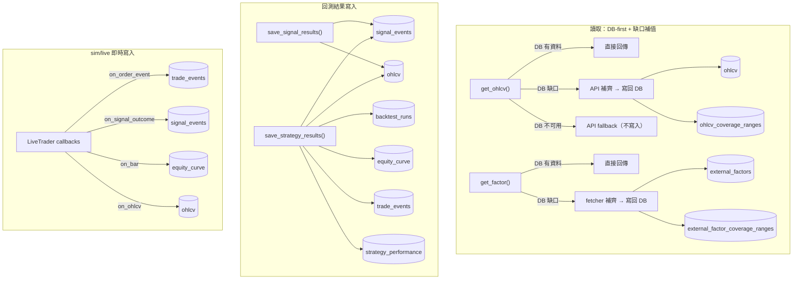

# Architecture & Naming Conventions

> **文件定位**：這是一份**持續更新的現況文件**，反映系統目前的架構與命名慣例，隨程式碼演進直接修改本檔。
> 這與 `docs/decisions/`（決策當下存證、寫下後不回溯修改）性質相反 —— 本檔只承載「現在是什麼」，
> 命名規則背後「為什麼」的決策脈絡留在對應的 decision 文件，本檔用連結交叉引用。
>
> 新增/修改 table、column、`db/` 讀寫函數時，**必須同步更新本文件**。若命名規則本身改變（而非新增條目），
> 視情況在 `docs/decisions/` 補一份新的 decision 記錄「為什麼改」。

## 系統分層概覽

```
brokers (券商/交易所 adapter)  →  librae (core → backtest / live)  →  db (timescale_writer / timescale_reader)
```

- `brokers/`：每個券商/交易所一個 adapter（`ShioajiAdapter`、`CryptoAdapter`、`IBKRAdapter`），提供 `fetch_ohlcv` / `place_order` / `get_position` / `info`，供 live engine 抓資料與下單。設計細節見下方「Broker Adapter 設計」。
- `librae/core/`：策略執行的共用邏輯（`strategy.py` 定義 Position/Action/Fill，`executor.py` 定義 TradeResult/OrderEvent 與撮合邏輯），backtest 與 live 共用。
- `librae/backtest/engine.py`：逐 bar 回測引擎，產出 `BacktestOutput`（`librae/backtest/schema.py` 定義的 DB 持久化用 dataclass：RunMetadata/EquityCurvePoint/OrderEventRecord/StrategyMetrics）。
- `librae/live/engine.py`：sim/live 模式的即時輪詢引擎，同一份 executor 邏輯，即時寫入 DB，資料/下單透過 `brokers/` adapter。
- `db/timescale_writer.py` / `db/timescale_reader.py`：唯一的 DB 存取層，上層一律透過這裡讀寫，不直接下 SQL；schema 定義見 `db/timescale_init.sql`。

分層細節見 `docs/decisions/2026-03-26-platform-architecture.md`（歷史決策文件，現況已用 librae 取代文件中提到的舊執行層）。

## Broker Adapter 設計（`brokers/`）

- 每個券商/交易所一個扁平 adapter class（`ShioajiAdapter`、`CryptoAdapter`），**duck-typed，不繼承共同 ABC**。共同方法簽章：`fetch_ohlcv(symbol, timeframe, ...) -> pd.DataFrame`、`place_order(signal: dict) -> dict`、`get_position(symbol) -> dict`、`info() -> AdapterInfo`。
- `brokers/base.py` 只提供兩個真正共用、逐字相同的部分：`AdapterInfo`（靜態 metadata）與 `CredentialConfig.from_env(prefix)`（env var 讀取慣例 `{PREFIX}_{FIELD}`，`prefix` 由呼叫端指定，例：`SHIOAJI_API_KEY`、`BINANCE_API_KEY`）。`CryptoAdapter`/`CryptoCredentials` 本身跟交易所無關（靠 `exchange_id` 選 CCXT 後端），目前只接了 Binance，用 `BINANCE_*` 當 prefix；之後加第二個 crypto 交易所，走同一個 class、換一個 prefix（例如 `OKX_*`）即可，不用改共用邏輯。
- OHLCV 回傳統一 schema：`[ts, open, high, low, close, volume]`，`ts` 為 UTC-aware datetime；timeframe 字串轉換共用 `librae/core/utils.py`（`interval_to_timedelta` 等），不在各 adapter 重複實作。
- 需要型別約束時用 `typing.Protocol`，**在呼叫端就近宣告最小介面**，不做涵蓋全部能力的共用介面 —— 例如 `librae/live/executor.py` 的 `OrderAdapter` Protocol 只宣告 `place_order`，因為 executor 只用到這個方法。
- 曾嘗試以 async ABC 分層（`MarketDataAdapter`/`OrderAdapter`/`AccountAdapter`）搭配 `MarketHub` 統一 dispatch（見 `docs/decisions/2026-03-26-market-adapter-architecture.md`），因 Shioaji（stateful login+CA）與 CCXT（stateless per-call REST）的 auth 模型差異太大、且無 adapter 真正使用該分層而移除；**現況以扁平 duck-typed class 為準，不要重新引入跨券商的共用階層**。

## 回測引擎設計（`librae/`）

量化回測與即時交易引擎。提供策略執行、持倉管理、成本模擬、績效計算的完整框架。**回測、模擬、實盤共用同一份策略，零修改。**

### 架構

```
librae/
├── core/                     共用 domain model（純計算，無 I/O）
│   ├── strategy.py           BaseStrategy, Action, Context, Position, PositionState, Fill
│   ├── executor.py           make_fill, process_actions, calc_trade_pnl, close_position, scale_into_position, reduce_position, liquidate_all
│   ├── cost_model.py         CostModel（手續費 / 滑價 / 稅 / 合約乘數 / 保證金）
│   ├── metrics.py            compute_all（QuantStats adapter）
│   ├── run_config.py         RunConfig — 統一執行參數（frozen dataclass）
│   └── utils.py              generate_run_id, infer_timeframe, to_ccxt, to_canonical
│
├── backtest/                 回測 runtime
│   ├── engine.py             Backtest — bar-by-bar 執行 + build_output()
│   ├── schema.py             BacktestOutput, RunMetadata, StrategyMetrics, OrderEventRecord
│   └── charts.py             plot_trades — lightweight-charts 疊 order_events 進出場點（純渲染，不重算，本地研究用；[extra: viz]）
│
├── live/                     即時 / 模擬 runtime
│   ├── engine.py             LiveTrader — polling loop + 信號偵測
│   └── executor.py           LiveExecutor（sim 通知 / live 下單）
│
└── config/                   設定管理
    ├── markets.yaml          市場參數（成本模型、tick_size、乘數、保證金率）
    ├── market_config.py      MarketConfig dataclass + load helpers
    └── symbols.py            symbol → market/data_source 對應

# librae 之外，跟 db/、brokers/ 同層級的擴充範例（可替換，見下方「依賴方向」）
notifications/                Telegram 推播（TelegramAdapter + TelegramCredentials）
orchestration/cli.py          共用 CLI parser + config YAML 合併（build_config/run_dispatch）
```

### 依賴方向

```
backtest/ ──→ core/
live/     ──→ core/
```

`backtest/` 和 `live/` 之間無直接依賴，共用邏輯全部在 `core/`。`db`/`brokers`/`notifications` 都不是 `librae` 的必要依賴——`LiveTrader` 用 `adapter`/`order_adapter`/`cost_model`/`notifier` 建構子參數 + `cfg.no_db` 控制是否需要它們，未注入時走 lazy import 的預設實作（`brokers.*`/`db.timescale_writer`/`notifications.telegram`），明確傳入或 `cfg.no_db=True` 時完全不會 import 這些套件（見 `docs/plans/refactor_librae_decouple.md`）。

### 執行流程（策略 → 引擎 → 輸出）

跟下方「資料流」小節是兩件事：那裡講的是 DB 表之間的讀寫管線，這裡講的是單次 run 內、策略程式碼到輸出結果的呼叫順序。

```
策略 ETL (utils.py)  →  DataFrame (MultiIndex + 信號欄位)
                              ↓
策略邏輯 (strategy.py)  →  on_bar(ctx) → list[Action]
                              ↓
引擎 (engine.py)     →  make_fill / close_position → Fill / TradeResult
                              ↓
輸出 (build_output)  →  BacktestOutput (metrics + equity_curve + trades)
```

### 使用方式

#### 回測 (backtest)

```python
from librae import Backtest, BaseStrategy, Action, Context, RunConfig

# 1. 定義策略
class MyStrategy(BaseStrategy):
    def on_bar(self, ctx: Context) -> list[Action]:
        if ctx.positions.get(ctx.symbol):
            if ctx.bar.get("exit_signal"):
                return [Action(type="close", symbol=ctx.symbol)]
            return []
        if ctx.bar.get("entry_signal"):
            return [Action(type="long", symbol=ctx.symbol)]
        return []

# 2. 跑引擎（通常由 orchestration.cli.build_config() 建立 RunConfig）
df = fetch_and_prepare(symbol, months)          # 你的 ETL
bt = Backtest(data=df, strategy=MyStrategy(), cfg=cfg)
bt.add_benchmark(df.xs(symbol, level="symbol")["close"])
bt.run()

# 3. 取得結果
output = bt.build_output()                      # BacktestOutput
```

**資料格式**：MultiIndex DataFrame `(symbol, datetime)` + OHLCV + 自訂特徵欄位。

#### 多資產 / 選股策略

引擎本身是 portfolio-level 設計（`positions` 是 `dict[symbol]`，`equity_curve`/`metrics` 皆為組合層級），`on_bar()` 可在同一根 bar 回傳多個不同 symbol 的 `Action`，不需改動 engine/executor/schema。唯一要注意：`Action.quantity=None` 預設用光可用現金（單資產便利預設），同一 bar 開多檔部位時必須自行算好每檔 `quantity`（見 `strategy.py` 中 `Action.quantity` docstring），否則第一個 Action 會吃光現金。

#### 本地看進出場點 (trade chart)

`pip install -e ".[viz]"` 後使用。純渲染 `build_output()` 已算好的 `order_events`，不重新模擬/計算，數字保證跟 `strategy_performance` 表一致（SSOT 見上方「多資產 / 選股策略」段落）。

```python
from librae.backtest.charts import plot_trades, plot_trades_by_run_id

ohlcv = df.xs(symbol, level="symbol")            # 單一 symbol 的 OHLCV
plot_trades(ohlcv, output.order_events, symbol)  # 剛跑完回測，手上已有 output

plot_trades_by_run_id(run_id)                    # 或者：不重跑回測，直接從 DB 讀已落地的 run
```

`plot_trades_by_run_id` 讀的是 `db.timescale_reader.load_trade_events`/`load_ohlcv`——跟其他任何查詢 `trade_events`/`ohlcv` 表的下游工具同源，保證不 drift。

#### 風控 (risk controls)

引擎層級強制，策略無法繞過；三者皆預設關閉（`None`）。backtest/live 共用同一份 `core.executor.liquidate_all`/`_cap_fill_to_notional`/`_cap_fill_to_volume`。

```python
cfg = RunConfig(..., params={
    "max_position_pct": 0.3,             # 單一部位 notional 上限 = 30% 最新已知權益
    "max_drawdown_pct": 0.2,             # 權益從高點回落 20% -> 全平倉並永久停止進場
    "max_volume_participation_pct": 0.1, # 單筆成交量上限 = 10% 該根 bar 的 volume
})
```

- `max_position_pct`：新倉/加碼皆會被裁量（裁量後重算 commission/slippage/tax），不是直接拒絕。
- `max_drawdown_pct`：觸發後呼叫 `liquidate_all()` 全平倉，並停止呼叫策略 `on_bar()`（live 仍持續 polling/監控，只是不再進場）；一次觸發即永久生效，需重啟該次 run。
- `max_volume_participation_pct`：只限制單筆成交（新倉/加碼），不是累加 vs 部位大小；跟 `max_position_pct` 一樣是裁量不拒絕。只作用於進場 —— 出場（策略平倉、停損/停利、force close、回撤熔斷平倉）不受此限制。
- 成交量感知的滑價（`CostModel.impact_coef`）跟這個開關無關、預設也是關閉：只要有成交量資料傳入，且該市場/symbol 的 `impact_coef > 0`（在 `markets.yaml`/`symbols.yaml`/`cost_overrides` 設定），滑價就會隨單筆成交佔該 bar volume 的比例線性放大，無論有沒有設定上限。

#### 保證金 / 強平模擬

`CostModel.maintenance_margin_rate`（預設 0 = 關閉，跟 `impact_coef` 同一套「屬於市場/商品，不是 `cfg.params`」的設定方式，走 `markets.yaml`/`symbols.yaml`/`cost_overrides`）。設定後 `resolve_stop_exit`（backtest/live 共用）在每根 bar 都會檢查部位是否觸及 `CostModel.liquidation_price(entry_price, side)` 算出的強平價，觸及就以 `REASON_LIQUIDATION` 強制平倉，用跟 `stop_price` 一樣的 gap-through 邏輯（缺口跳空時取較差的（強平價, bar open））。強平檢查優先於停損/停利——同一根 bar 兩者都觸發時，強平（交易所實際會執行的最保守結果）優先。

公式是簡化過的 isolated margin 近似值（忽略手續費/資金費率，維持這個引擎既有保證金模型的簡化程度）：多單 `entry*(1 + maintenance_margin_rate - margin_rate)`，空單 `entry*(1 - maintenance_margin_rate + margin_rate)`。現貨（`margin_rate=1.0`）不設 `maintenance_margin_rate` 就永遠不會觸發。

#### 對帳 (reconciliation, live only)

`LiveTrader.run()` 啟動時自動執行，`sim` 模式（無 `order_adapter`）為 no-op：

- **部位**（`_reconcile_positions`）：直接採信 broker 回傳的 `get_position()`，覆蓋本地 `self._positions`——部位方向/數量是無歧義的，錯誤的本地部位對訊號判斷是實際風險。
- **現金**（`_reconcile_cash`，目前僅 `CryptoAdapter`/CCXT 支援，其他 broker adapter 沒有 `get_balance()` 會被 duck-type 跳過）：只告警不覆蓋。落差超過 `LiveTrader.CASH_RECONCILE_TOLERANCE_PCT`（預設 1%，engine 常數而非 `cfg.params`）才發 Telegram alert，`self._cash` 永遠以本地帳本為準——broker 的 free/total 餘額語意會隨帳戶模式（現貨/合約/cross-margin）不同，貿然覆蓋可能讓本來正確的本地狀態被錯讀的數字污染。

#### 資料 staleness 偵測 (live only)

每個 poll cycle 都會檢查，跟上面對帳不同、不是只在啟動時跑一次。`_check_staleness` 比對最新一根 bar 的時間戳跟現在時間的差距，超過 `(LiveTrader.STALE_DATA_TOLERANCE_BARS + 1) * timeframe`（預設 tolerance=2，即 3 個 timeframe 沒有新資料）才發告警——`+1`是因為即使 feed 完全正常，一根已收盤 bar 的時間戳本來就會落後現在時間約 1 個 timeframe，這是預期的，不能當成 stale。純監控功能，不影響交易行為（不會 halt、不會擋新倉），所以是 always-on 的 engine 常數，跟 `CONSECUTIVE_ERROR_THRESHOLD` 同一套設計理由；跟後者的差別是 `CONSECUTIVE_ERROR_THRESHOLD` 只抓 fetch 拋例外的情況，這個抓的是 fetch 成功但資料不再更新（exchange API 靜默卡住）。edge-triggered：從新鮮轉 stale 才發一次，不會每個 cycle 洗版，資料恢復後會重新武裝、下次 stale 還會再告警一次。

#### 模擬監控 (sim)

```python
from librae.live.engine import LiveTrader

trader = LiveTrader(
    strategy=MyStrategy(),
    feature_fn=prepare_signals,     # 同一個 ETL pipeline
    cfg=cfg,                        # RunConfig（由 orchestration.cli.build_config() 建立）
)
trader.run()  # DB 寫入、Telegram、heartbeat、KPI 更新全由引擎處理
```

`sink`（DB 寫入）、`notifier`（Telegram）、`order_adapter`（下單）都可以在建構子明確覆蓋成自己的實作，或傳 `None` 完全關閉；`cfg.no_db=True` 時三者皆預設關閉，不 import `db`/`brokers`/`notifications` 任何一個套件——這是 librae 能被單獨當函式庫使用、不必連帶裝 TimescaleDB/交易所 SDK 的關鍵設計。

#### 模式對比

| | 回測 (backtest) | 模擬 (sim) | 實盤 (live) |
|---|---|---|---|
| 資料來源 | 歷史 OHLCV | 即時 OHLCV（polling） | 即時 OHLCV |
| 執行器 | `core.make_fill()` | `LiveExecutor(simulation=True)` | `LiveExecutor(simulation=False)` |
| 下單 | 模擬成交 | 模擬成交 + Telegram 通知 | 真實下單 |

### 核心類型

#### Strategy 層

| 類型 | 說明 |
|------|------|
| `BaseStrategy` | 抽象基類，實作 `on_bar(ctx) -> list[Action]` |
| `Context` | 不可變快照：ts, symbol, symbols, bar, bars, positions, cash, period_index |
| `Action` | 策略意圖：`type` = long / short / close / hold |
| `Position` | 凍結持倉（給策略看）：symbol, side, entry_price, quantity, unrealized_pnl |
| `PositionState` | 可變持倉（引擎內部）：追蹤 periods_held, entry_commission, entry_slippage, entry_tax, total_entry_cost |

#### Execution 層

| 類型 | 說明 |
|------|------|
| `Fill` | 成交回報：price, quantity, commission, slippage, tax |
| `TradeResult` | 完成交易：entry/exit 全資訊 + PnL + periods_held |
| `TradePnL` | PnL 拆解：gross_pnl, net_pnl, commission, slippage, tax |
| `CostModel` | 成本模型（frozen）：multiplier, commission_rate, slippage_ticks, tick_size, tax, long/short_margin_rate, impact_coef（成交量衝擊係數，預設 0 關閉）, maintenance_margin_rate（維持保證金率，預設 0 關閉強平模擬） |

#### Output 層

| 類型 | 說明 |
|------|------|
| `BacktestOutput` | 頂層容器（frozen）：run_metadata + equity_curve + trades + metrics |
| `RunMetadata` | run_id, strategy, symbol, timeframe, start/end/run timestamps |
| `StrategyMetrics` | 績效指標：total_return, sharpe, sortino, calmar, max_drawdown, win_rate... |
| `OrderEventRecord` | 部位生命週期事件（open/add/reduce/close）|
| `EquityCurvePoint` | 單點：ts, equity, period_return, drawdown, benchmark_equity |

#### 共用函數

| 函數 | 說明 |
|------|------|
| `make_fill(action, price, cash, cost_model)` | 模擬成交（backtest 直接用） |
| `process_actions(actions, ...)` | 共用 action 迴圈（backtest + live 共用） |
| `close_position(pos, exit_price, cost_model)` | 平倉 PnL + proceeds |
| `liquidate_all(positions, bars, ts, ...)` | 全平倉（end-of-run / 最大回撤熔斷共用） |
| `scale_into_position(pos, fill, cost_model)` | 同方向加碼（weighted avg entry） |
| `reduce_position(pos, quantity, exit_price, cost_model)` | 部分平倉 |
| `calc_trade_pnl(...)` | 單筆交易 PnL 拆解 |
| `compute_all(equity_values, timestamps, trade_pnls, ...)` | 績效計算（QuantStats adapter） |
| `direction(side)` | `"long"` → +1.0, `"short"` → -1.0 |

### 設計決策

- **Primitive signature**: `compute_all()` 接受 `Sequence[float]` / `Sequence[datetime]`，不依賴 `BacktestResult`，讓 live 引擎也能直接呼叫。
- **Lazy import**: `quantstats` 在 `compute_all()` 內延遲載入，`import librae` 保持 <1s；`db`/`brokers`/`notifications` 同理，見上方「依賴方向」。
- **PositionState in core**: backtest 和 live 共用同一個可變持倉型別，追蹤 `total_entry_cost` 避免 scaling 時浮點數漂移。
- **Pre-computed bars**: `_precompute_bars()` 一次性將 DataFrame 轉為 dict-of-dicts，避免 hot loop 中每 bar 呼叫 `to_dict()`。
- **Frozen dataclasses**: `BacktestOutput`, `StrategyMetrics`, `OrderEventRecord`, `CostModel` 等皆為 frozen，確保不可變。
- **Margin rate 統一公式**: `margin_rate` = 從可用現金流出的比例 / notional。開倉 `cash -= notional * margin_rate + costs`，平倉 `proceeds = notional * margin_rate + gross_pnl - exit_costs`，equity `mtm += unrealized + notional * margin_rate`。一個公式覆蓋現貨（1.0）、美股做空（0.5, Reg T）、台股融券（0.9）、期貨（0.067）。使用者可透過 `cost_overrides` 覆蓋預設值。

### Config API

> 完整設定檔清單（環境變數、YAML 範例、CLI 參數表）見 [根目錄 README「設定檔總覽」](../README.md#設定檔總覽)。以下僅說明引擎內部的程式碼調用方式。

#### MarketConfig（市場成本）

預設來源：`librae/config/markets.yaml`（程式啟動時讀取）；也可以完全不碰這個檔案，自己組一份 registry 傳進去（外部套件使用 librae 時常用）：

```python
from librae.config.market_config import get_market
from librae.core.cost_model import CostModel

market = get_market("crypto")            # → MarketConfig（讀 librae 內建 markets.yaml）
cost_model = CostModel.from_market(market)

# 或者：完全不依賴 librae 內建 markets.yaml，自己註冊市場
my_markets = {"my_market": MarketConfig(name="my_market", commission_rate=0.001, ...)}
market = get_market("my_market", markets=my_markets)
cost_model = CostModel.from_config(cfg, markets=my_markets)
```

#### TelegramAdapter（通知）

來源：行為設定從呼叫方的 config.yaml `telegram:` 區塊（經 `RunConfig.telegram_config` 傳入），secrets 從環境變數。`librae` 本身不依賴這個套件——`LiveTrader` 只在沒被明確覆蓋、且 `cfg.no_db=False` 時才會 lazy import 它建立預設實作。

```python
from notifications.config import TelegramConfig
from notifications.telegram import TelegramAdapter, TelegramCredentials

config = TelegramConfig.from_dict(yaml_dict.get("telegram", {}))
creds = TelegramCredentials.from_env("TELEGRAM")
adapter = TelegramAdapter(config=config, credentials=creds)
```

`TelegramAdapter` 方法與對應 flag（定義在 `notifications/config.py`）：

| 方法 | Flag | 預設 |
|------|------|------|
| `send_signal()` | `notifications.signal` | `True` |
| `send_startup()` / `send_shutdown()` | `notifications.startup` | `True` |
| `send_alert()` | `notifications.error` | `True` |
| `send_status()` | `notifications.status.enabled` | `False` |

#### parse_with_config（CLI + YAML 合併）

策略 `run.py` 用這組函數處理 CLI 參數和 config.yaml 合併。
`telegram` 等巢狀區塊自動分離為 dict，不經過 argparse。

```python
from orchestration.cli import base_parser, parse_with_config, setup_logging

p = base_parser("My strategy")
args = parse_with_config(p, config_path=Path(__file__).parent / "config.yaml")
# args.mode, args.dry_run      ← runtime flags (argparse)
# args.strategy                ← dict from config.yaml strategy: block
# args.telegram                ← dict from config.yaml telegram: block
```

## 資料流

三個獨立的資料流各自畫一個子圖（同名節點在不同子圖裡代表同一張表，只是拆開避免線交錯，實際 schema 以下面「資料庫設計規範」為準）。`get_ohlcv()`/`get_factor()` 是外部呼叫方（不在這個 repo 內），這裡只畫它們對 `db/` 的讀寫介面。



## 資料庫設計規範

### 資料表命名規則

| 類型 | 規則 | 範例 |
|---|---|---|
| 離散事件/紀錄表（每列代表一次獨立發生的事件或紀錄） | 複數 | `backtest_runs`, `trade_events`, `signal_events`, `ohlcv_coverage_ranges` |
| 代表連續時序整體的領域慣用詞（每列是整體序列的一個點，但表名指稱的是序列本身） | 維持領域單數慣用詞 | `equity_curve`, `ohlcv` |

### 時間戳記命名規則

**`ts` 只保留給 hypertable 的時間維度欄位**（`ohlcv`/`equity_curve`/`trade_events`/`signal_events` 的分區鍵，代表「這一列發生的時間」）。
**所有其他時間點中繼資料一律用 `_at` 後綴**，即使是作為查詢範圍過濾參數（例如 `load_ohlcv(started_at=..., ended_at=...)`）也一致套用，避免同一個字根在不同函式簽章裡時而叫 `ts` 時而叫別的名字。

| 欄位 | 意義 | 出現位置 |
|---|---|---|
| `started_at` | run 的資料區間起點 | `backtest_runs`, `RunMetadata`, `load_ohlcv()` 查詢參數 |
| `ended_at` | run 的資料區間終點 | 同上 |
| `run_at` | run 被執行/建立的時間 | `backtest_runs`, `RunMetadata` |
| `entry_at` | 部位進場時間 | `trade_events`, `Position`, `PositionState`, `TradeResult`, `OrderEvent`, `OrderEventRecord` |
| `exit_at` | 交易出場時間 | `TradeResult` |
| `last_heartbeat_at` | 執行程序最後一次回報存活的時間 | `backtest_runs` |
| `range_started_at` | 快取覆蓋區間起點 | `ohlcv_coverage_ranges` |
| `range_ended_at` | 快取覆蓋區間終點 | `ohlcv_coverage_ranges` |

### 現行 9 張表一覽

| 表名 | 用途 | PK / FK | Hypertable |
|---|---|---|---|
| `backtest_runs` | Run 中樞，1 row / run | PK `run_id` | 否 |
| `equity_curve` | 每 bar 淨值 | FK `run_id` → `backtest_runs` CASCADE | 是（`ts`） |
| `trade_events` | 部位生命週期事件（open/add/reduce/close） | FK `run_id`（nullable） | 是（`ts`） |
| `strategy_performance` | 聚合 KPI，1 row / run | PK+FK `run_id` → `backtest_runs` CASCADE | 否 |
| `ohlcv` | 共用市場資料（`get_ohlcv()` cache） | 無 FK | 是（`ts`） |
| `signal_events` | 訊號品質監控（策略原始訊號，非成交紀錄） | FK `run_id`（nullable） | 是（`ts`） |
| `ohlcv_coverage_ranges` | `get_ohlcv()` 快取覆蓋區間追蹤（每列一個 range） | 無 FK | 否 |
| `external_factors` | 第三方因子資料（funding rate、open interest...），一致 schema 的 long table，新資料源不用 migration，`get_factor()` 自動寫入 | 無 FK（unique index: ts+symbol+factor_name+source+instrument_type） | 是（`ts`） |
| `external_factor_coverage_ranges` | `get_factor()` 快取覆蓋區間追蹤，跟 `ohlcv_coverage_ranges` 同一套機制 | 無 FK | 否 |

### 數量歧義處理原則

同一筆紀錄若同時存在「本次成交量」與「事件後剩餘部位量」，禁止用 `quantity` 泛稱兩者 —— 名稱本身要能區分語意。統一用：

- `fill_quantity` — 本次事件的成交量
- `remaining_quantity` — 事件後剩餘部位量

**只在同時持有兩者的類別上做這個區分**（`trade_events` 表、`OrderEvent`、`OrderEventRecord`）。單一數量欄位的類別（`Position.quantity`、`PositionState.quantity`、`Fill.quantity`、`Action.quantity`、`TradeResult.quantity`）維持 `quantity` 不變 —— 它們本身沒有歧義，不需要比照修改。

### 純量計數不可用複數

代表「持有了幾根 bar」的整數計數統一用 `periods_held`，不用複數形式（複數容易誤讀成列表）。套用在所有代表這個概念的欄位/屬性上：`trade_events.periods_held`、`Position.periods_held`、`PositionState.periods_held`、`TradeResult.periods_held`、`OrderEvent.periods_held`、`OrderEventRecord.periods_held`。

### 報酬率命名

`period_return` / `benchmark_period_return`：每個 bar 的報酬率，不綁定特定頻率字眼（不用 `1d` 這類字根）—— `timeframe` 可以是 1h/4h/1d 任何頻率，命名不該暗示固定為日頻。

## Python 函數命名規範

### `db/timescale_writer.py`（五類動詞，寫在該檔案的 module docstring）

```
write_*   — 單表 INSERT/UPSERT（可包含型別/時區正規化），整列寫入
update_*  — 單表局部 UPDATE，只更新既有列的部分欄位
merge_*   — 單表 read-modify-write 整併邏輯（例如區間合併），超出單純 UPSERT 範圍
save_*    — 多表交易性協調器；可能從更廣的輸入中萃取/轉換資料
refresh_* — 從其他表重新計算衍生/聚合資料並 upsert 結果
```

判斷準則：**單表 vs 多表**決定 `write_`/`save_` 二選一；**整列寫入 vs 局部更新既有列**決定 `write_`/`update_`；**是否需要先讀取既有資料才能決定寫入內容**（而非單純 UPSERT）用 `merge_`；**是否從其他表重新聚合**用 `refresh_`。

例：`save_backtest_output`（一次寫 5 張表，多表協調器）、`write_trade_event`（單表整列寫入）、`update_heartbeat`（單表局部更新一個欄位）、`merge_ohlcv_coverage_ranges`（要先讀既有區間才能決定合併結果）、`refresh_performance`（從 `equity_curve` + `trade_events` 重新算 KPI 寫回 `strategy_performance`）。

**重複資料衝突處理**：`write_ohlcv()`/`write_external_factor()` 的 SQL 都是 `ON CONFLICT (...) DO NOTHING`——同一個主鍵（ts + symbol + timeframe/factor_name + data_source/source + instrument_type）已存在時，新抓到的值直接丟棄，DB 裡舊值不變（保留最先寫入的，不是保留最新的）。這是刻意的，跟 `us_fundamentals.py`'s `_first_disclosure()` 保留最早申報值、只警告不覆蓋是同一套 point-in-time 正確性哲學：回測要重現「當時看到的數字」，不能讓資料源事後的訂正悄悄改寫過去某個時間點的快照。

### `db/timescale_reader.py`（三類動詞，寫在該檔案的 module docstring）

```
get_*    — 單一純量 / 小型物件查詢（id、dict、list of tuples）
load_*   — 回傳 DataFrame 的批次查詢，供分析/dashboard 使用
derive_* — 從既有資料算出不同形狀的結果；不是原始表的直接讀取
```

例：`get_run_by_config_hash`（回傳 dict）、`load_trade_events`（回傳 DataFrame）、`derive_trade_signals`（從 `trade_events`「反推」出進出場訊號序列，**不是**在讀 `signal_events` 表 —— 這兩者容易混淆，命名刻意用 `derive_` 而非 `load_` 來提醒呼叫端這是衍生資料，不是原始訊號）。

## 維護規則

1. 新增/修改 table、column，或 `db/timescale_writer.py`、`db/timescale_reader.py` 裡的讀寫函數時，同步更新本文件對應章節。
2. 新增欄位如果碰到「這個名字算不算歧義」「該不該用 `_at`」等邊界判斷，對照上面「數量歧義處理原則」「時間戳記命名規則」的準則，而不是逐案自行決定。
3. 若命名規則本身要改變（而非單純新增條目），在 `docs/decisions/` 開一份新的 decision 記錄改動原因，本檔案改完後只反映最終現況，不保留舊規則的說明。
